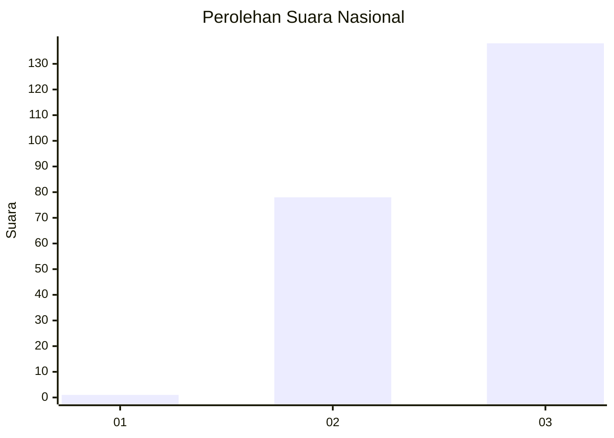
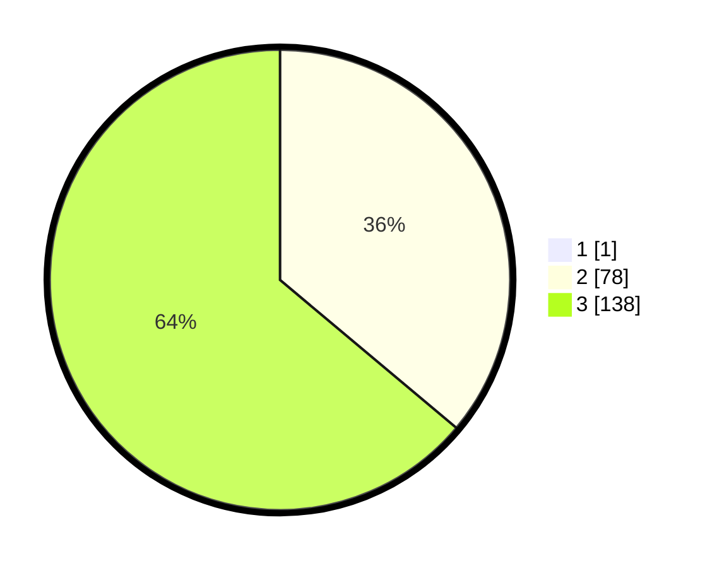

# Hasil

## Grafik

## Tabel

| No. | Nama Paslon    | Suara | Suara (raw) | Persentase |
|:--- |:-------------- | -----:| -----------:| ----------:|
| 1   | ANIES MUHAIMIN | 1     | [1][p-1]    | 0,46       |
| 2   | PRABOWO GIBRAN | 78    | [78][p-2]   | 35,94      |
| 3   | GANJAR MAHFUD  | 138   | [138][p-3]  | 63,59      |

[p-1]: https://github.com/gigit-pemilu/pemilu-2024/blob/main/pilpres/hitung-suara/sub/51-bali/sub/02-tabanan/sub/03-selemadeg-barat/sub/2001-mundeh/sub/001-tps/sub/paslon-1.txt
[p-2]: https://github.com/gigit-pemilu/pemilu-2024/blob/main/pilpres/hitung-suara/sub/51-bali/sub/02-tabanan/sub/03-selemadeg-barat/sub/2001-mundeh/sub/001-tps/sub/paslon-2.txt
[p-3]: https://github.com/gigit-pemilu/pemilu-2024/blob/main/pilpres/hitung-suara/sub/51-bali/sub/02-tabanan/sub/03-selemadeg-barat/sub/2001-mundeh/sub/001-tps/sub/paslon-3.txt

## Foto C Plano

https://sirekap-obj-formc.kpu.go.id/7ec3/pemilu/ppwp/51/02/03/20/01/5102032001001-20240215-221115--099a692a-8578-4aaf-a0b7-e65bc0477096.jpg

https://sirekap-obj-formc.kpu.go.id/7ec3/pemilu/ppwp/51/02/03/20/01/5102032001001-20240215-221120--2f069ebf-15ba-414c-a184-b203cc8ed47b.jpg

https://sirekap-obj-formc.kpu.go.id/7ec3/pemilu/ppwp/51/02/03/20/01/5102032001001-20240215-221118--ccdd7566-c765-4d54-9270-ee7198246796.jpg

## Metadata

| Key        | Value               |
| ---------- | ------------------- |
| Time Stamp | 2024-02-16 10:00:28 |

## DATA PEMILIH TETAP

Jumlah pemilih dalam DPT: **269**.
 * L: **129**.
 * P: **140**.

## DATA PENGGUNA HAK PILIH

Jumlah pengguna hak pilih dalam DPT: **218**.
 * L: **105**.
 * P: **113**.

Jumlah pengguna hak pilih dalam DPTb: **0**.
 * L: **0**.
 * P: **0**.

Jumlah pengguna hak pilih dalam DPK: **2**.
 * L: **0**.
 * P: **2**.

Jumlah pengguna hak pilih: **220**.
 * L: **105**.
 * P: **115**.

## JUMLAH SUARA SAH DAN TIDAK SAH

JUMLAH SELURUH SUARA SAH: **217**.

JUMLAH SUARA TIDAK SAH: **3**.

JUMLAH SELURUH SUARA SAH DAN SUARA TIDAK SAH: **220**.

