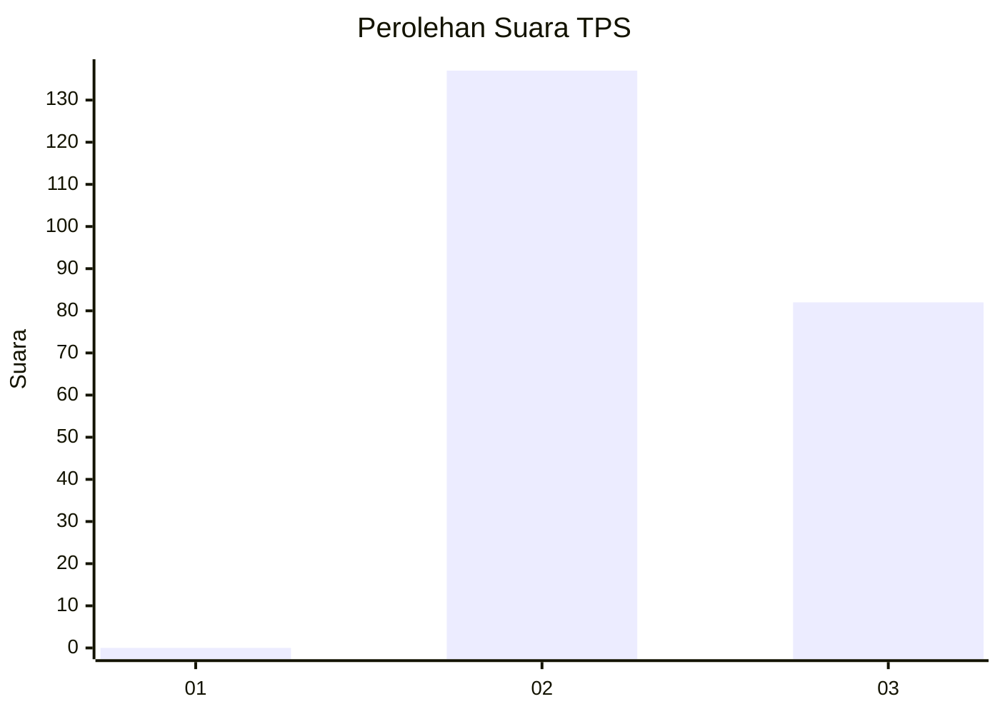
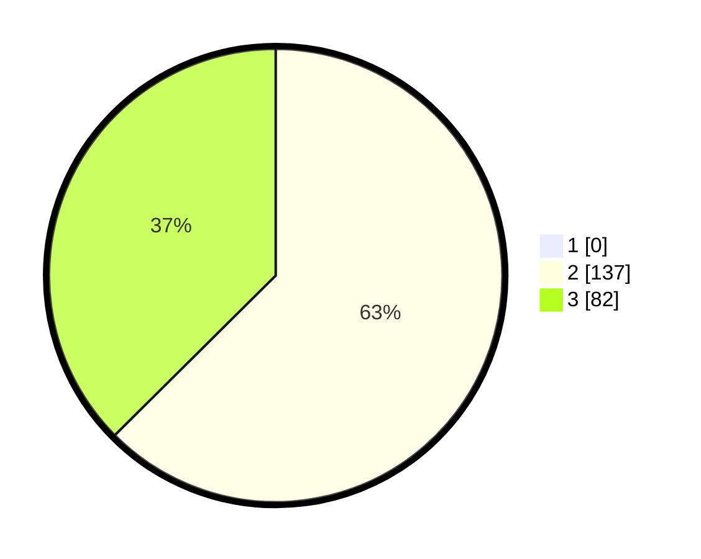

# Hasil

## Grafik

## Tabel

| No. | Nama Paslon    | Suara | Suara (raw) | Persentase |
|:--- |:-------------- | -----:| -----------:| ----------:|
| 1   | ANIES MUHAIMIN | 0     | [0][p-1]    | 0,00       |
| 2   | PRABOWO GIBRAN | 137   | [137][p-2]  | 62,56      |
| 3   | GANJAR MAHFUD  | 82    | [82][p-3]   | 37,44      |

[p-1]: https://github.com/gigit-pemilu/pemilu-2024-51-bali/blob/main/pilpres/hitung-suara/sub/51-bali/sub/02-tabanan/sub/03-selemadeg-barat/sub/2001-mundeh/sub/004-tps/sub/paslon-1.txt
[p-2]: https://github.com/gigit-pemilu/pemilu-2024-51-bali/blob/main/pilpres/hitung-suara/sub/51-bali/sub/02-tabanan/sub/03-selemadeg-barat/sub/2001-mundeh/sub/004-tps/sub/paslon-2.txt
[p-3]: https://github.com/gigit-pemilu/pemilu-2024-51-bali/blob/main/pilpres/hitung-suara/sub/51-bali/sub/02-tabanan/sub/03-selemadeg-barat/sub/2001-mundeh/sub/004-tps/sub/paslon-3.txt

## Foto C Plano

https://sirekap-obj-formc.kpu.go.id/5aea/pemilu/ppwp/51/02/03/20/01/5102032001004-20240216-004745--80313983-a0f1-4b16-a191-0ded2c6fc3cd.jpg

https://sirekap-obj-formc.kpu.go.id/5aea/pemilu/ppwp/51/02/03/20/01/5102032001004-20240216-004759--1afef334-e276-4dae-8689-6bdfb87741ee.jpg

https://sirekap-obj-formc.kpu.go.id/5aea/pemilu/ppwp/51/02/03/20/01/5102032001004-20240216-004754--fa29b85e-42d2-45bf-bb8e-3121c25f3595.jpg

## Metadata

| Key        | Value               |
| ---------- | ------------------- |
| Time Stamp | 2024-02-16 10:00:28 |

## DATA PEMILIH TETAP

Jumlah pemilih dalam DPT: **276**.
 * L: **138**.
 * P: **138**.

## DATA PENGGUNA HAK PILIH

Jumlah pengguna hak pilih dalam DPT: **222**.
 * L: **107**.
 * P: **115**.

Jumlah pengguna hak pilih dalam DPTb: **1**.
 * L: **0**.
 * P: **1**.

Jumlah pengguna hak pilih dalam DPK: **0**.
 * L: **0**.
 * P: **0**.

Jumlah pengguna hak pilih: **223**.
 * L: **107**.
 * P: **116**.

## JUMLAH SUARA SAH DAN TIDAK SAH

JUMLAH SELURUH SUARA SAH: **219**.

JUMLAH SUARA TIDAK SAH: **4**.

JUMLAH SELURUH SUARA SAH DAN SUARA TIDAK SAH: **223**.

