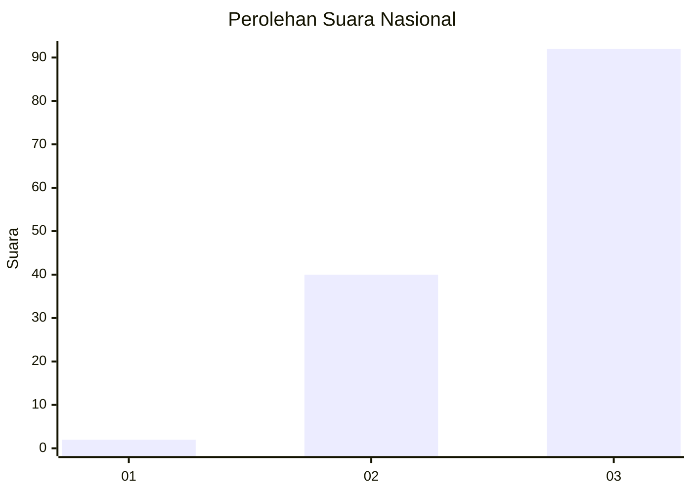
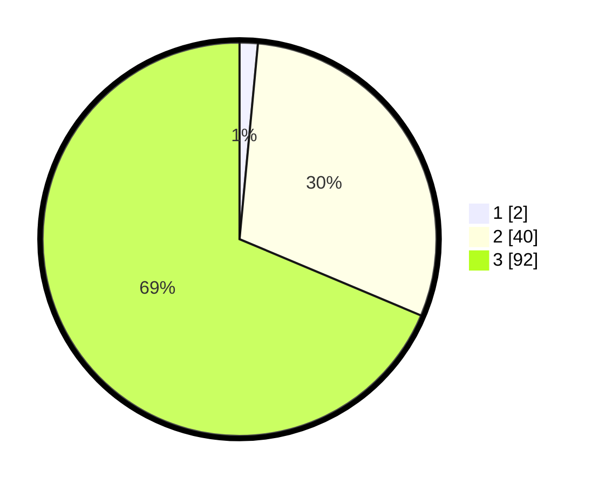

# Hasil

## Grafik

## Tabel

| No. | Nama Paslon    | Suara | Suara (raw) | Persentase |
|:--- |:-------------- | -----:| -----------:| ----------:|
| 1   | ANIES MUHAIMIN | 2     | [2][p-1]    | 1,49       |
| 2   | PRABOWO GIBRAN | 40    | [40][p-2]   | 29,85      |
| 3   | GANJAR MAHFUD  | 92    | [92][p-3]   | 68,66      |

[p-1]: https://github.com/gigit-pemilu/pemilu-2024/blob/main/pilpres/hitung-suara/sub/51-bali/sub/02-tabanan/sub/03-selemadeg-barat/sub/2001-mundeh/sub/005-tps/sub/paslon-1.txt
[p-2]: https://github.com/gigit-pemilu/pemilu-2024/blob/main/pilpres/hitung-suara/sub/51-bali/sub/02-tabanan/sub/03-selemadeg-barat/sub/2001-mundeh/sub/005-tps/sub/paslon-2.txt
[p-3]: https://github.com/gigit-pemilu/pemilu-2024/blob/main/pilpres/hitung-suara/sub/51-bali/sub/02-tabanan/sub/03-selemadeg-barat/sub/2001-mundeh/sub/005-tps/sub/paslon-3.txt

## Foto C Plano

https://sirekap-obj-formc.kpu.go.id/e95c/pemilu/ppwp/51/02/03/20/01/5102032001005-20240214-191112--6237ce82-92e7-4c00-a114-5fc37b07b066.jpg

https://sirekap-obj-formc.kpu.go.id/e95c/pemilu/ppwp/51/02/03/20/01/5102032001005-20240214-191134--2f60a165-387d-4bcf-9187-13c529a0847c.jpg

https://sirekap-obj-formc.kpu.go.id/e95c/pemilu/ppwp/51/02/03/20/01/5102032001005-20240214-191123--1fbed2b1-355d-477b-b1d2-01ff87854abe.jpg

## Metadata

| Key        | Value               |
| ---------- | ------------------- |
| Time Stamp | 2024-02-15 22:00:27 |

## DATA PEMILIH TETAP

Jumlah pemilih dalam DPT: **134**.
 * L: **66**.
 * P: **68**.

## DATA PENGGUNA HAK PILIH

Jumlah pengguna hak pilih dalam DPT: **131**.
 * L: **64**.
 * P: **67**.

Jumlah pengguna hak pilih dalam DPTb: **3**.
 * L: **2**.
 * P: **1**.

Jumlah pengguna hak pilih dalam DPK: **0**.
 * L: **0**.
 * P: **0**.

Jumlah pengguna hak pilih: **134**.
 * L: **66**.
 * P: **68**.

## JUMLAH SUARA SAH DAN TIDAK SAH

JUMLAH SELURUH SUARA SAH: **134**.

JUMLAH SUARA TIDAK SAH: **0**.

JUMLAH SELURUH SUARA SAH DAN SUARA TIDAK SAH: **134**.

