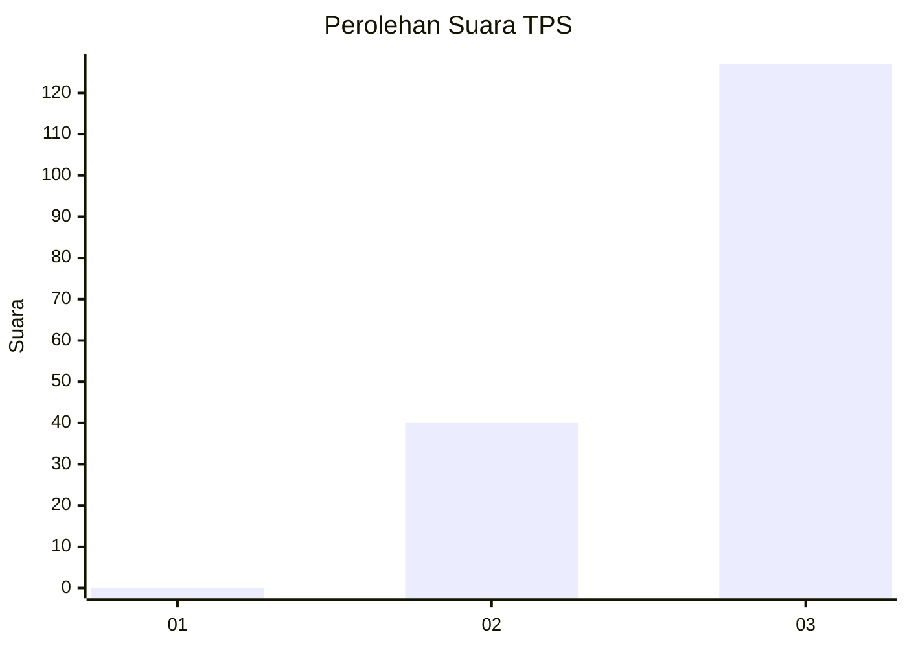
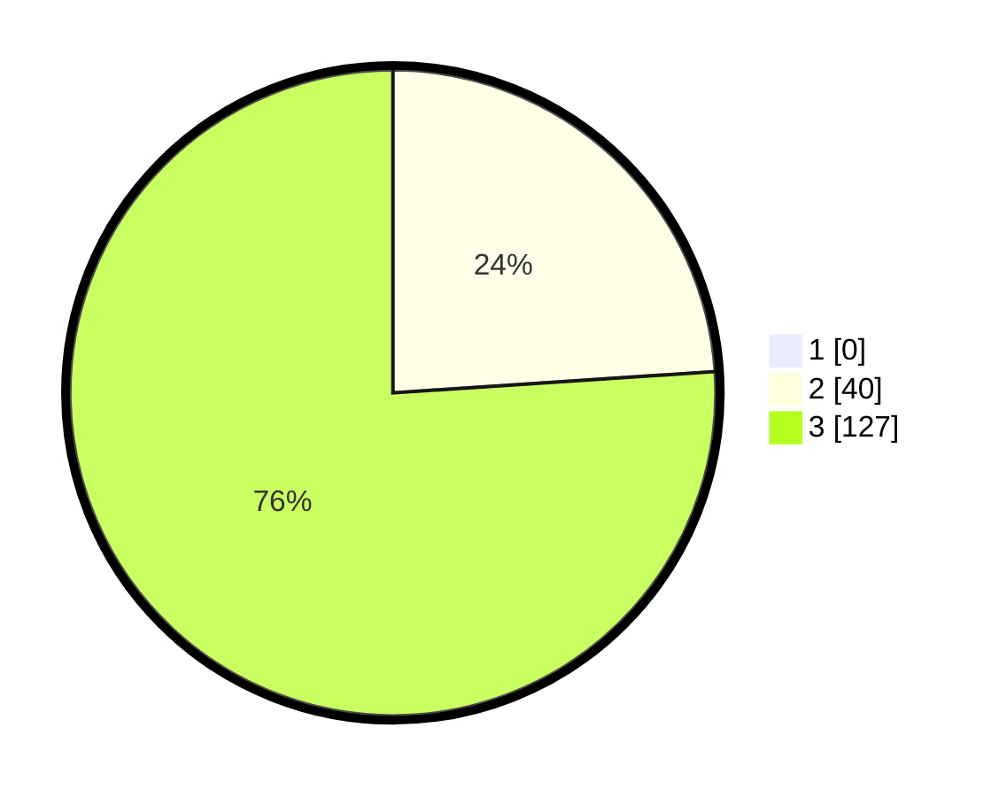

# Hasil

## Grafik

## Tabel

| No. | Nama Paslon    | Suara | Suara (raw) | Persentase |
|:--- |:-------------- | -----:| -----------:| ----------:|
| 1   | ANIES MUHAIMIN | 0     | [0][p-1]    | 0,00       |
| 2   | PRABOWO GIBRAN | 40    | [40][p-2]   | 23,95      |
| 3   | GANJAR MAHFUD  | 127   | [127][p-3]  | 76,05      |

[p-1]: https://github.com/gigit-pemilu/pemilu-2024-51-bali/blob/main/pilpres/hitung-suara/sub/51-bali/sub/02-tabanan/sub/03-selemadeg-barat/sub/2001-mundeh/sub/007-tps/sub/paslon-1.txt
[p-2]: https://github.com/gigit-pemilu/pemilu-2024-51-bali/blob/main/pilpres/hitung-suara/sub/51-bali/sub/02-tabanan/sub/03-selemadeg-barat/sub/2001-mundeh/sub/007-tps/sub/paslon-2.txt
[p-3]: https://github.com/gigit-pemilu/pemilu-2024-51-bali/blob/main/pilpres/hitung-suara/sub/51-bali/sub/02-tabanan/sub/03-selemadeg-barat/sub/2001-mundeh/sub/007-tps/sub/paslon-3.txt

## Foto C Plano

https://sirekap-obj-formc.kpu.go.id/cb8f/pemilu/ppwp/51/02/03/20/01/5102032001007-20240216-005602--2db1a58e-c457-4e83-a990-8d3ae8524761.jpg

https://sirekap-obj-formc.kpu.go.id/cb8f/pemilu/ppwp/51/02/03/20/01/5102032001007-20240216-005613--1368c122-c64b-4650-ab01-cb7d9119494b.jpg

https://sirekap-obj-formc.kpu.go.id/cb8f/pemilu/ppwp/51/02/03/20/01/5102032001007-20240216-005610--c743eac9-1f37-43da-9c3b-5c57bbd46211.jpg

## Metadata

| Key        | Value               |
| ---------- | ------------------- |
| Time Stamp | 2024-02-16 10:00:28 |

## DATA PEMILIH TETAP

Jumlah pemilih dalam DPT: **192**.
 * L: **93**.
 * P: **99**.

## DATA PENGGUNA HAK PILIH

Jumlah pengguna hak pilih dalam DPT: **168**.
 * L: **82**.
 * P: **86**.

Jumlah pengguna hak pilih dalam DPTb: **0**.
 * L: **0**.
 * P: **0**.

Jumlah pengguna hak pilih dalam DPK: **0**.
 * L: **0**.
 * P: **0**.

Jumlah pengguna hak pilih: **168**.
 * L: **82**.
 * P: **86**.

## JUMLAH SUARA SAH DAN TIDAK SAH

JUMLAH SELURUH SUARA SAH: **167**.

JUMLAH SUARA TIDAK SAH: **1**.

JUMLAH SELURUH SUARA SAH DAN SUARA TIDAK SAH: **168**.

