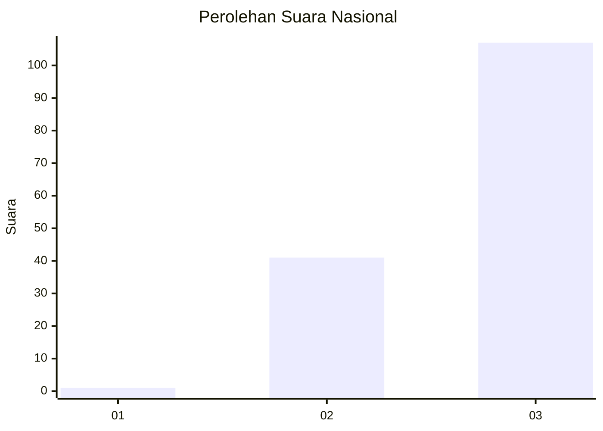
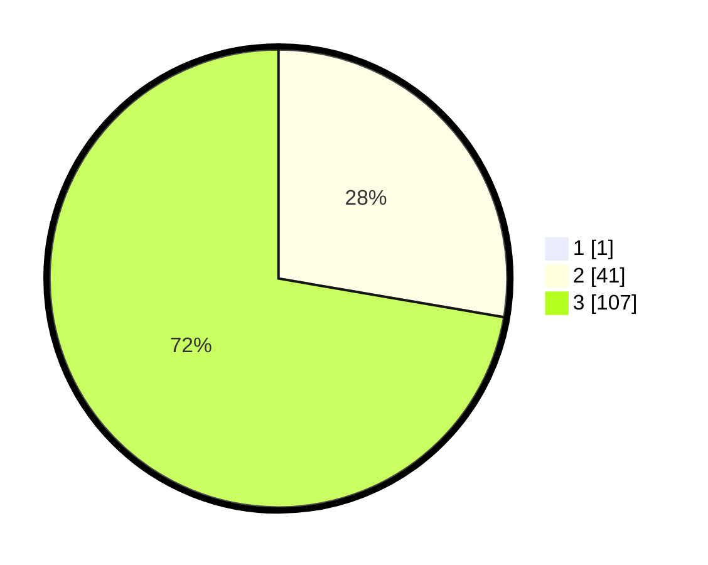

# Hasil

## Grafik

## Tabel

| No. | Nama Paslon    | Suara | Suara (raw) | Persentase |
|:--- |:-------------- | -----:| -----------:| ----------:|
| 1   | ANIES MUHAIMIN | 1     | [1][p-1]    | 0,67       |
| 2   | PRABOWO GIBRAN | 41    | [41][p-2]   | 27,52      |
| 3   | GANJAR MAHFUD  | 107   | [107][p-3]  | 71,81      |

[p-1]: https://github.com/gigit-pemilu/pemilu-2024/blob/main/pilpres/hitung-suara/sub/51-bali/sub/02-tabanan/sub/03-selemadeg-barat/sub/2001-mundeh/sub/008-tps/sub/paslon-1.txt
[p-2]: https://github.com/gigit-pemilu/pemilu-2024/blob/main/pilpres/hitung-suara/sub/51-bali/sub/02-tabanan/sub/03-selemadeg-barat/sub/2001-mundeh/sub/008-tps/sub/paslon-2.txt
[p-3]: https://github.com/gigit-pemilu/pemilu-2024/blob/main/pilpres/hitung-suara/sub/51-bali/sub/02-tabanan/sub/03-selemadeg-barat/sub/2001-mundeh/sub/008-tps/sub/paslon-3.txt

## Foto C Plano

https://sirekap-obj-formc.kpu.go.id/7264/pemilu/ppwp/51/02/03/20/01/5102032001008-20240216-053201--1e7f90b9-d59f-456a-aa87-f10b1ed759d4.jpg

https://sirekap-obj-formc.kpu.go.id/7264/pemilu/ppwp/51/02/03/20/01/5102032001008-20240216-053202--4e83b984-2036-4710-9fe8-719bd8421cba.jpg

https://sirekap-obj-formc.kpu.go.id/7264/pemilu/ppwp/51/02/03/20/01/5102032001008-20240216-053202--31730cca-82e6-460d-a18d-fdd4dd45b788.jpg

## Metadata

| Key        | Value               |
| ---------- | ------------------- |
| Time Stamp | 2024-02-16 10:00:28 |

## DATA PEMILIH TETAP

Jumlah pemilih dalam DPT: **187**.
 * L: **86**.
 * P: **101**.

## DATA PENGGUNA HAK PILIH

Jumlah pengguna hak pilih dalam DPT: **150**.
 * L: **73**.
 * P: **77**.

Jumlah pengguna hak pilih dalam DPTb: **0**.
 * L: **0**.
 * P: **0**.

Jumlah pengguna hak pilih dalam DPK: **1**.
 * L: **1**.
 * P: **0**.

Jumlah pengguna hak pilih: **151**.
 * L: **74**.
 * P: **77**.

## JUMLAH SUARA SAH DAN TIDAK SAH

JUMLAH SELURUH SUARA SAH: **149**.

JUMLAH SUARA TIDAK SAH: **2**.

JUMLAH SELURUH SUARA SAH DAN SUARA TIDAK SAH: **151**.

