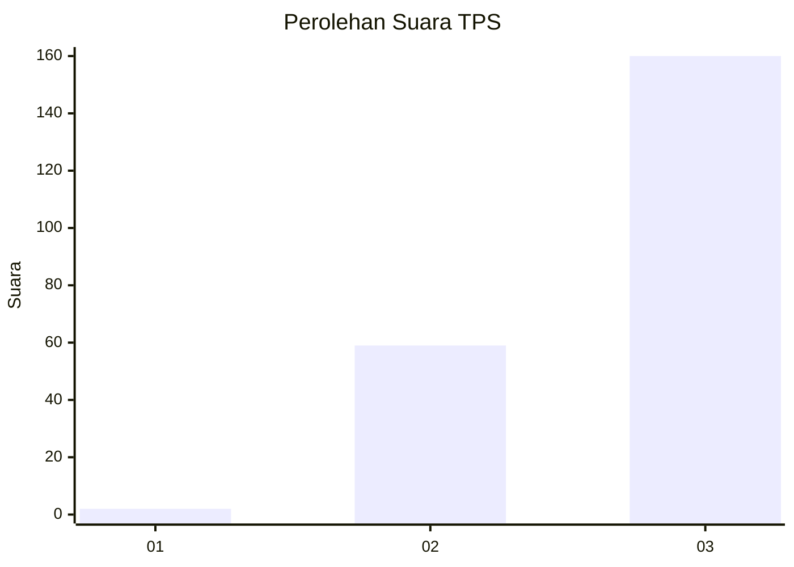
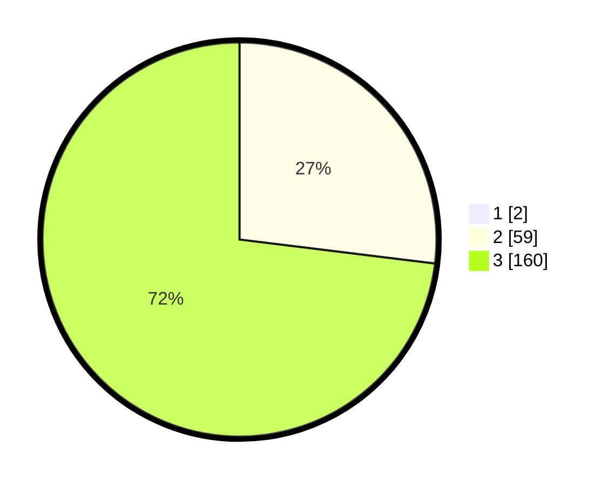

# Hasil

## Grafik

## Tabel

| No. | Nama Paslon    | Suara | Suara (raw) | Persentase |
|:--- |:-------------- | -----:| -----------:| ----------:|
| 1   | ANIES MUHAIMIN | 2     | [2][p-1]    | 0,90       |
| 2   | PRABOWO GIBRAN | 59    | [59][p-2]   | 26,70      |
| 3   | GANJAR MAHFUD  | 160   | [160][p-3]  | 72,40      |

[p-1]: https://github.com/gigit-pemilu/pemilu-2024-51-bali/blob/main/pilpres/hitung-suara/sub/51-bali/sub/02-tabanan/sub/03-selemadeg-barat/sub/2001-mundeh/sub/011-tps/sub/paslon-1.txt
[p-2]: https://github.com/gigit-pemilu/pemilu-2024-51-bali/blob/main/pilpres/hitung-suara/sub/51-bali/sub/02-tabanan/sub/03-selemadeg-barat/sub/2001-mundeh/sub/011-tps/sub/paslon-2.txt
[p-3]: https://github.com/gigit-pemilu/pemilu-2024-51-bali/blob/main/pilpres/hitung-suara/sub/51-bali/sub/02-tabanan/sub/03-selemadeg-barat/sub/2001-mundeh/sub/011-tps/sub/paslon-3.txt

## Foto C Plano

https://sirekap-obj-formc.kpu.go.id/96c1/pemilu/ppwp/51/02/03/20/01/5102032001011-20240216-042547--69baf01b-2318-4370-a2a4-aa9116a55a82.jpg

https://sirekap-obj-formc.kpu.go.id/96c1/pemilu/ppwp/51/02/03/20/01/5102032001011-20240216-042622--617ee4e6-caa7-4110-bb12-9563816563b1.jpg

https://sirekap-obj-formc.kpu.go.id/96c1/pemilu/ppwp/51/02/03/20/01/5102032001011-20240216-042549--c85b90d7-7262-4a3d-85a9-b0aa653bb7ce.jpg

## Metadata

| Key        | Value               |
| ---------- | ------------------- |
| Time Stamp | 2024-02-16 10:00:28 |

## DATA PEMILIH TETAP

Jumlah pemilih dalam DPT: **244**.
 * L: **119**.
 * P: **125**.

## DATA PENGGUNA HAK PILIH

Jumlah pengguna hak pilih dalam DPT: **221**.
 * L: **112**.
 * P: **109**.

Jumlah pengguna hak pilih dalam DPTb: **1**.
 * L: **1**.
 * P: **0**.

Jumlah pengguna hak pilih dalam DPK: **0**.
 * L: **0**.
 * P: **0**.

Jumlah pengguna hak pilih: **222**.
 * L: **113**.
 * P: **109**.

## JUMLAH SUARA SAH DAN TIDAK SAH

JUMLAH SELURUH SUARA SAH: **221**.

JUMLAH SUARA TIDAK SAH: **1**.

JUMLAH SELURUH SUARA SAH DAN SUARA TIDAK SAH: **222**.

