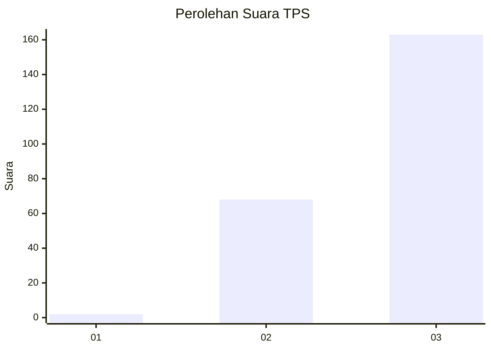
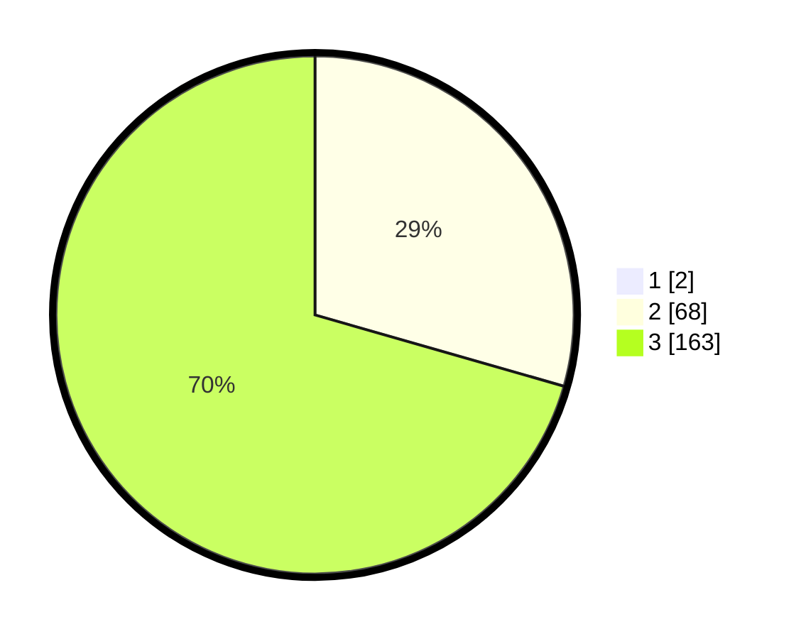

# Hasil

## Grafik

## Tabel

| No. | Nama Paslon    | Suara | Suara (raw) | Persentase |
|:--- |:-------------- | -----:| -----------:| ----------:|
| 1   | ANIES MUHAIMIN | 2     | [2][p-1]    | 0,86       |
| 2   | PRABOWO GIBRAN | 68    | [68][p-2]   | 29,18      |
| 3   | GANJAR MAHFUD  | 163   | [163][p-3]  | 69,96      |

[p-1]: https://github.com/gigit-pemilu/pemilu-2024-51-bali/blob/main/pilpres/hitung-suara/sub/51-bali/sub/02-tabanan/sub/03-selemadeg-barat/sub/2002-mundeh-kangin/sub/001-tps/sub/paslon-1.txt
[p-2]: https://github.com/gigit-pemilu/pemilu-2024-51-bali/blob/main/pilpres/hitung-suara/sub/51-bali/sub/02-tabanan/sub/03-selemadeg-barat/sub/2002-mundeh-kangin/sub/001-tps/sub/paslon-2.txt
[p-3]: https://github.com/gigit-pemilu/pemilu-2024-51-bali/blob/main/pilpres/hitung-suara/sub/51-bali/sub/02-tabanan/sub/03-selemadeg-barat/sub/2002-mundeh-kangin/sub/001-tps/sub/paslon-3.txt

## Foto C Plano

https://sirekap-obj-formc.kpu.go.id/13ed/pemilu/ppwp/51/02/03/20/02/5102032002001-20240215-235416--3829d2e1-f559-4171-ba25-4bc46667c31b.jpg

https://sirekap-obj-formc.kpu.go.id/13ed/pemilu/ppwp/51/02/03/20/02/5102032002001-20240215-235420--9f3f0ff1-c7c6-4565-8f4a-cf25e18845e3.jpg

https://sirekap-obj-formc.kpu.go.id/13ed/pemilu/ppwp/51/02/03/20/02/5102032002001-20240215-235418--aa9feb82-e0e4-419d-b7ed-4c17cafc2bee.jpg

## Metadata

| Key        | Value               |
| ---------- | ------------------- |
| Time Stamp | 2024-02-16 10:00:28 |

## DATA PEMILIH TETAP

Jumlah pemilih dalam DPT: **237**.
 * L: **123**.
 * P: **114**.

## DATA PENGGUNA HAK PILIH

Jumlah pengguna hak pilih dalam DPT: **232**.
 * L: **120**.
 * P: **112**.

Jumlah pengguna hak pilih dalam DPTb: **0**.
 * L: **0**.
 * P: **0**.

Jumlah pengguna hak pilih dalam DPK: **2**.
 * L: **0**.
 * P: **2**.

Jumlah pengguna hak pilih: **234**.
 * L: **120**.
 * P: **114**.

## JUMLAH SUARA SAH DAN TIDAK SAH

JUMLAH SELURUH SUARA SAH: **233**.

JUMLAH SUARA TIDAK SAH: **1**.

JUMLAH SELURUH SUARA SAH DAN SUARA TIDAK SAH: **234**.

