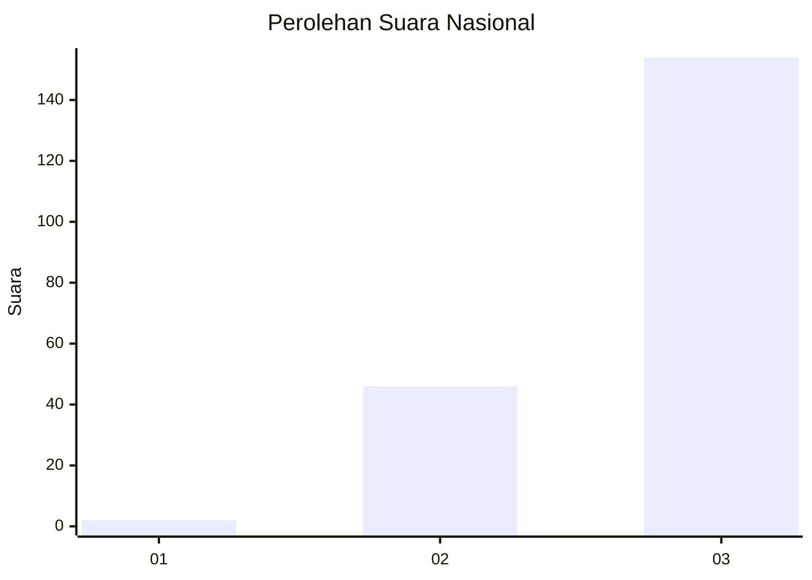
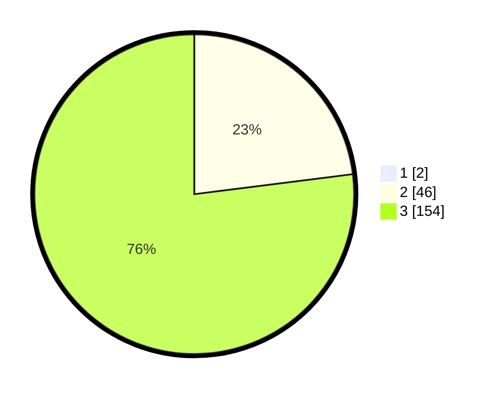

# Hasil

## Grafik

## Tabel

| No. | Nama Paslon    | Suara | Suara (raw) | Persentase |
|:--- |:-------------- | -----:| -----------:| ----------:|
| 1   | ANIES MUHAIMIN | 2     | [2][p-1]    | 0,99       |
| 2   | PRABOWO GIBRAN | 46    | [46][p-2]   | 22,77      |
| 3   | GANJAR MAHFUD  | 154   | [154][p-3]  | 76,24      |

[p-1]: https://github.com/gigit-pemilu/pemilu-2024/blob/main/pilpres/hitung-suara/sub/51-bali/sub/02-tabanan/sub/03-selemadeg-barat/sub/2002-mundeh-kangin/sub/002-tps/sub/paslon-1.txt
[p-2]: https://github.com/gigit-pemilu/pemilu-2024/blob/main/pilpres/hitung-suara/sub/51-bali/sub/02-tabanan/sub/03-selemadeg-barat/sub/2002-mundeh-kangin/sub/002-tps/sub/paslon-2.txt
[p-3]: https://github.com/gigit-pemilu/pemilu-2024/blob/main/pilpres/hitung-suara/sub/51-bali/sub/02-tabanan/sub/03-selemadeg-barat/sub/2002-mundeh-kangin/sub/002-tps/sub/paslon-3.txt

## Foto C Plano

https://sirekap-obj-formc.kpu.go.id/440b/pemilu/ppwp/51/02/03/20/02/5102032002002-20240215-214751--777e0e2d-9c85-4c02-a8e4-fcb1d6cb0e88.jpg

https://sirekap-obj-formc.kpu.go.id/440b/pemilu/ppwp/51/02/03/20/02/5102032002002-20240215-214754--e8e80a09-a5fb-4b79-91bf-7796fe80512d.jpg

https://sirekap-obj-formc.kpu.go.id/440b/pemilu/ppwp/51/02/03/20/02/5102032002002-20240215-214752--b3d9acf2-275a-4cdb-9a17-809c92ad7695.jpg

## Metadata

| Key        | Value               |
| ---------- | ------------------- |
| Time Stamp | 2024-02-15 22:30:27 |

## DATA PEMILIH TETAP

Jumlah pemilih dalam DPT: **238**.
 * L: **128**.
 * P: **110**.

## DATA PENGGUNA HAK PILIH

Jumlah pengguna hak pilih dalam DPT: **203**.
 * L: **111**.
 * P: **92**.

Jumlah pengguna hak pilih dalam DPTb: **0**.
 * L: **0**.
 * P: **0**.

Jumlah pengguna hak pilih dalam DPK: **2**.
 * L: **1**.
 * P: **1**.

Jumlah pengguna hak pilih: **205**.
 * L: **112**.
 * P: **93**.

## JUMLAH SUARA SAH DAN TIDAK SAH

JUMLAH SELURUH SUARA SAH: **202**.

JUMLAH SUARA TIDAK SAH: **3**.

JUMLAH SELURUH SUARA SAH DAN SUARA TIDAK SAH: **205**.

