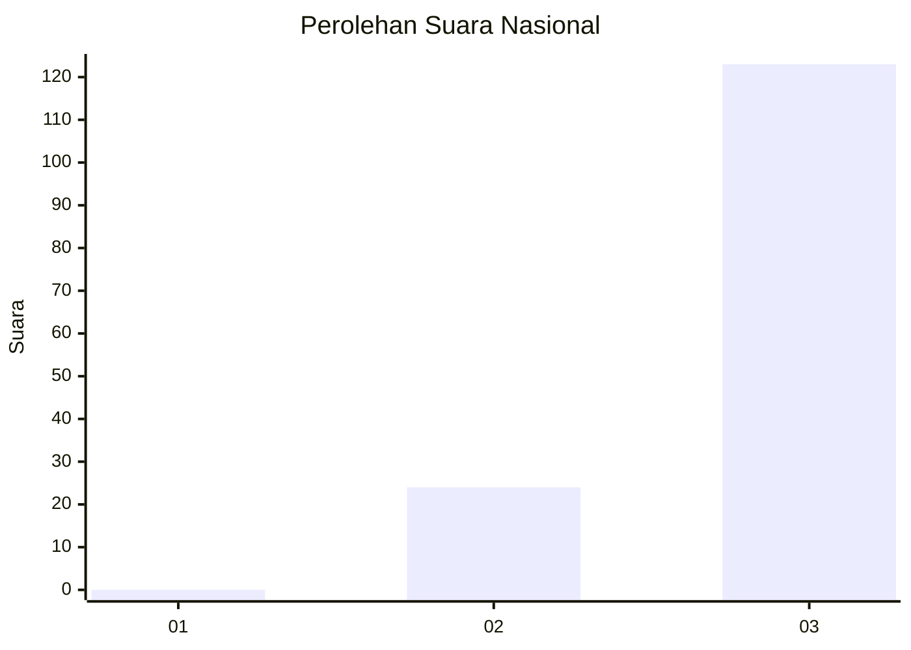
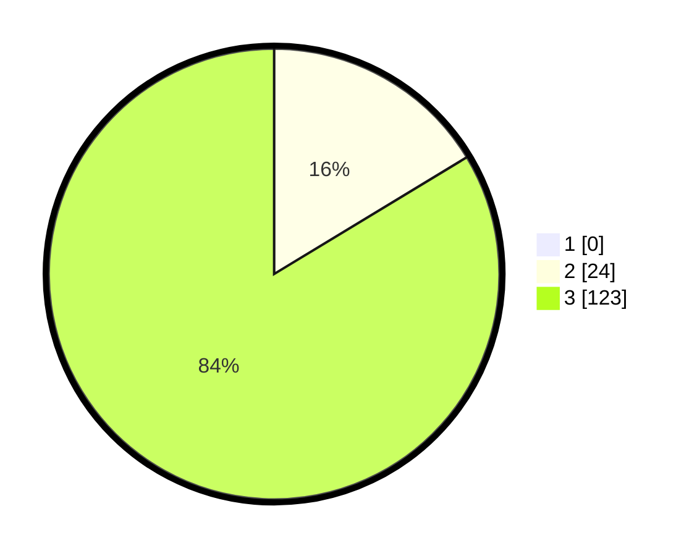

# Hasil

## Grafik

## Tabel

| No. | Nama Paslon    | Suara | Suara (raw) | Persentase |
|:--- |:-------------- | -----:| -----------:| ----------:|
| 1   | ANIES MUHAIMIN | 0     | [0][p-1]    | 0,00       |
| 2   | PRABOWO GIBRAN | 24    | [24][p-2]   | 16,33      |
| 3   | GANJAR MAHFUD  | 123   | [123][p-3]  | 83,67      |

[p-1]: https://github.com/gigit-pemilu/pemilu-2024/blob/main/pilpres/hitung-suara/sub/51-bali/sub/02-tabanan/sub/03-selemadeg-barat/sub/2002-mundeh-kangin/sub/005-tps/sub/paslon-1.txt
[p-2]: https://github.com/gigit-pemilu/pemilu-2024/blob/main/pilpres/hitung-suara/sub/51-bali/sub/02-tabanan/sub/03-selemadeg-barat/sub/2002-mundeh-kangin/sub/005-tps/sub/paslon-2.txt
[p-3]: https://github.com/gigit-pemilu/pemilu-2024/blob/main/pilpres/hitung-suara/sub/51-bali/sub/02-tabanan/sub/03-selemadeg-barat/sub/2002-mundeh-kangin/sub/005-tps/sub/paslon-3.txt

## Foto C Plano

https://sirekap-obj-formc.kpu.go.id/9407/pemilu/ppwp/51/02/03/20/02/5102032002005-20240216-062859--b9569f77-a371-405c-90e0-9d582763ed7a.jpg

https://sirekap-obj-formc.kpu.go.id/9407/pemilu/ppwp/51/02/03/20/02/5102032002005-20240216-062902--09c74cee-b8b0-40b4-b962-560324ab6a18.jpg

https://sirekap-obj-formc.kpu.go.id/9407/pemilu/ppwp/51/02/03/20/02/5102032002005-20240216-062901--05891685-535c-46e5-819b-0465158115a0.jpg

## Metadata

| Key        | Value               |
| ---------- | ------------------- |
| Time Stamp | 2024-02-16 10:00:28 |

## DATA PEMILIH TETAP

Jumlah pemilih dalam DPT: **150**.
 * L: **75**.
 * P: **75**.

## DATA PENGGUNA HAK PILIH

Jumlah pengguna hak pilih dalam DPT: **147**.
 * L: **74**.
 * P: **73**.

Jumlah pengguna hak pilih dalam DPTb: **0**.
 * L: **0**.
 * P: **0**.

Jumlah pengguna hak pilih dalam DPK: **0**.
 * L: **0**.
 * P: **0**.

Jumlah pengguna hak pilih: **147**.
 * L: **74**.
 * P: **73**.

## JUMLAH SUARA SAH DAN TIDAK SAH

JUMLAH SELURUH SUARA SAH: **147**.

JUMLAH SUARA TIDAK SAH: **0**.

JUMLAH SELURUH SUARA SAH DAN SUARA TIDAK SAH: **147**.

