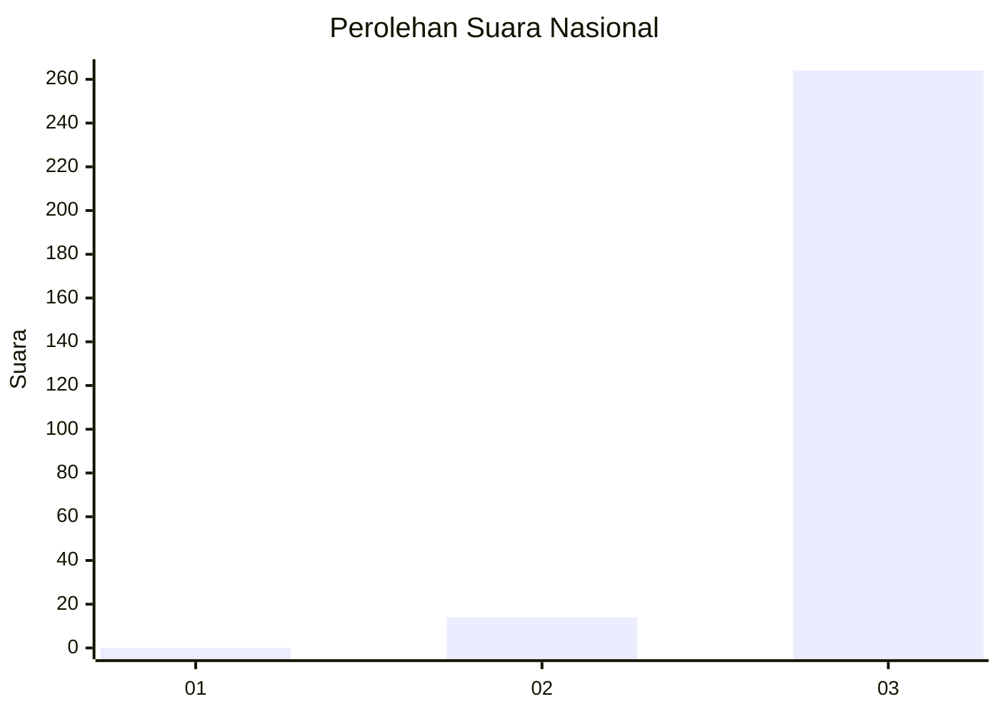
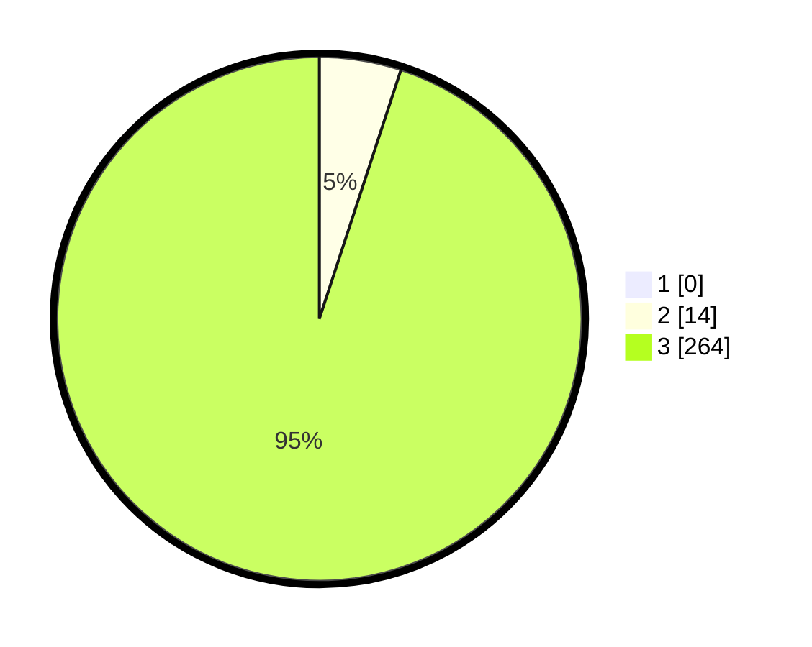

# Hasil

## Grafik

## Tabel

| No. | Nama Paslon    | Suara | Suara (raw) | Persentase |
|:--- |:-------------- | -----:| -----------:| ----------:|
| 1   | ANIES MUHAIMIN | 0     | [0][p-1]    | 0,00       |
| 2   | PRABOWO GIBRAN | 14    | [14][p-2]   | 5,04       |
| 3   | GANJAR MAHFUD  | 264   | [264][p-3]  | 94,96      |

[p-1]: https://github.com/gigit-pemilu/pemilu-2024/blob/main/pilpres/hitung-suara/sub/51-bali/sub/02-tabanan/sub/03-selemadeg-barat/sub/2002-mundeh-kangin/sub/007-tps/sub/paslon-1.txt
[p-2]: https://github.com/gigit-pemilu/pemilu-2024/blob/main/pilpres/hitung-suara/sub/51-bali/sub/02-tabanan/sub/03-selemadeg-barat/sub/2002-mundeh-kangin/sub/007-tps/sub/paslon-2.txt
[p-3]: https://github.com/gigit-pemilu/pemilu-2024/blob/main/pilpres/hitung-suara/sub/51-bali/sub/02-tabanan/sub/03-selemadeg-barat/sub/2002-mundeh-kangin/sub/007-tps/sub/paslon-3.txt

## Foto C Plano

https://sirekap-obj-formc.kpu.go.id/ea03/pemilu/ppwp/51/02/03/20/02/5102032002007-20240216-001103--71d8dd3b-c279-4d64-a038-44128733b06f.jpg

https://sirekap-obj-formc.kpu.go.id/ea03/pemilu/ppwp/51/02/03/20/02/5102032002007-20240216-001105--a5089af4-c64a-4b8c-9aaf-da75df69f7f7.jpg

https://sirekap-obj-formc.kpu.go.id/ea03/pemilu/ppwp/51/02/03/20/02/5102032002007-20240216-001104--835d9f4f-8fa1-4157-9339-a8491d4287f2.jpg

## Metadata

| Key        | Value               |
| ---------- | ------------------- |
| Time Stamp | 2024-02-16 10:00:28 |

## DATA PEMILIH TETAP

Jumlah pemilih dalam DPT: **287**.
 * L: **146**.
 * P: **141**.

## DATA PENGGUNA HAK PILIH

Jumlah pengguna hak pilih dalam DPT: **278**.
 * L: **142**.
 * P: **136**.

Jumlah pengguna hak pilih dalam DPTb: **0**.
 * L: **0**.
 * P: **0**.

Jumlah pengguna hak pilih dalam DPK: **0**.
 * L: **0**.
 * P: **0**.

Jumlah pengguna hak pilih: **278**.
 * L: **142**.
 * P: **136**.

## JUMLAH SUARA SAH DAN TIDAK SAH

JUMLAH SELURUH SUARA SAH: **278**.

JUMLAH SUARA TIDAK SAH: **0**.

JUMLAH SELURUH SUARA SAH DAN SUARA TIDAK SAH: **278**.

