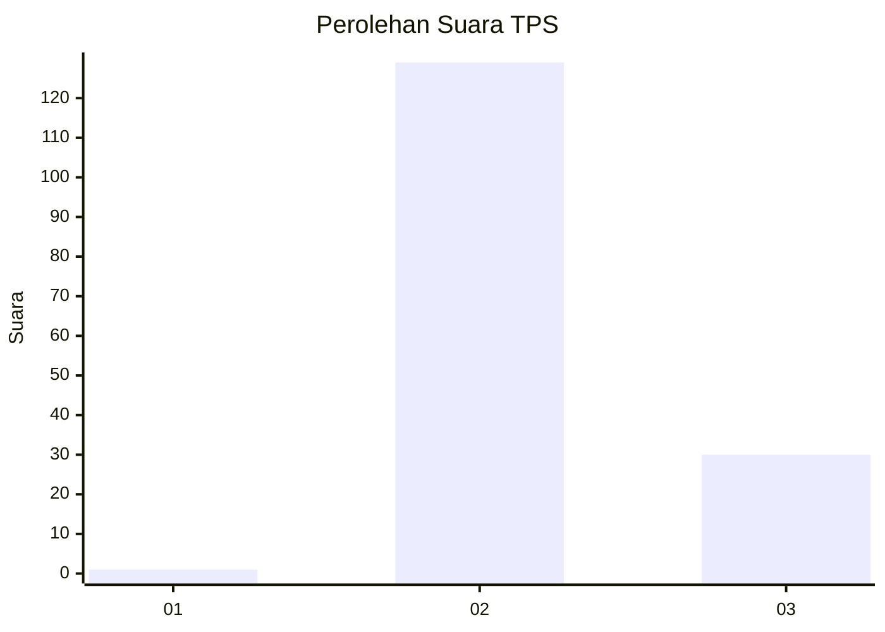
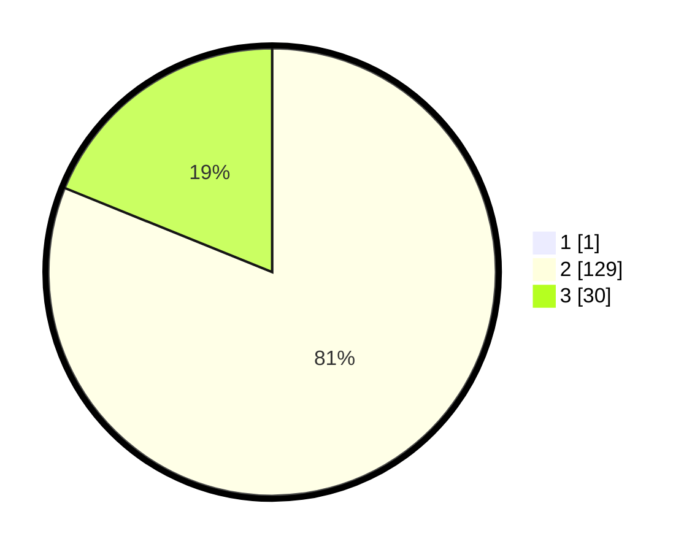

# Hasil

## Grafik

## Tabel

| No. | Nama Paslon    | Suara | Suara (raw) | Persentase |
|:--- |:-------------- | -----:| -----------:| ----------:|
| 1   | ANIES MUHAIMIN | 1     | [1][p-1]    | 0,63       |
| 2   | PRABOWO GIBRAN | 129   | [129][p-2]  | 80,63      |
| 3   | GANJAR MAHFUD  | 30    | [30][p-3]   | 18,75      |

[p-1]: https://github.com/gigit-pemilu/pemilu-2024-51-bali/blob/main/pilpres/hitung-suara/sub/51-bali/sub/02-tabanan/sub/03-selemadeg-barat/sub/2003-lalanglinggah/sub/001-tps/sub/paslon-1.txt
[p-2]: https://github.com/gigit-pemilu/pemilu-2024-51-bali/blob/main/pilpres/hitung-suara/sub/51-bali/sub/02-tabanan/sub/03-selemadeg-barat/sub/2003-lalanglinggah/sub/001-tps/sub/paslon-2.txt
[p-3]: https://github.com/gigit-pemilu/pemilu-2024-51-bali/blob/main/pilpres/hitung-suara/sub/51-bali/sub/02-tabanan/sub/03-selemadeg-barat/sub/2003-lalanglinggah/sub/001-tps/sub/paslon-3.txt

## Foto C Plano

https://sirekap-obj-formc.kpu.go.id/1cbc/pemilu/ppwp/51/02/03/20/03/5102032003001-20240216-085746--4c070f00-314f-4cd5-8f16-b5d555046ed4.jpg

https://sirekap-obj-formc.kpu.go.id/1cbc/pemilu/ppwp/51/02/03/20/03/5102032003001-20240216-085755--072a0eed-b4f7-468b-bfc0-9ba7be4a5726.jpg

https://sirekap-obj-formc.kpu.go.id/1cbc/pemilu/ppwp/51/02/03/20/03/5102032003001-20240216-085747--8fe01bd2-deab-43ef-ac93-04c7020cb401.jpg

## Metadata

| Key        | Value               |
| ---------- | ------------------- |
| Time Stamp | 2024-02-16 10:00:28 |

## DATA PEMILIH TETAP

Jumlah pemilih dalam DPT: **187**.
 * L: **91**.
 * P: **96**.

## DATA PENGGUNA HAK PILIH

Jumlah pengguna hak pilih dalam DPT: **161**.
 * L: **78**.
 * P: **83**.

Jumlah pengguna hak pilih dalam DPTb: **1**.
 * L: **0**.
 * P: **1**.

Jumlah pengguna hak pilih dalam DPK: **0**.
 * L: **0**.
 * P: **0**.

Jumlah pengguna hak pilih: **162**.
 * L: **78**.
 * P: **84**.

## JUMLAH SUARA SAH DAN TIDAK SAH

JUMLAH SELURUH SUARA SAH: **160**.

JUMLAH SUARA TIDAK SAH: **2**.

JUMLAH SELURUH SUARA SAH DAN SUARA TIDAK SAH: **162**.

