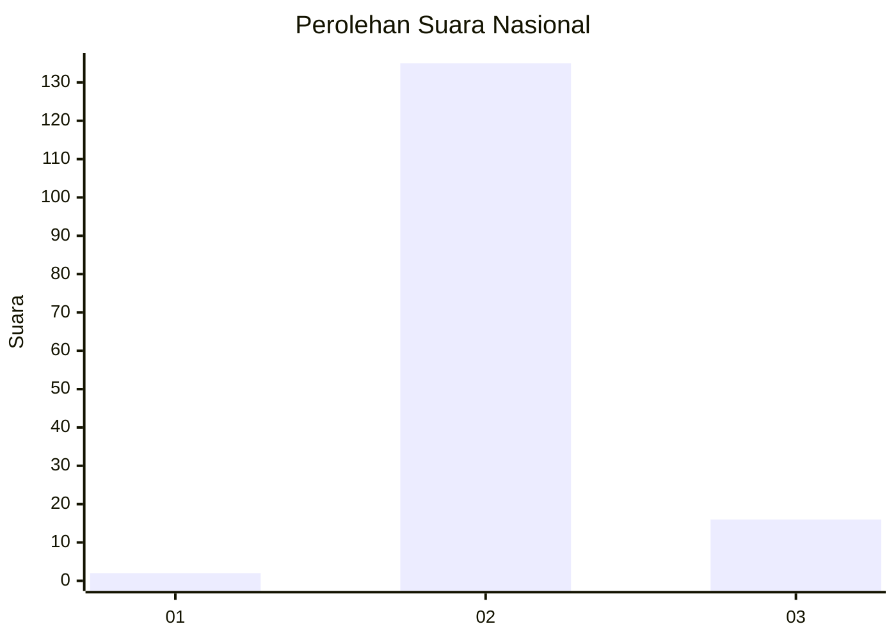
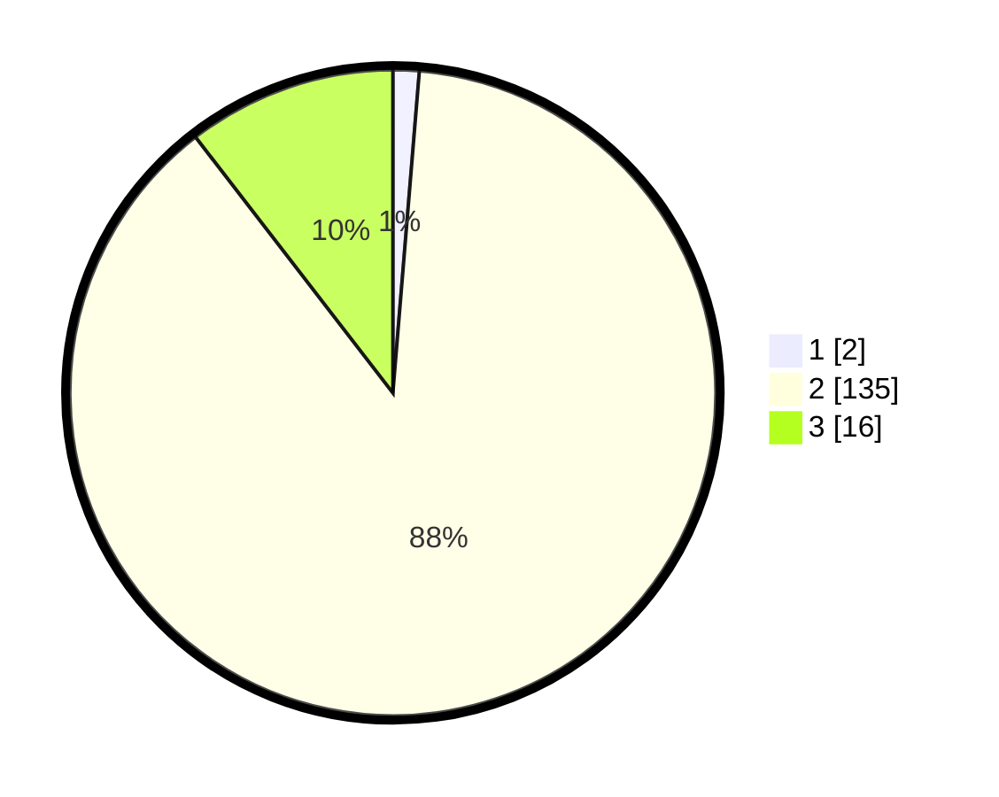

# Hasil

## Grafik

## Tabel

| No. | Nama Paslon    | Suara | Suara (raw) | Persentase |
|:--- |:-------------- | -----:| -----------:| ----------:|
| 1   | ANIES MUHAIMIN | 2     | [2][p-1]    | 1,31       |
| 2   | PRABOWO GIBRAN | 135   | [135][p-2]  | 88,24      |
| 3   | GANJAR MAHFUD  | 16    | [16][p-3]   | 10,46      |

[p-1]: https://github.com/gigit-pemilu/pemilu-2024/blob/main/pilpres/hitung-suara/sub/51-bali/sub/02-tabanan/sub/03-selemadeg-barat/sub/2003-lalanglinggah/sub/002-tps/sub/paslon-1.txt
[p-2]: https://github.com/gigit-pemilu/pemilu-2024/blob/main/pilpres/hitung-suara/sub/51-bali/sub/02-tabanan/sub/03-selemadeg-barat/sub/2003-lalanglinggah/sub/002-tps/sub/paslon-2.txt
[p-3]: https://github.com/gigit-pemilu/pemilu-2024/blob/main/pilpres/hitung-suara/sub/51-bali/sub/02-tabanan/sub/03-selemadeg-barat/sub/2003-lalanglinggah/sub/002-tps/sub/paslon-3.txt

## Foto C Plano

https://sirekap-obj-formc.kpu.go.id/569f/pemilu/ppwp/51/02/03/20/03/5102032003002-20240217-030052--e67582f9-9644-4753-a6b9-98caf27cbabe.jpg

https://sirekap-obj-formc.kpu.go.id/569f/pemilu/ppwp/51/02/03/20/03/5102032003002-20240217-030054--7fbeec59-025a-4586-94af-f5a65745ee83.jpg

https://sirekap-obj-formc.kpu.go.id/569f/pemilu/ppwp/51/02/03/20/03/5102032003002-20240217-030053--45e3f083-0e39-4598-b3c4-e7a70e8295c3.jpg

## Metadata

| Key        | Value               |
| ---------- | ------------------- |
| Time Stamp | 2024-02-21 12:00:00 |

## DATA PEMILIH TETAP

Jumlah pemilih dalam DPT: **187**.
 * L: **92**.
 * P: **95**.

## DATA PENGGUNA HAK PILIH

Jumlah pengguna hak pilih dalam DPT: **152**.
 * L: **72**.
 * P: **80**.

Jumlah pengguna hak pilih dalam DPTb: **1**.
 * L: **0**.
 * P: **1**.

Jumlah pengguna hak pilih dalam DPK: **0**.
 * L: **0**.
 * P: **0**.

Jumlah pengguna hak pilih: **153**.
 * L: **72**.
 * P: **81**.

## JUMLAH SUARA SAH DAN TIDAK SAH

JUMLAH SELURUH SUARA SAH: **153**.

JUMLAH SUARA TIDAK SAH: **0**.

JUMLAH SELURUH SUARA SAH DAN SUARA TIDAK SAH: **153**.

