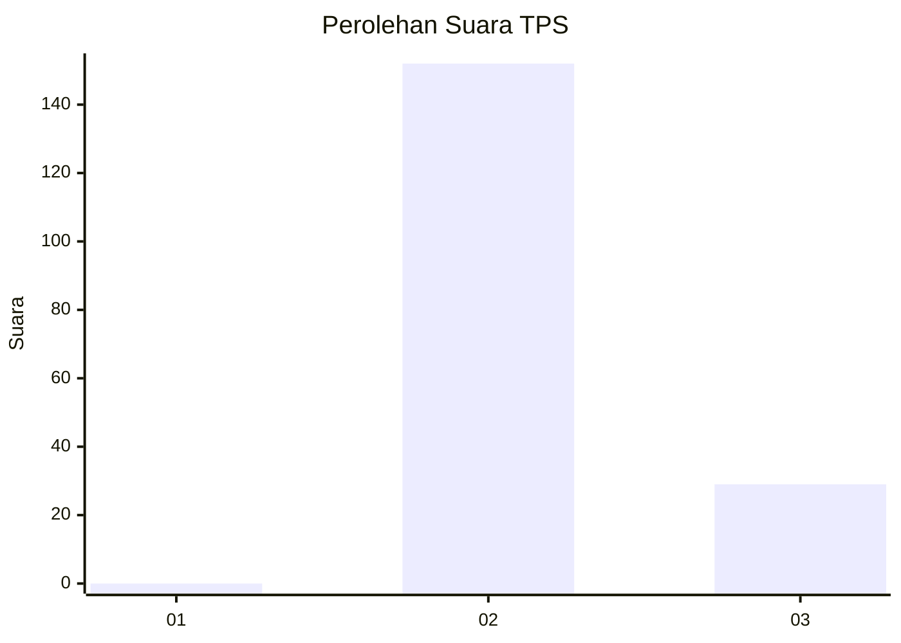
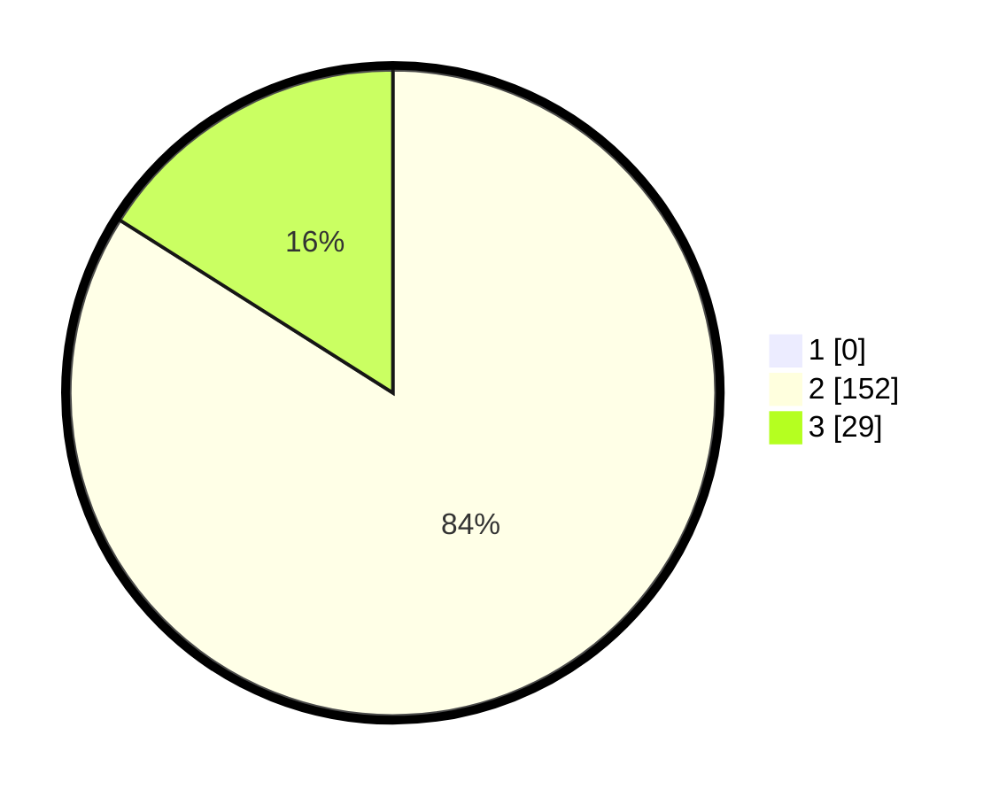

# Hasil

## Grafik

## Tabel

| No. | Nama Paslon    | Suara | Suara (raw) | Persentase |
|:--- |:-------------- | -----:| -----------:| ----------:|
| 1   | ANIES MUHAIMIN | 0     | [0][p-1]    | 0,00       |
| 2   | PRABOWO GIBRAN | 152   | [152][p-2]  | 83,98      |
| 3   | GANJAR MAHFUD  | 29    | [29][p-3]   | 16,02      |

[p-1]: https://github.com/gigit-pemilu/pemilu-2024-51-bali/blob/main/pilpres/hitung-suara/sub/51-bali/sub/02-tabanan/sub/03-selemadeg-barat/sub/2003-lalanglinggah/sub/003-tps/sub/paslon-1.txt
[p-2]: https://github.com/gigit-pemilu/pemilu-2024-51-bali/blob/main/pilpres/hitung-suara/sub/51-bali/sub/02-tabanan/sub/03-selemadeg-barat/sub/2003-lalanglinggah/sub/003-tps/sub/paslon-2.txt
[p-3]: https://github.com/gigit-pemilu/pemilu-2024-51-bali/blob/main/pilpres/hitung-suara/sub/51-bali/sub/02-tabanan/sub/03-selemadeg-barat/sub/2003-lalanglinggah/sub/003-tps/sub/paslon-3.txt

## Foto C Plano

https://sirekap-obj-formc.kpu.go.id/4a3c/pemilu/ppwp/51/02/03/20/03/5102032003003-20240217-044251--17880c03-6156-4ca5-80ec-17454c4810dd.jpg

https://sirekap-obj-formc.kpu.go.id/4a3c/pemilu/ppwp/51/02/03/20/03/5102032003003-20240217-044252--772d6bea-7259-4f36-aa04-5c6b1dea5816.jpg

https://sirekap-obj-formc.kpu.go.id/4a3c/pemilu/ppwp/51/02/03/20/03/5102032003003-20240217-044251--2ebfb73c-50f4-4bb0-b794-66868d60153f.jpg

## Metadata

| Key        | Value               |
| ---------- | ------------------- |
| Time Stamp | 2024-02-21 23:00:00 |

## DATA PEMILIH TETAP

Jumlah pemilih dalam DPT: **295**.
 * L: **150**.
 * P: **145**.

## DATA PENGGUNA HAK PILIH

Jumlah pengguna hak pilih dalam DPT: **242**.
 * L: **125**.
 * P: **117**.

Jumlah pengguna hak pilih dalam DPTb: **1**.
 * L: **1**.
 * P: **0**.

Jumlah pengguna hak pilih dalam DPK: **0**.
 * L: **0**.
 * P: **0**.

Jumlah pengguna hak pilih: **243**.
 * L: **126**.
 * P: **117**.

## JUMLAH SUARA SAH DAN TIDAK SAH

JUMLAH SELURUH SUARA SAH: **241**.

JUMLAH SUARA TIDAK SAH: **2**.

JUMLAH SELURUH SUARA SAH DAN SUARA TIDAK SAH: **243**.

