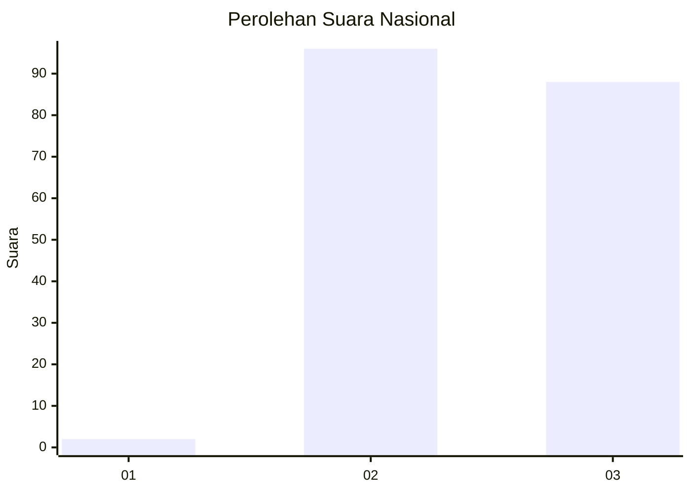
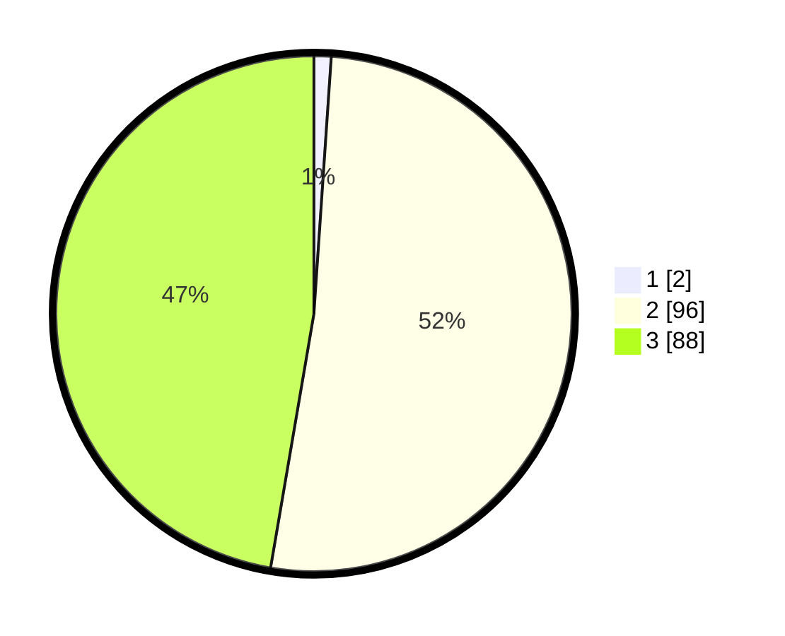

# Hasil

## Grafik

## Tabel

| No. | Nama Paslon    | Suara | Suara (raw) | Persentase |
|:--- |:-------------- | -----:| -----------:| ----------:|
| 1   | ANIES MUHAIMIN | 2     | [2][p-1]    | 1,08       |
| 2   | PRABOWO GIBRAN | 96    | [96][p-2]   | 51,61      |
| 3   | GANJAR MAHFUD  | 88    | [88][p-3]   | 47,31      |

[p-1]: https://github.com/gigit-pemilu/pemilu-2024/blob/main/pilpres/hitung-suara/sub/51-bali/sub/02-tabanan/sub/03-selemadeg-barat/sub/2003-lalanglinggah/sub/004-tps/sub/paslon-1.txt
[p-2]: https://github.com/gigit-pemilu/pemilu-2024/blob/main/pilpres/hitung-suara/sub/51-bali/sub/02-tabanan/sub/03-selemadeg-barat/sub/2003-lalanglinggah/sub/004-tps/sub/paslon-2.txt
[p-3]: https://github.com/gigit-pemilu/pemilu-2024/blob/main/pilpres/hitung-suara/sub/51-bali/sub/02-tabanan/sub/03-selemadeg-barat/sub/2003-lalanglinggah/sub/004-tps/sub/paslon-3.txt

## Foto C Plano

https://sirekap-obj-formc.kpu.go.id/6826/pemilu/ppwp/51/02/03/20/03/5102032003004-20240216-131308--2e7ab539-74ae-4c05-ac88-aa969151f5c5.jpg

https://sirekap-obj-formc.kpu.go.id/6826/pemilu/ppwp/51/02/03/20/03/5102032003004-20240216-131309--338b3040-7399-46e6-a9c4-7cc55b7ba61e.jpg

https://sirekap-obj-formc.kpu.go.id/6826/pemilu/ppwp/51/02/03/20/03/5102032003004-20240216-131308--e3cc70a1-d0ab-41b5-a4ba-16a84b8588cc.jpg

## Metadata

| Key        | Value               |
| ---------- | ------------------- |
| Time Stamp | 2024-02-16 14:00:34 |

## DATA PEMILIH TETAP

Jumlah pemilih dalam DPT: **215**.
 * L: **105**.
 * P: **110**.

## DATA PENGGUNA HAK PILIH

Jumlah pengguna hak pilih dalam DPT: **186**.
 * L: **91**.
 * P: **95**.

Jumlah pengguna hak pilih dalam DPTb: **0**.
 * L: **0**.
 * P: **0**.

Jumlah pengguna hak pilih dalam DPK: **0**.
 * L: **0**.
 * P: **0**.

Jumlah pengguna hak pilih: **186**.
 * L: **91**.
 * P: **95**.

## JUMLAH SUARA SAH DAN TIDAK SAH

JUMLAH SELURUH SUARA SAH: **186**.

JUMLAH SUARA TIDAK SAH: **0**.

JUMLAH SELURUH SUARA SAH DAN SUARA TIDAK SAH: **186**.

