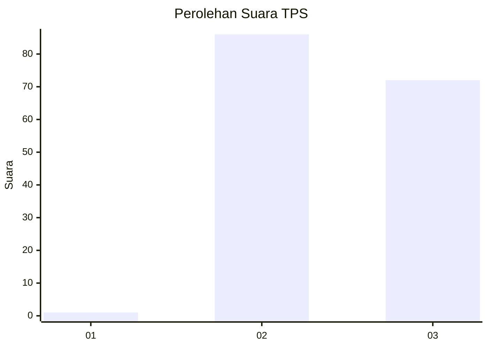
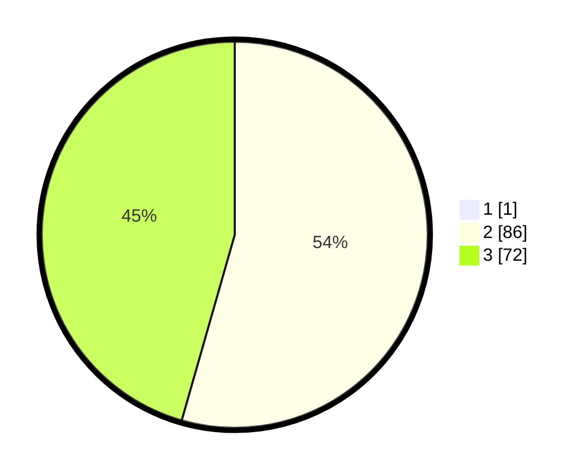

# Hasil

## Grafik

## Tabel

| No. | Nama Paslon    | Suara | Suara (raw) | Persentase |
|:--- |:-------------- | -----:| -----------:| ----------:|
| 1   | ANIES MUHAIMIN | 1     | [1][p-1]    | 0,63       |
| 2   | PRABOWO GIBRAN | 86    | [86][p-2]   | 54,09      |
| 3   | GANJAR MAHFUD  | 72    | [72][p-3]   | 45,28      |

[p-1]: https://github.com/gigit-pemilu/pemilu-2024-51-bali/blob/main/pilpres/hitung-suara/sub/51-bali/sub/02-tabanan/sub/03-selemadeg-barat/sub/2003-lalanglinggah/sub/005-tps/sub/paslon-1.txt
[p-2]: https://github.com/gigit-pemilu/pemilu-2024-51-bali/blob/main/pilpres/hitung-suara/sub/51-bali/sub/02-tabanan/sub/03-selemadeg-barat/sub/2003-lalanglinggah/sub/005-tps/sub/paslon-2.txt
[p-3]: https://github.com/gigit-pemilu/pemilu-2024-51-bali/blob/main/pilpres/hitung-suara/sub/51-bali/sub/02-tabanan/sub/03-selemadeg-barat/sub/2003-lalanglinggah/sub/005-tps/sub/paslon-3.txt

## Foto C Plano

https://sirekap-obj-formc.kpu.go.id/8b44/pemilu/ppwp/51/02/03/20/03/5102032003005-20240216-000308--28f3e991-c67d-440a-8bf2-7dac3151d0d4.jpg

https://sirekap-obj-formc.kpu.go.id/8b44/pemilu/ppwp/51/02/03/20/03/5102032003005-20240216-000312--f73b8ed3-a576-4322-ab07-c0dbc74d0101.jpg

https://sirekap-obj-formc.kpu.go.id/8b44/pemilu/ppwp/51/02/03/20/03/5102032003005-20240216-000310--0e7d1b4d-e521-4709-8e64-62450b514e70.jpg

## Metadata

| Key        | Value               |
| ---------- | ------------------- |
| Time Stamp | 2024-02-16 10:00:28 |

## DATA PEMILIH TETAP

Jumlah pemilih dalam DPT: **193**.
 * L: **84**.
 * P: **109**.

## DATA PENGGUNA HAK PILIH

Jumlah pengguna hak pilih dalam DPT: **158**.
 * L: **69**.
 * P: **89**.

Jumlah pengguna hak pilih dalam DPTb: **1**.
 * L: **1**.
 * P: **0**.

Jumlah pengguna hak pilih dalam DPK: **0**.
 * L: **0**.
 * P: **0**.

Jumlah pengguna hak pilih: **159**.
 * L: **70**.
 * P: **89**.

## JUMLAH SUARA SAH DAN TIDAK SAH

JUMLAH SELURUH SUARA SAH: **159**.

JUMLAH SUARA TIDAK SAH: **0**.

JUMLAH SELURUH SUARA SAH DAN SUARA TIDAK SAH: **159**.

