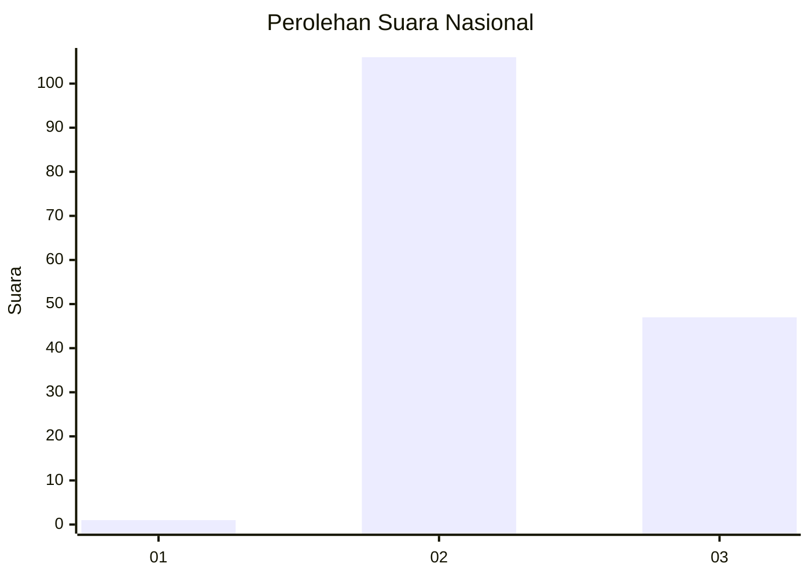
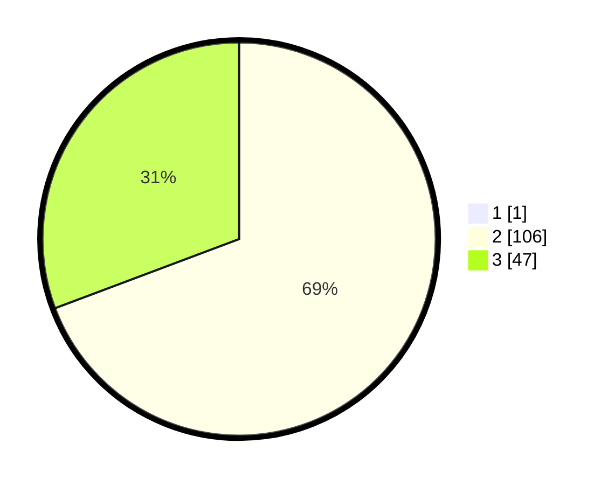

# Hasil

## Grafik

## Tabel

| No. | Nama Paslon    | Suara | Suara (raw) | Persentase |
|:--- |:-------------- | -----:| -----------:| ----------:|
| 1   | ANIES MUHAIMIN | 1     | [1][p-1]    | 0,65       |
| 2   | PRABOWO GIBRAN | 106   | [106][p-2]  | 68,83      |
| 3   | GANJAR MAHFUD  | 47    | [47][p-3]   | 30,52      |

[p-1]: https://github.com/gigit-pemilu/pemilu-2024/blob/main/pilpres/hitung-suara/sub/51-bali/sub/02-tabanan/sub/03-selemadeg-barat/sub/2003-lalanglinggah/sub/006-tps/sub/paslon-1.txt
[p-2]: https://github.com/gigit-pemilu/pemilu-2024/blob/main/pilpres/hitung-suara/sub/51-bali/sub/02-tabanan/sub/03-selemadeg-barat/sub/2003-lalanglinggah/sub/006-tps/sub/paslon-2.txt
[p-3]: https://github.com/gigit-pemilu/pemilu-2024/blob/main/pilpres/hitung-suara/sub/51-bali/sub/02-tabanan/sub/03-selemadeg-barat/sub/2003-lalanglinggah/sub/006-tps/sub/paslon-3.txt

## Foto C Plano

https://sirekap-obj-formc.kpu.go.id/28ec/pemilu/ppwp/51/02/03/20/03/5102032003006-20240217-044703--643e30b0-cf17-4aed-b7a1-fec1369fbd9b.jpg

https://sirekap-obj-formc.kpu.go.id/28ec/pemilu/ppwp/51/02/03/20/03/5102032003006-20240217-044704--c2cdcae1-d4bf-4dde-b423-388ca8ac2849.jpg

https://sirekap-obj-formc.kpu.go.id/28ec/pemilu/ppwp/51/02/03/20/03/5102032003006-20240217-044703--a628414f-843c-4ac5-840e-70800113b672.jpg

## Metadata

| Key        | Value               |
| ---------- | ------------------- |
| Time Stamp | 2024-02-21 16:00:00 |

## DATA PEMILIH TETAP

Jumlah pemilih dalam DPT: **192**.
 * L: **103**.
 * P: **89**.

## DATA PENGGUNA HAK PILIH

Jumlah pengguna hak pilih dalam DPT: **154**.
 * L: **83**.
 * P: **71**.

Jumlah pengguna hak pilih dalam DPTb: **1**.
 * L: **0**.
 * P: **1**.

Jumlah pengguna hak pilih dalam DPK: **0**.
 * L: **0**.
 * P: **0**.

Jumlah pengguna hak pilih: **155**.
 * L: **83**.
 * P: **72**.

## JUMLAH SUARA SAH DAN TIDAK SAH

JUMLAH SELURUH SUARA SAH: **154**.

JUMLAH SUARA TIDAK SAH: **1**.

JUMLAH SELURUH SUARA SAH DAN SUARA TIDAK SAH: **155**.

