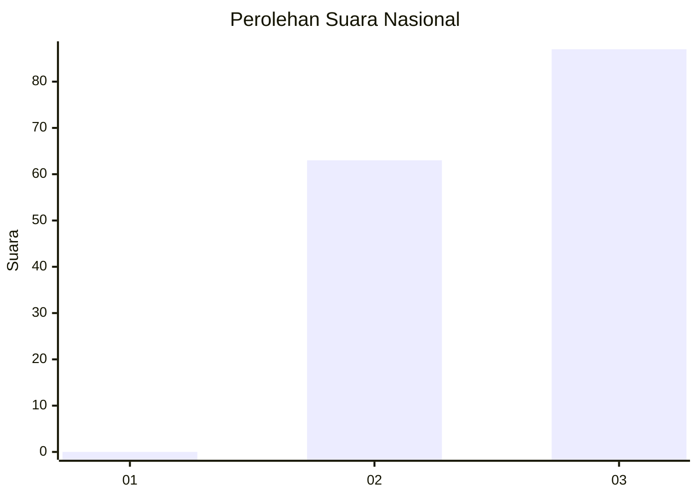
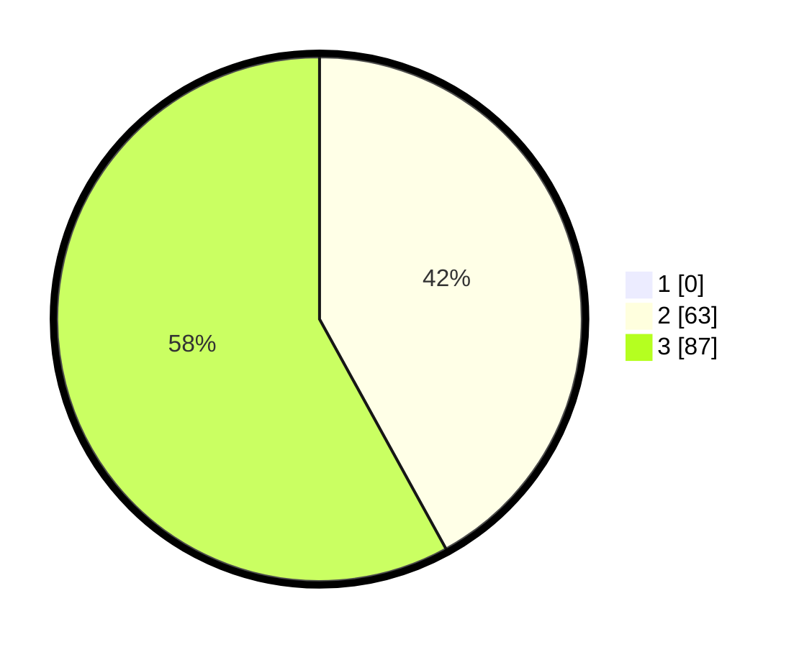

# Hasil

## Grafik

## Tabel

| No. | Nama Paslon    | Suara | Suara (raw) | Persentase |
|:--- |:-------------- | -----:| -----------:| ----------:|
| 1   | ANIES MUHAIMIN | 0     | [0][p-1]    | 0,00       |
| 2   | PRABOWO GIBRAN | 63    | [63][p-2]   | 42,00      |
| 3   | GANJAR MAHFUD  | 87    | [87][p-3]   | 58,00      |

[p-1]: https://github.com/gigit-pemilu/pemilu-2024/blob/main/pilpres/hitung-suara/sub/51-bali/sub/02-tabanan/sub/03-selemadeg-barat/sub/2003-lalanglinggah/sub/007-tps/sub/paslon-1.txt
[p-2]: https://github.com/gigit-pemilu/pemilu-2024/blob/main/pilpres/hitung-suara/sub/51-bali/sub/02-tabanan/sub/03-selemadeg-barat/sub/2003-lalanglinggah/sub/007-tps/sub/paslon-2.txt
[p-3]: https://github.com/gigit-pemilu/pemilu-2024/blob/main/pilpres/hitung-suara/sub/51-bali/sub/02-tabanan/sub/03-selemadeg-barat/sub/2003-lalanglinggah/sub/007-tps/sub/paslon-3.txt

## Foto C Plano

https://sirekap-obj-formc.kpu.go.id/6e4a/pemilu/ppwp/51/02/03/20/03/5102032003007-20240217-030300--8b5f55be-c690-4a23-8df9-0f5cee29e913.jpg

https://sirekap-obj-formc.kpu.go.id/6e4a/pemilu/ppwp/51/02/03/20/03/5102032003007-20240217-030301--29276a3e-8359-4927-b5c0-6fd3b8818dbc.jpg

https://sirekap-obj-formc.kpu.go.id/6e4a/pemilu/ppwp/51/02/03/20/03/5102032003007-20240217-030301--488b3897-4fb4-4902-af27-967fdc143ef7.jpg

## Metadata

| Key        | Value               |
| ---------- | ------------------- |
| Time Stamp | 2024-02-21 10:00:00 |

## DATA PEMILIH TETAP

Jumlah pemilih dalam DPT: **179**.
 * L: **91**.
 * P: **88**.

## DATA PENGGUNA HAK PILIH

Jumlah pengguna hak pilih dalam DPT: **152**.
 * L: **74**.
 * P: **78**.

Jumlah pengguna hak pilih dalam DPTb: **1**.
 * L: **0**.
 * P: **1**.

Jumlah pengguna hak pilih dalam DPK: **0**.
 * L: **0**.
 * P: **0**.

Jumlah pengguna hak pilih: **153**.
 * L: **74**.
 * P: **79**.

## JUMLAH SUARA SAH DAN TIDAK SAH

JUMLAH SELURUH SUARA SAH: **150**.

JUMLAH SUARA TIDAK SAH: **2**.

JUMLAH SELURUH SUARA SAH DAN SUARA TIDAK SAH: **152**.

