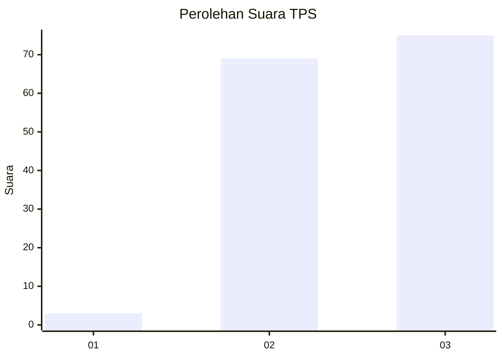
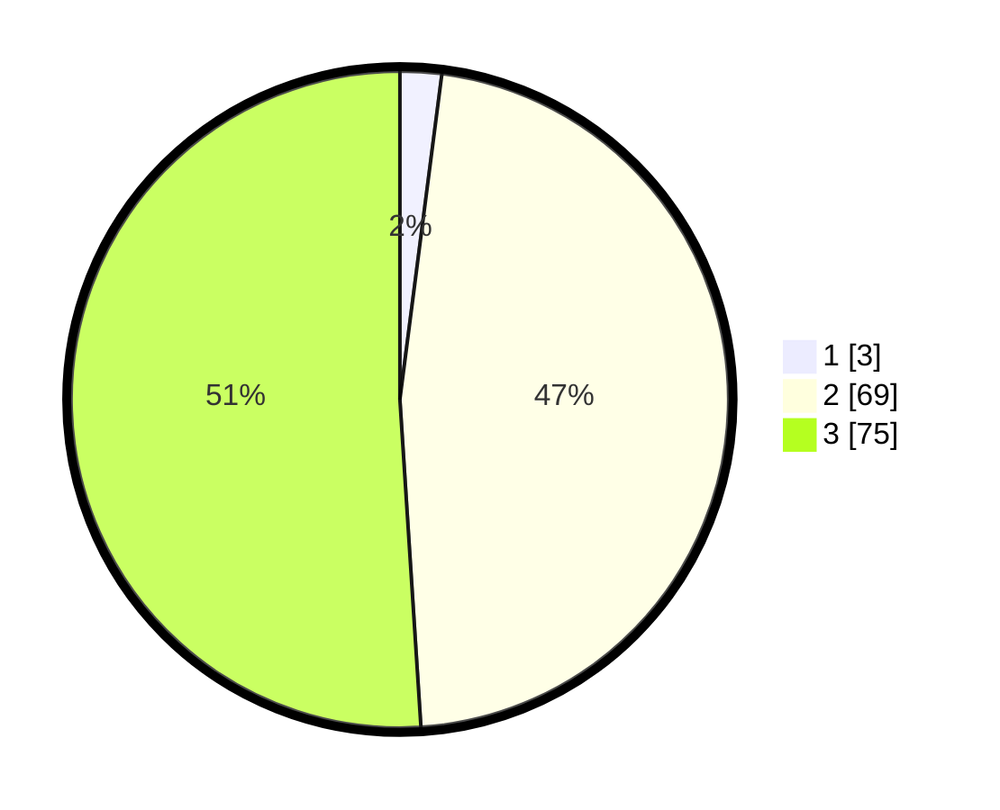

# Hasil

## Grafik

## Tabel

| No. | Nama Paslon    | Suara | Suara (raw) | Persentase |
|:--- |:-------------- | -----:| -----------:| ----------:|
| 1   | ANIES MUHAIMIN | 3     | [3][p-1]    | 2,04       |
| 2   | PRABOWO GIBRAN | 69    | [69][p-2]   | 46,94      |
| 3   | GANJAR MAHFUD  | 75    | [75][p-3]   | 51,02      |

[p-1]: https://github.com/gigit-pemilu/pemilu-2024-51-bali/blob/main/pilpres/hitung-suara/sub/51-bali/sub/02-tabanan/sub/03-selemadeg-barat/sub/2003-lalanglinggah/sub/008-tps/sub/paslon-1.txt
[p-2]: https://github.com/gigit-pemilu/pemilu-2024-51-bali/blob/main/pilpres/hitung-suara/sub/51-bali/sub/02-tabanan/sub/03-selemadeg-barat/sub/2003-lalanglinggah/sub/008-tps/sub/paslon-2.txt
[p-3]: https://github.com/gigit-pemilu/pemilu-2024-51-bali/blob/main/pilpres/hitung-suara/sub/51-bali/sub/02-tabanan/sub/03-selemadeg-barat/sub/2003-lalanglinggah/sub/008-tps/sub/paslon-3.txt

## Foto C Plano

https://sirekap-obj-formc.kpu.go.id/b8ae/pemilu/ppwp/51/02/03/20/03/5102032003008-20240216-025411--5c371652-0aa4-4708-b198-55036ae6f4c1.jpg

https://sirekap-obj-formc.kpu.go.id/b8ae/pemilu/ppwp/51/02/03/20/03/5102032003008-20240216-025419--97bd8415-cb3a-45d0-bc4a-8253af77d2a8.jpg

https://sirekap-obj-formc.kpu.go.id/b8ae/pemilu/ppwp/51/02/03/20/03/5102032003008-20240216-025416--94b1879b-10aa-45a9-be31-2c3c784b48c0.jpg

## Metadata

| Key        | Value               |
| ---------- | ------------------- |
| Time Stamp | 2024-02-16 10:00:28 |

## DATA PEMILIH TETAP

Jumlah pemilih dalam DPT: **171**.
 * L: **82**.
 * P: **89**.

## DATA PENGGUNA HAK PILIH

Jumlah pengguna hak pilih dalam DPT: **148**.
 * L: **78**.
 * P: **70**.

Jumlah pengguna hak pilih dalam DPTb: **0**.
 * L: **0**.
 * P: **0**.

Jumlah pengguna hak pilih dalam DPK: **1**.
 * L: **0**.
 * P: **1**.

Jumlah pengguna hak pilih: **149**.
 * L: **78**.
 * P: **71**.

## JUMLAH SUARA SAH DAN TIDAK SAH

JUMLAH SELURUH SUARA SAH: **147**.

JUMLAH SUARA TIDAK SAH: **2**.

JUMLAH SELURUH SUARA SAH DAN SUARA TIDAK SAH: **149**.

