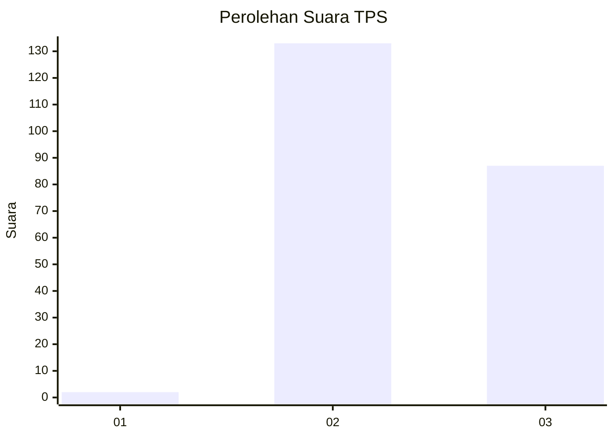
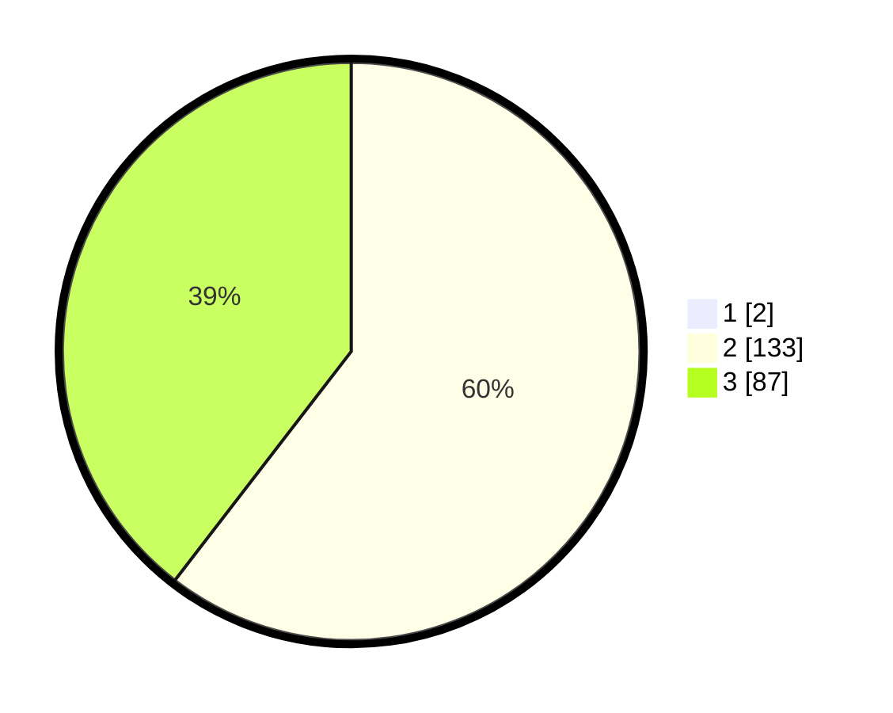

# Hasil

## Grafik

## Tabel

| No. | Nama Paslon    | Suara | Suara (raw) | Persentase |
|:--- |:-------------- | -----:| -----------:| ----------:|
| 1   | ANIES MUHAIMIN | 2     | [2][p-1]    | 0,90       |
| 2   | PRABOWO GIBRAN | 133   | [133][p-2]  | 59,91      |
| 3   | GANJAR MAHFUD  | 87    | [87][p-3]   | 39,19      |

[p-1]: https://github.com/gigit-pemilu/pemilu-2024-51-bali/blob/main/pilpres/hitung-suara/sub/51-bali/sub/02-tabanan/sub/03-selemadeg-barat/sub/2003-lalanglinggah/sub/009-tps/sub/paslon-1.txt
[p-2]: https://github.com/gigit-pemilu/pemilu-2024-51-bali/blob/main/pilpres/hitung-suara/sub/51-bali/sub/02-tabanan/sub/03-selemadeg-barat/sub/2003-lalanglinggah/sub/009-tps/sub/paslon-2.txt
[p-3]: https://github.com/gigit-pemilu/pemilu-2024-51-bali/blob/main/pilpres/hitung-suara/sub/51-bali/sub/02-tabanan/sub/03-selemadeg-barat/sub/2003-lalanglinggah/sub/009-tps/sub/paslon-3.txt

## Foto C Plano

https://sirekap-obj-formc.kpu.go.id/e7fa/pemilu/ppwp/51/02/03/20/03/5102032003009-20240217-044353--0450eaaa-1524-4230-a35b-7c677a032119.jpg

https://sirekap-obj-formc.kpu.go.id/e7fa/pemilu/ppwp/51/02/03/20/03/5102032003009-20240217-044354--306d2b00-9e4f-4024-9176-a3bbb0c32e6c.jpg

https://sirekap-obj-formc.kpu.go.id/e7fa/pemilu/ppwp/51/02/03/20/03/5102032003009-20240217-044354--6f10555f-0033-4e01-954b-9581a3b69ebb.jpg

## Metadata

| Key        | Value               |
| ---------- | ------------------- |
| Time Stamp | 2024-02-24 22:31:28 |

## DATA PEMILIH TETAP

Jumlah pemilih dalam DPT: **246**.
 * L: **118**.
 * P: **128**.

## DATA PENGGUNA HAK PILIH

Jumlah pengguna hak pilih dalam DPT: **224**.
 * L: **110**.
 * P: **114**.

Jumlah pengguna hak pilih dalam DPTb: **0**.
 * L: **0**.
 * P: **0**.

Jumlah pengguna hak pilih dalam DPK: **0**.
 * L: **0**.
 * P: **0**.

Jumlah pengguna hak pilih: **224**.
 * L: **110**.
 * P: **114**.

## JUMLAH SUARA SAH DAN TIDAK SAH

JUMLAH SELURUH SUARA SAH: **222**.

JUMLAH SUARA TIDAK SAH: **2**.

JUMLAH SELURUH SUARA SAH DAN SUARA TIDAK SAH: **224**.

