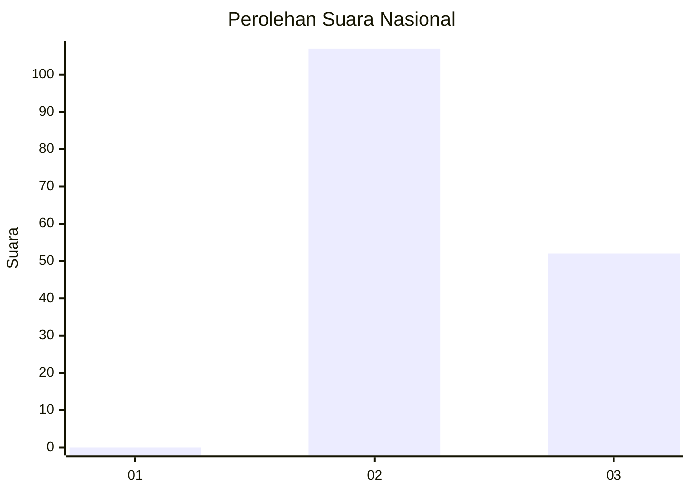
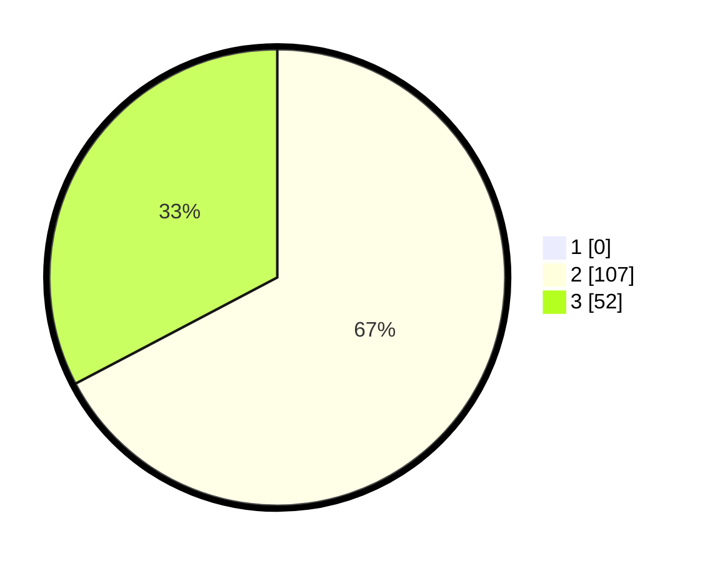

# Hasil

## Grafik

## Tabel

| No. | Nama Paslon    | Suara | Suara (raw) | Persentase |
|:--- |:-------------- | -----:| -----------:| ----------:|
| 1   | ANIES MUHAIMIN | 0     | [0][p-1]    | 0,00       |
| 2   | PRABOWO GIBRAN | 107   | [107][p-2]  | 67,30      |
| 3   | GANJAR MAHFUD  | 52    | [52][p-3]   | 32,70      |

[p-1]: https://github.com/gigit-pemilu/pemilu-2024/blob/main/pilpres/hitung-suara/sub/51-bali/sub/02-tabanan/sub/03-selemadeg-barat/sub/2003-lalanglinggah/sub/011-tps/sub/paslon-1.txt
[p-2]: https://github.com/gigit-pemilu/pemilu-2024/blob/main/pilpres/hitung-suara/sub/51-bali/sub/02-tabanan/sub/03-selemadeg-barat/sub/2003-lalanglinggah/sub/011-tps/sub/paslon-2.txt
[p-3]: https://github.com/gigit-pemilu/pemilu-2024/blob/main/pilpres/hitung-suara/sub/51-bali/sub/02-tabanan/sub/03-selemadeg-barat/sub/2003-lalanglinggah/sub/011-tps/sub/paslon-3.txt

## Foto C Plano

https://sirekap-obj-formc.kpu.go.id/8ac6/pemilu/ppwp/51/02/03/20/03/5102032003011-20240217-044459--9cb5f51a-e82a-4dd0-a5ad-02b393402df8.jpg

https://sirekap-obj-formc.kpu.go.id/8ac6/pemilu/ppwp/51/02/03/20/03/5102032003011-20240217-044500--33f087c8-5b25-4a18-a11d-4470ad9160f3.jpg

https://sirekap-obj-formc.kpu.go.id/8ac6/pemilu/ppwp/51/02/03/20/03/5102032003011-20240217-044500--4a4bcad0-035b-409a-b4de-c142f0ae729a.jpg

## Metadata

| Key        | Value               |
| ---------- | ------------------- |
| Time Stamp | 2024-02-21 11:00:00 |

## DATA PEMILIH TETAP

Jumlah pemilih dalam DPT: **172**.
 * L: **80**.
 * P: **92**.

## DATA PENGGUNA HAK PILIH

Jumlah pengguna hak pilih dalam DPT: **159**.
 * L: **76**.
 * P: **83**.

Jumlah pengguna hak pilih dalam DPTb: **1**.
 * L: **0**.
 * P: **1**.

Jumlah pengguna hak pilih dalam DPK: **0**.
 * L: **0**.
 * P: **0**.

Jumlah pengguna hak pilih: **160**.
 * L: **76**.
 * P: **84**.

## JUMLAH SUARA SAH DAN TIDAK SAH

JUMLAH SELURUH SUARA SAH: **159**.

JUMLAH SUARA TIDAK SAH: **1**.

JUMLAH SELURUH SUARA SAH DAN SUARA TIDAK SAH: **160**.

