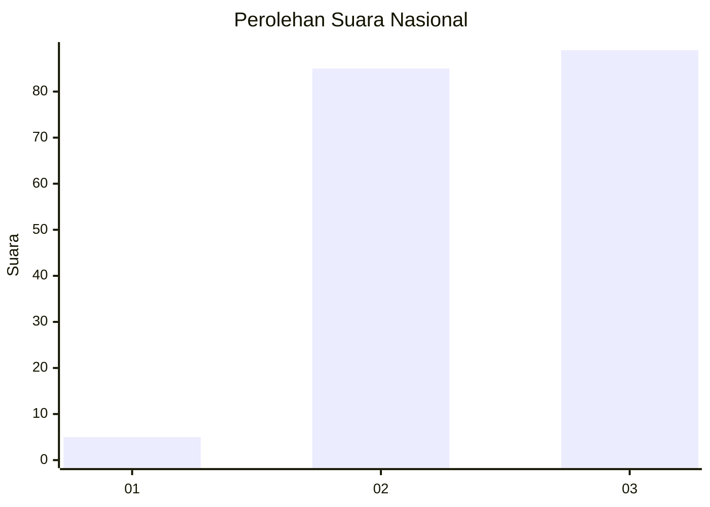
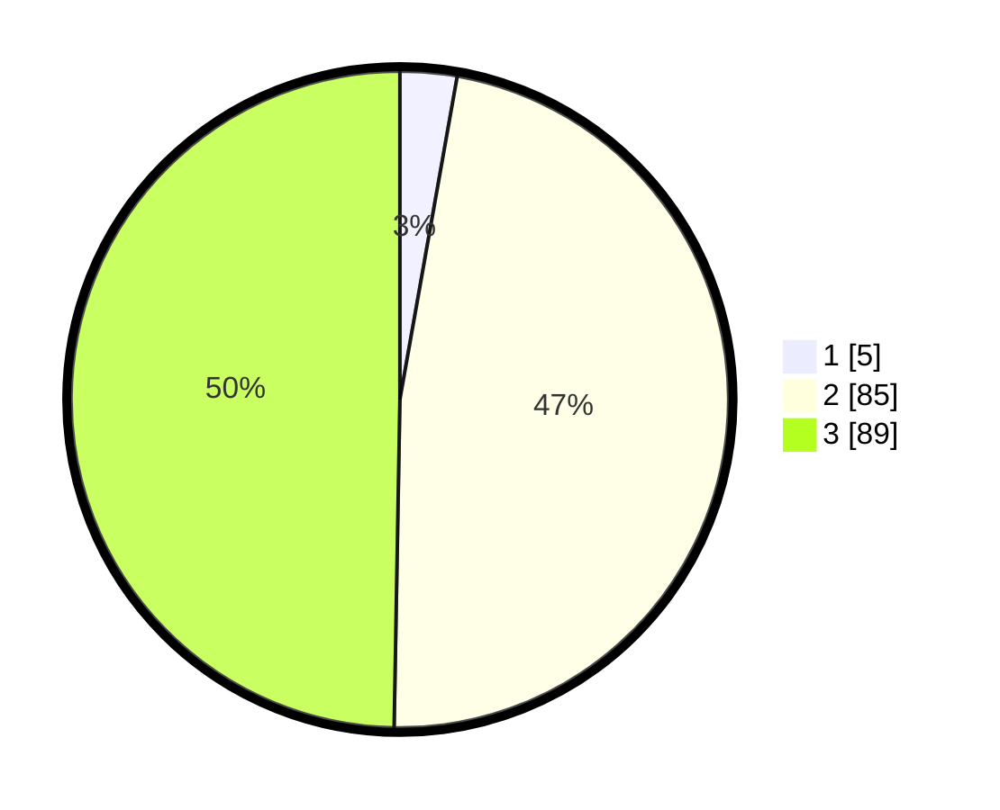

# Hasil

## Grafik

## Tabel

| No. | Nama Paslon    | Suara | Suara (raw) | Persentase |
|:--- |:-------------- | -----:| -----------:| ----------:|
| 1   | ANIES MUHAIMIN | 5     | [5][p-1]    | 2,79       |
| 2   | PRABOWO GIBRAN | 85    | [85][p-2]   | 47,49      |
| 3   | GANJAR MAHFUD  | 89    | [89][p-3]   | 49,72      |

[p-1]: https://github.com/gigit-pemilu/pemilu-2024/blob/main/pilpres/hitung-suara/sub/51-bali/sub/02-tabanan/sub/03-selemadeg-barat/sub/2003-lalanglinggah/sub/012-tps/sub/paslon-1.txt
[p-2]: https://github.com/gigit-pemilu/pemilu-2024/blob/main/pilpres/hitung-suara/sub/51-bali/sub/02-tabanan/sub/03-selemadeg-barat/sub/2003-lalanglinggah/sub/012-tps/sub/paslon-2.txt
[p-3]: https://github.com/gigit-pemilu/pemilu-2024/blob/main/pilpres/hitung-suara/sub/51-bali/sub/02-tabanan/sub/03-selemadeg-barat/sub/2003-lalanglinggah/sub/012-tps/sub/paslon-3.txt

## Foto C Plano

https://sirekap-obj-formc.kpu.go.id/711b/pemilu/ppwp/51/02/03/20/03/5102032003012-20240215-221732--1a6d3907-0561-4c9b-b23e-2699b3677431.jpg

https://sirekap-obj-formc.kpu.go.id/711b/pemilu/ppwp/51/02/03/20/03/5102032003012-20240215-221735--9e97ee65-7c77-47af-8095-c6ecc3824040.jpg

https://sirekap-obj-formc.kpu.go.id/711b/pemilu/ppwp/51/02/03/20/03/5102032003012-20240215-221734--9fb68092-12f8-4312-919d-42d0a5cc5ed1.jpg

## Metadata

| Key        | Value               |
| ---------- | ------------------- |
| Time Stamp | 2024-02-16 10:00:28 |

## DATA PEMILIH TETAP

Jumlah pemilih dalam DPT: **187**.
 * L: **91**.
 * P: **96**.

## DATA PENGGUNA HAK PILIH

Jumlah pengguna hak pilih dalam DPT: **179**.
 * L: **92**.
 * P: **87**.

Jumlah pengguna hak pilih dalam DPTb: **0**.
 * L: **0**.
 * P: **0**.

Jumlah pengguna hak pilih dalam DPK: **0**.
 * L: **0**.
 * P: **0**.

Jumlah pengguna hak pilih: **179**.
 * L: **92**.
 * P: **87**.

## JUMLAH SUARA SAH DAN TIDAK SAH

JUMLAH SELURUH SUARA SAH: **179**.

JUMLAH SUARA TIDAK SAH: **0**.

JUMLAH SELURUH SUARA SAH DAN SUARA TIDAK SAH: **179**.

