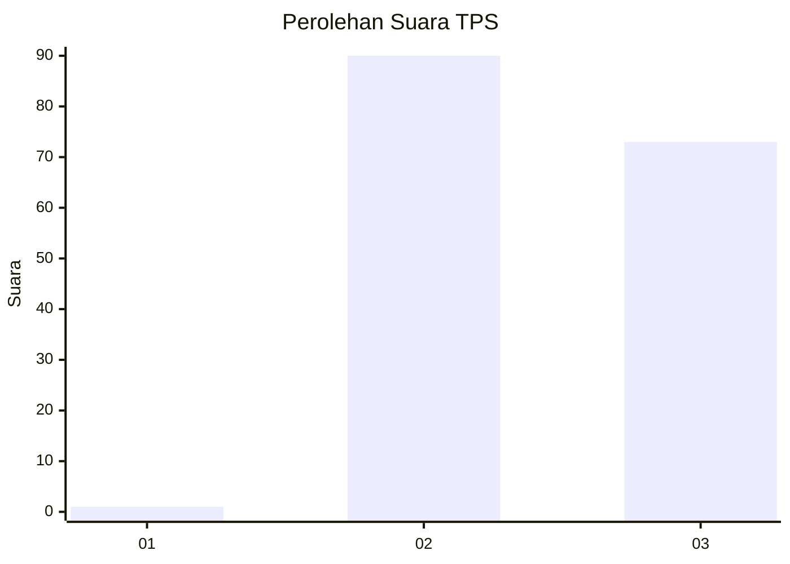
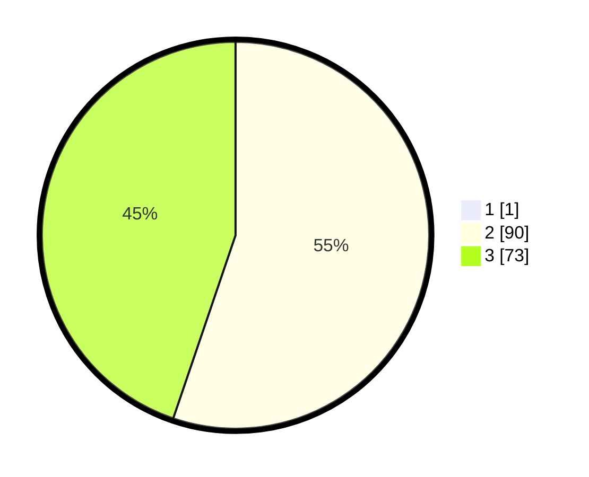

# Hasil

## Grafik

## Tabel

| No. | Nama Paslon    | Suara | Suara (raw) | Persentase |
|:--- |:-------------- | -----:| -----------:| ----------:|
| 1   | ANIES MUHAIMIN | 1     | [1][p-1]    | 0,61       |
| 2   | PRABOWO GIBRAN | 90    | [90][p-2]   | 54,88      |
| 3   | GANJAR MAHFUD  | 73    | [73][p-3]   | 44,51      |

[p-1]: https://github.com/gigit-pemilu/pemilu-2024-51-bali/blob/main/pilpres/hitung-suara/sub/51-bali/sub/02-tabanan/sub/03-selemadeg-barat/sub/2003-lalanglinggah/sub/013-tps/sub/paslon-1.txt
[p-2]: https://github.com/gigit-pemilu/pemilu-2024-51-bali/blob/main/pilpres/hitung-suara/sub/51-bali/sub/02-tabanan/sub/03-selemadeg-barat/sub/2003-lalanglinggah/sub/013-tps/sub/paslon-2.txt
[p-3]: https://github.com/gigit-pemilu/pemilu-2024-51-bali/blob/main/pilpres/hitung-suara/sub/51-bali/sub/02-tabanan/sub/03-selemadeg-barat/sub/2003-lalanglinggah/sub/013-tps/sub/paslon-3.txt

## Foto C Plano

https://sirekap-obj-formc.kpu.go.id/79d0/pemilu/ppwp/51/02/03/20/03/5102032003013-20240215-225556--ac32439b-fb88-493e-a76b-279aad97ccf8.jpg

https://sirekap-obj-formc.kpu.go.id/79d0/pemilu/ppwp/51/02/03/20/03/5102032003013-20240215-225559--ecd00cd1-7950-4793-9710-fa8375e42230.jpg

https://sirekap-obj-formc.kpu.go.id/79d0/pemilu/ppwp/51/02/03/20/03/5102032003013-20240215-225557--42d2bb02-0910-4725-a555-65177a67c568.jpg

## Metadata

| Key        | Value               |
| ---------- | ------------------- |
| Time Stamp | 2024-02-16 10:00:28 |

## DATA PEMILIH TETAP

Jumlah pemilih dalam DPT: **179**.
 * L: **94**.
 * P: **85**.

## DATA PENGGUNA HAK PILIH

Jumlah pengguna hak pilih dalam DPT: **168**.
 * L: **90**.
 * P: **78**.

Jumlah pengguna hak pilih dalam DPTb: **0**.
 * L: **0**.
 * P: **0**.

Jumlah pengguna hak pilih dalam DPK: **0**.
 * L: **0**.
 * P: **0**.

Jumlah pengguna hak pilih: **168**.
 * L: **90**.
 * P: **78**.

## JUMLAH SUARA SAH DAN TIDAK SAH

JUMLAH SELURUH SUARA SAH: **164**.

JUMLAH SUARA TIDAK SAH: **4**.

JUMLAH SELURUH SUARA SAH DAN SUARA TIDAK SAH: **168**.

