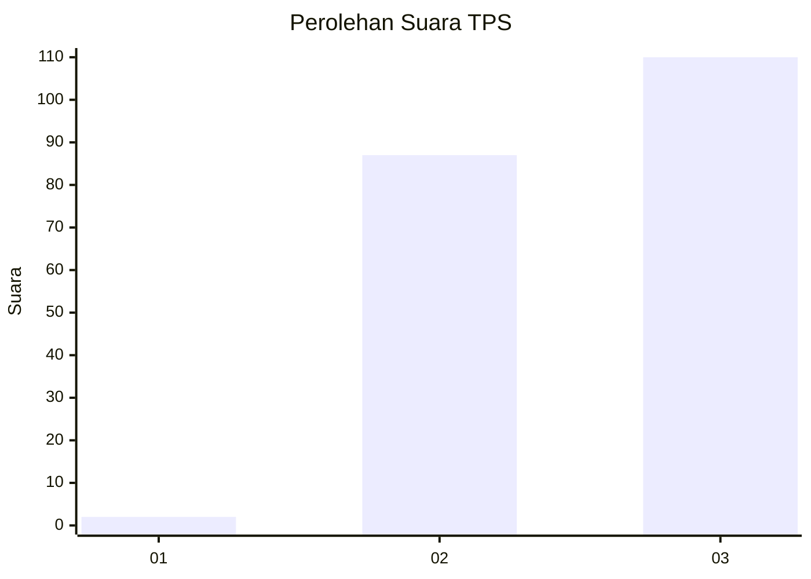
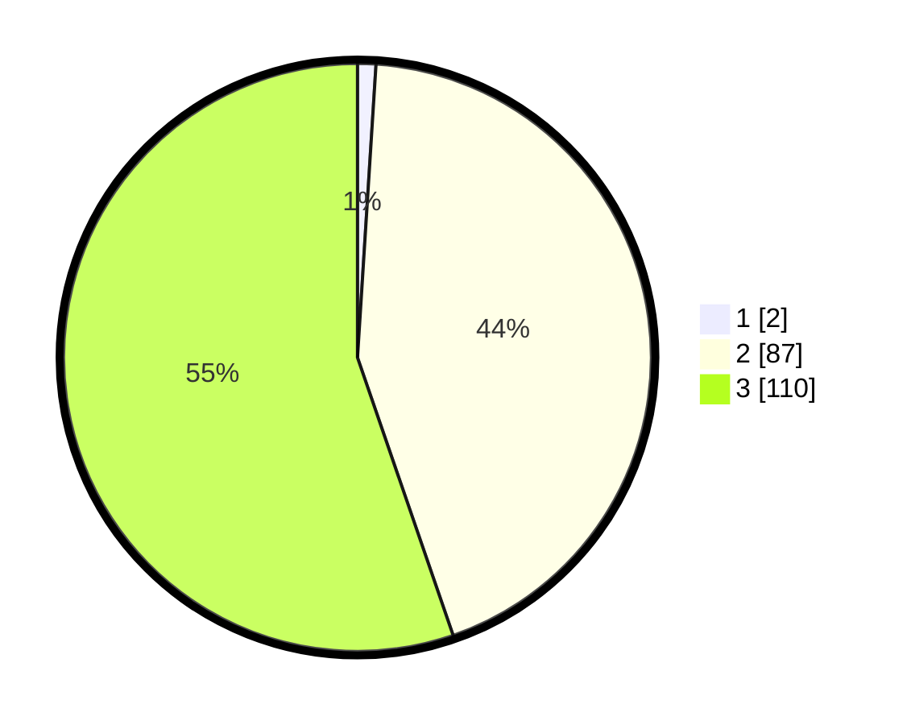

# Hasil

## Grafik

## Tabel

| No. | Nama Paslon    | Suara | Suara (raw) | Persentase |
|:--- |:-------------- | -----:| -----------:| ----------:|
| 1   | ANIES MUHAIMIN | 2     | [2][p-1]    | 1,01       |
| 2   | PRABOWO GIBRAN | 87    | [87][p-2]   | 43,72      |
| 3   | GANJAR MAHFUD  | 110   | [110][p-3]  | 55,28      |

[p-1]: https://github.com/gigit-pemilu/pemilu-2024-51-bali/blob/main/pilpres/hitung-suara/sub/51-bali/sub/02-tabanan/sub/03-selemadeg-barat/sub/2003-lalanglinggah/sub/014-tps/sub/paslon-1.txt
[p-2]: https://github.com/gigit-pemilu/pemilu-2024-51-bali/blob/main/pilpres/hitung-suara/sub/51-bali/sub/02-tabanan/sub/03-selemadeg-barat/sub/2003-lalanglinggah/sub/014-tps/sub/paslon-2.txt
[p-3]: https://github.com/gigit-pemilu/pemilu-2024-51-bali/blob/main/pilpres/hitung-suara/sub/51-bali/sub/02-tabanan/sub/03-selemadeg-barat/sub/2003-lalanglinggah/sub/014-tps/sub/paslon-3.txt

## Foto C Plano

https://sirekap-obj-formc.kpu.go.id/818f/pemilu/ppwp/51/02/03/20/03/5102032003014-20240215-215355--bca0ce01-f2f2-47ef-8299-7af1a9adfb56.jpg

https://sirekap-obj-formc.kpu.go.id/818f/pemilu/ppwp/51/02/03/20/03/5102032003014-20240215-215357--03bab2b2-bf09-4f9e-bea9-0ac274655263.jpg

https://sirekap-obj-formc.kpu.go.id/818f/pemilu/ppwp/51/02/03/20/03/5102032003014-20240215-215356--ea37da80-5244-4356-afe3-ab45788fab7f.jpg

## Metadata

| Key        | Value               |
| ---------- | ------------------- |
| Time Stamp | 2024-02-15 22:30:27 |

## DATA PEMILIH TETAP

Jumlah pemilih dalam DPT: **210**.
 * L: **103**.
 * P: **107**.

## DATA PENGGUNA HAK PILIH

Jumlah pengguna hak pilih dalam DPT: **199**.
 * L: **97**.
 * P: **102**.

Jumlah pengguna hak pilih dalam DPTb: **1**.
 * L: **1**.
 * P: **0**.

Jumlah pengguna hak pilih dalam DPK: **0**.
 * L: **0**.
 * P: **0**.

Jumlah pengguna hak pilih: **200**.
 * L: **98**.
 * P: **102**.

## JUMLAH SUARA SAH DAN TIDAK SAH

JUMLAH SELURUH SUARA SAH: **199**.

JUMLAH SUARA TIDAK SAH: **1**.

JUMLAH SELURUH SUARA SAH DAN SUARA TIDAK SAH: **200**.

