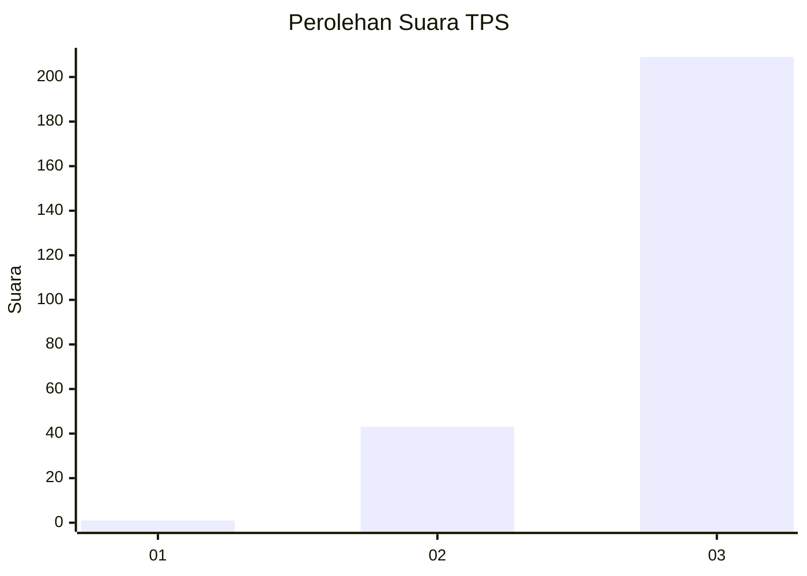
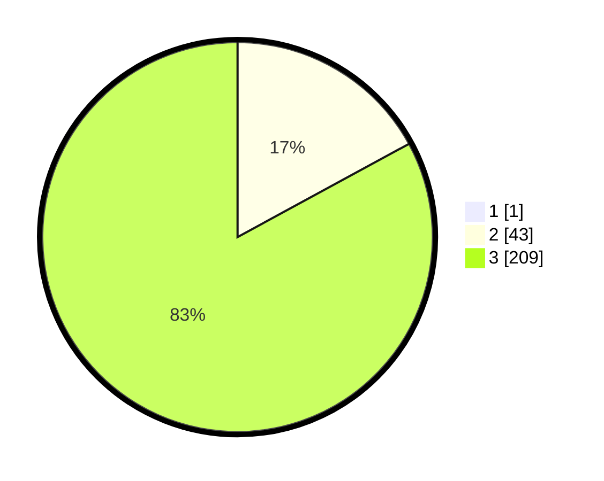

# Hasil

## Grafik

## Tabel

| No. | Nama Paslon    | Suara | Suara (raw) | Persentase |
|:--- |:-------------- | -----:| -----------:| ----------:|
| 1   | ANIES MUHAIMIN | 1     | [1][p-1]    | 0,40       |
| 2   | PRABOWO GIBRAN | 43    | [43][p-2]   | 17,00      |
| 3   | GANJAR MAHFUD  | 209   | [209][p-3]  | 82,61      |

[p-1]: https://github.com/gigit-pemilu/pemilu-2024-51-bali/blob/main/pilpres/hitung-suara/sub/51-bali/sub/02-tabanan/sub/03-selemadeg-barat/sub/2003-lalanglinggah/sub/015-tps/sub/paslon-1.txt
[p-2]: https://github.com/gigit-pemilu/pemilu-2024-51-bali/blob/main/pilpres/hitung-suara/sub/51-bali/sub/02-tabanan/sub/03-selemadeg-barat/sub/2003-lalanglinggah/sub/015-tps/sub/paslon-2.txt
[p-3]: https://github.com/gigit-pemilu/pemilu-2024-51-bali/blob/main/pilpres/hitung-suara/sub/51-bali/sub/02-tabanan/sub/03-selemadeg-barat/sub/2003-lalanglinggah/sub/015-tps/sub/paslon-3.txt

## Foto C Plano

https://sirekap-obj-formc.kpu.go.id/9ee8/pemilu/ppwp/51/02/03/20/03/5102032003015-20240217-044532--c1e760f1-f6ed-42b7-ac33-528695f09a53.jpg

https://sirekap-obj-formc.kpu.go.id/9ee8/pemilu/ppwp/51/02/03/20/03/5102032003015-20240217-044534--ac99a575-7a64-4998-817a-9ea512faf90a.jpg

https://sirekap-obj-formc.kpu.go.id/9ee8/pemilu/ppwp/51/02/03/20/03/5102032003015-20240217-044533--694ba602-42b2-400c-ab82-b45a4a8dfcbf.jpg

## Metadata

| Key        | Value               |
| ---------- | ------------------- |
| Time Stamp | 2024-02-21 12:00:00 |

## DATA PEMILIH TETAP

Jumlah pemilih dalam DPT: **268**.
 * L: **136**.
 * P: **132**.

## DATA PENGGUNA HAK PILIH

Jumlah pengguna hak pilih dalam DPT: **257**.
 * L: **129**.
 * P: **128**.

Jumlah pengguna hak pilih dalam DPTb: **257**.
 * L: **129**.
 * P: **128**.

Jumlah pengguna hak pilih dalam DPK: **0**.
 * L: **0**.
 * P: **0**.

Jumlah pengguna hak pilih: **257**.
 * L: **129**.
 * P: **128**.

## JUMLAH SUARA SAH DAN TIDAK SAH

JUMLAH SELURUH SUARA SAH: **253**.

JUMLAH SUARA TIDAK SAH: **4**.

JUMLAH SELURUH SUARA SAH DAN SUARA TIDAK SAH: **257**.

