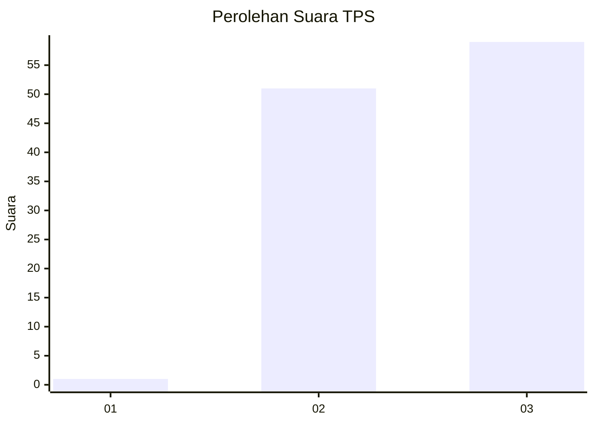
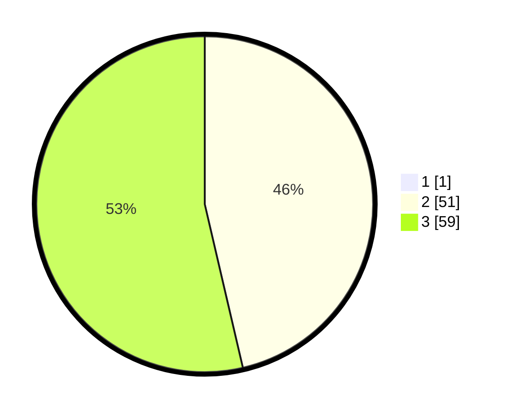

# Hasil

## Grafik

## Tabel

| No. | Nama Paslon    | Suara | Suara (raw) | Persentase |
|:--- |:-------------- | -----:| -----------:| ----------:|
| 1   | ANIES MUHAIMIN | 1     | [1][p-1]    | 0,90       |
| 2   | PRABOWO GIBRAN | 51    | [51][p-2]   | 45,95      |
| 3   | GANJAR MAHFUD  | 59    | [59][p-3]   | 53,15      |

[p-1]: https://github.com/gigit-pemilu/pemilu-2024-51-bali/blob/main/pilpres/hitung-suara/sub/51-bali/sub/02-tabanan/sub/03-selemadeg-barat/sub/2004-antosari/sub/001-tps/sub/paslon-1.txt
[p-2]: https://github.com/gigit-pemilu/pemilu-2024-51-bali/blob/main/pilpres/hitung-suara/sub/51-bali/sub/02-tabanan/sub/03-selemadeg-barat/sub/2004-antosari/sub/001-tps/sub/paslon-2.txt
[p-3]: https://github.com/gigit-pemilu/pemilu-2024-51-bali/blob/main/pilpres/hitung-suara/sub/51-bali/sub/02-tabanan/sub/03-selemadeg-barat/sub/2004-antosari/sub/001-tps/sub/paslon-3.txt

## Foto C Plano

https://sirekap-obj-formc.kpu.go.id/eb41/pemilu/ppwp/51/02/03/20/04/5102032004001-20240215-214706--14ef6b5c-185d-4d87-affd-6c03fe5300ef.jpg

https://sirekap-obj-formc.kpu.go.id/eb41/pemilu/ppwp/51/02/03/20/04/5102032004001-20240215-214708--7ac4a30d-ab28-45ac-8c1f-0d3ac1ed834e.jpg

https://sirekap-obj-formc.kpu.go.id/eb41/pemilu/ppwp/51/02/03/20/04/5102032004001-20240215-214707--879947ae-4fc1-4095-ad9e-a6ac20b10c9f.jpg

## Metadata

| Key        | Value               |
| ---------- | ------------------- |
| Time Stamp | 2024-02-15 22:00:27 |

## DATA PEMILIH TETAP

Jumlah pemilih dalam DPT: **130**.
 * L: **64**.
 * P: **66**.

## DATA PENGGUNA HAK PILIH

Jumlah pengguna hak pilih dalam DPT: **110**.
 * L: **54**.
 * P: **56**.

Jumlah pengguna hak pilih dalam DPTb: **0**.
 * L: **0**.
 * P: **0**.

Jumlah pengguna hak pilih dalam DPK: **1**.
 * L: **1**.
 * P: **0**.

Jumlah pengguna hak pilih: **111**.
 * L: **55**.
 * P: **56**.

## JUMLAH SUARA SAH DAN TIDAK SAH

JUMLAH SELURUH SUARA SAH: **111**.

JUMLAH SUARA TIDAK SAH: **0**.

JUMLAH SELURUH SUARA SAH DAN SUARA TIDAK SAH: **111**.

