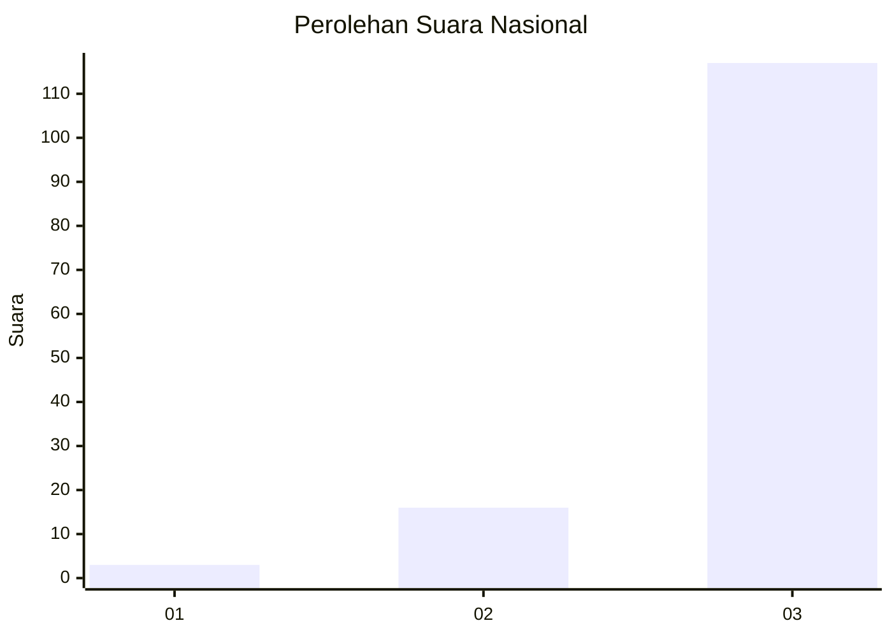
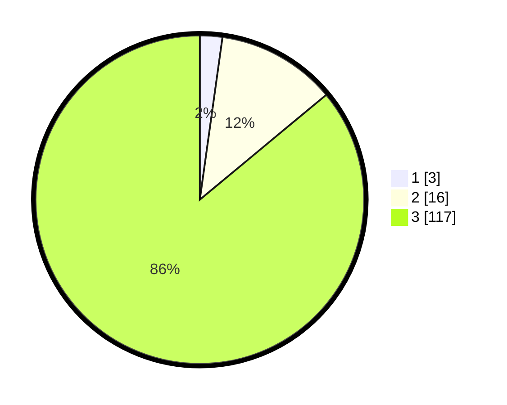

# Hasil

## Grafik

## Tabel

| No. | Nama Paslon    | Suara | Suara (raw) | Persentase |
|:--- |:-------------- | -----:| -----------:| ----------:|
| 1   | ANIES MUHAIMIN | 3     | [3][p-1]    | 2,21       |
| 2   | PRABOWO GIBRAN | 16    | [16][p-2]   | 11,76      |
| 3   | GANJAR MAHFUD  | 117   | [117][p-3]  | 86,03      |

[p-1]: https://github.com/gigit-pemilu/pemilu-2024/blob/main/pilpres/hitung-suara/sub/51-bali/sub/02-tabanan/sub/03-selemadeg-barat/sub/2004-antosari/sub/002-tps/sub/paslon-1.txt
[p-2]: https://github.com/gigit-pemilu/pemilu-2024/blob/main/pilpres/hitung-suara/sub/51-bali/sub/02-tabanan/sub/03-selemadeg-barat/sub/2004-antosari/sub/002-tps/sub/paslon-2.txt
[p-3]: https://github.com/gigit-pemilu/pemilu-2024/blob/main/pilpres/hitung-suara/sub/51-bali/sub/02-tabanan/sub/03-selemadeg-barat/sub/2004-antosari/sub/002-tps/sub/paslon-3.txt

## Foto C Plano

https://sirekap-obj-formc.kpu.go.id/e145/pemilu/ppwp/51/02/03/20/04/5102032004002-20240215-232429--8a0d10dc-e983-4064-9cc1-4a01f8103e89.jpg

https://sirekap-obj-formc.kpu.go.id/e145/pemilu/ppwp/51/02/03/20/04/5102032004002-20240215-232432--c8133ce5-e53e-4d36-bcdd-3326f4f9d3bb.jpg

https://sirekap-obj-formc.kpu.go.id/e145/pemilu/ppwp/51/02/03/20/04/5102032004002-20240215-232430--6c2706ad-d99d-4aac-bb07-64fe9d2aa7e0.jpg

## Metadata

| Key        | Value               |
| ---------- | ------------------- |
| Time Stamp | 2024-02-16 10:00:28 |

## DATA PEMILIH TETAP

Jumlah pemilih dalam DPT: **153**.
 * L: **72**.
 * P: **81**.

## DATA PENGGUNA HAK PILIH

Jumlah pengguna hak pilih dalam DPT: **137**.
 * L: **66**.
 * P: **71**.

Jumlah pengguna hak pilih dalam DPTb: **0**.
 * L: **0**.
 * P: **0**.

Jumlah pengguna hak pilih dalam DPK: **0**.
 * L: **0**.
 * P: **0**.

Jumlah pengguna hak pilih: **137**.
 * L: **66**.
 * P: **71**.

## JUMLAH SUARA SAH DAN TIDAK SAH

JUMLAH SELURUH SUARA SAH: **136**.

JUMLAH SUARA TIDAK SAH: **1**.

JUMLAH SELURUH SUARA SAH DAN SUARA TIDAK SAH: **137**.

