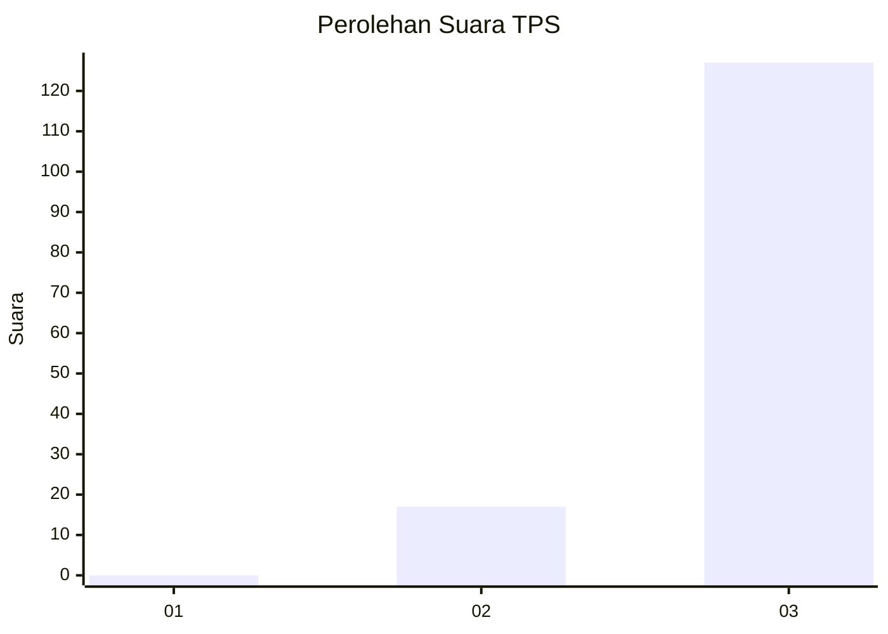
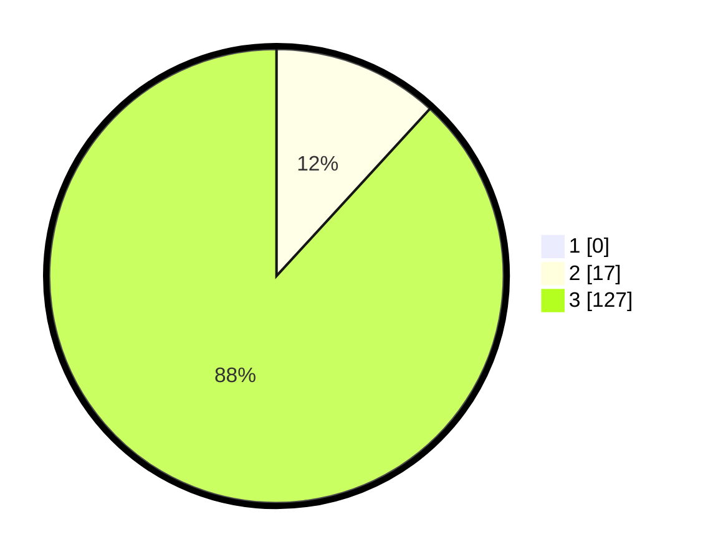

# Hasil

## Grafik

## Tabel

| No. | Nama Paslon    | Suara | Suara (raw) | Persentase |
|:--- |:-------------- | -----:| -----------:| ----------:|
| 1   | ANIES MUHAIMIN | 0     | [0][p-1]    | 0,00       |
| 2   | PRABOWO GIBRAN | 17    | [17][p-2]   | 11,81      |
| 3   | GANJAR MAHFUD  | 127   | [127][p-3]  | 88,19      |

[p-1]: https://github.com/gigit-pemilu/pemilu-2024-51-bali/blob/main/pilpres/hitung-suara/sub/51-bali/sub/02-tabanan/sub/03-selemadeg-barat/sub/2004-antosari/sub/003-tps/sub/paslon-1.txt
[p-2]: https://github.com/gigit-pemilu/pemilu-2024-51-bali/blob/main/pilpres/hitung-suara/sub/51-bali/sub/02-tabanan/sub/03-selemadeg-barat/sub/2004-antosari/sub/003-tps/sub/paslon-2.txt
[p-3]: https://github.com/gigit-pemilu/pemilu-2024-51-bali/blob/main/pilpres/hitung-suara/sub/51-bali/sub/02-tabanan/sub/03-selemadeg-barat/sub/2004-antosari/sub/003-tps/sub/paslon-3.txt

## Foto C Plano

https://sirekap-obj-formc.kpu.go.id/60d6/pemilu/ppwp/51/02/03/20/04/5102032004003-20240215-220511--7026c6be-701f-48d7-b2d2-01c6cf9560bf.jpg

https://sirekap-obj-formc.kpu.go.id/60d6/pemilu/ppwp/51/02/03/20/04/5102032004003-20240215-220513--43438bbb-4719-4b28-bdec-049724c86a8a.jpg

https://sirekap-obj-formc.kpu.go.id/60d6/pemilu/ppwp/51/02/03/20/04/5102032004003-20240215-220512--ca031094-8498-488a-9650-0546f29d6eae.jpg

## Metadata

| Key        | Value               |
| ---------- | ------------------- |
| Time Stamp | 2024-02-16 10:00:28 |

## DATA PEMILIH TETAP

Jumlah pemilih dalam DPT: **153**.
 * L: **78**.
 * P: **75**.

## DATA PENGGUNA HAK PILIH

Jumlah pengguna hak pilih dalam DPT: **150**.
 * L: **77**.
 * P: **73**.

Jumlah pengguna hak pilih dalam DPTb: **1**.
 * L: **0**.
 * P: **1**.

Jumlah pengguna hak pilih dalam DPK: **0**.
 * L: **0**.
 * P: **0**.

Jumlah pengguna hak pilih: **151**.
 * L: **77**.
 * P: **74**.

## JUMLAH SUARA SAH DAN TIDAK SAH

JUMLAH SELURUH SUARA SAH: **144**.

JUMLAH SUARA TIDAK SAH: **7**.

JUMLAH SELURUH SUARA SAH DAN SUARA TIDAK SAH: **151**.

