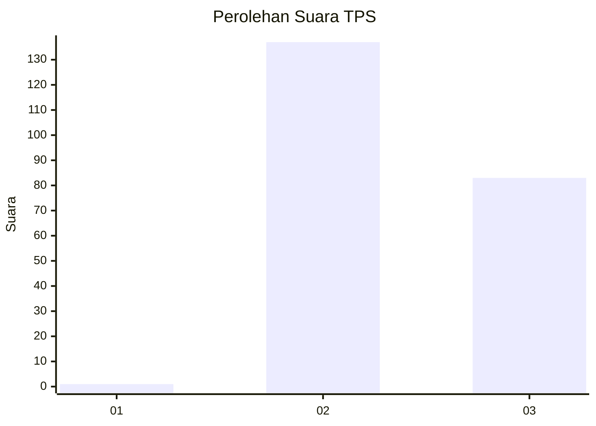
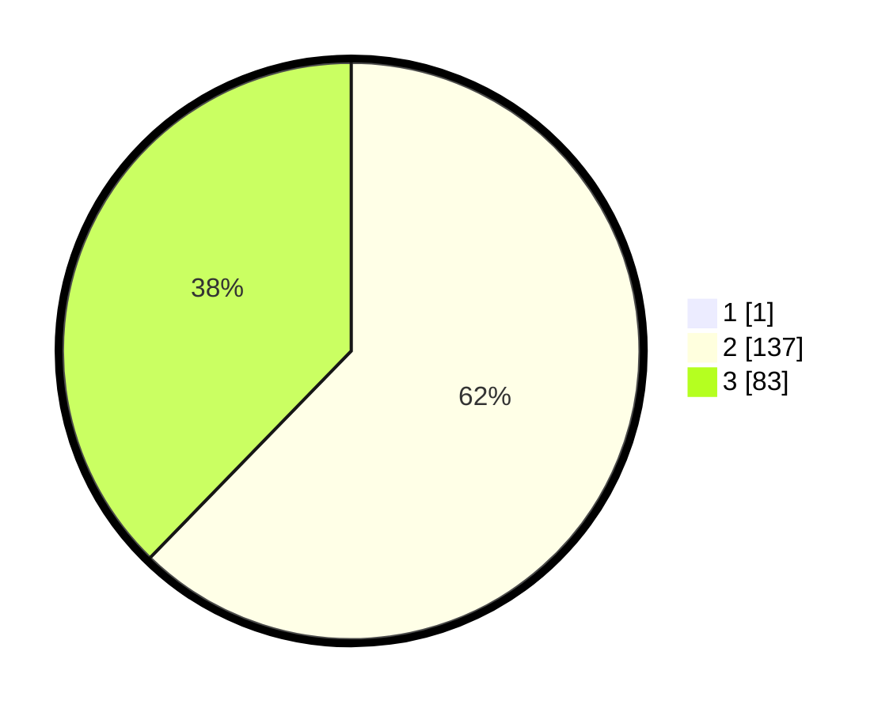

# Hasil

## Grafik

## Tabel

| No. | Nama Paslon    | Suara | Suara (raw) | Persentase |
|:--- |:-------------- | -----:| -----------:| ----------:|
| 1   | ANIES MUHAIMIN | 1     | [1][p-1]    | 0,45       |
| 2   | PRABOWO GIBRAN | 137   | [137][p-2]  | 61,99      |
| 3   | GANJAR MAHFUD  | 83    | [83][p-3]   | 37,56      |

[p-1]: https://github.com/gigit-pemilu/pemilu-2024-51-bali/blob/main/pilpres/hitung-suara/sub/51-bali/sub/02-tabanan/sub/03-selemadeg-barat/sub/2004-antosari/sub/004-tps/sub/paslon-1.txt
[p-2]: https://github.com/gigit-pemilu/pemilu-2024-51-bali/blob/main/pilpres/hitung-suara/sub/51-bali/sub/02-tabanan/sub/03-selemadeg-barat/sub/2004-antosari/sub/004-tps/sub/paslon-2.txt
[p-3]: https://github.com/gigit-pemilu/pemilu-2024-51-bali/blob/main/pilpres/hitung-suara/sub/51-bali/sub/02-tabanan/sub/03-selemadeg-barat/sub/2004-antosari/sub/004-tps/sub/paslon-3.txt

## Foto C Plano

https://sirekap-obj-formc.kpu.go.id/7c25/pemilu/ppwp/51/02/03/20/04/5102032004004-20240216-083506--204a2139-59c0-4167-8f64-88127a44614f.jpg

https://sirekap-obj-formc.kpu.go.id/7c25/pemilu/ppwp/51/02/03/20/04/5102032004004-20240216-083507--c2bdab4b-8ba1-4460-99fb-992b27441169.jpg

https://sirekap-obj-formc.kpu.go.id/7c25/pemilu/ppwp/51/02/03/20/04/5102032004004-20240216-083506--5513ef05-88a3-4ec0-b64f-22f185ef9743.jpg

## Metadata

| Key        | Value               |
| ---------- | ------------------- |
| Time Stamp | 2024-02-16 10:00:28 |

## DATA PEMILIH TETAP

Jumlah pemilih dalam DPT: **246**.
 * L: **133**.
 * P: **113**.

## DATA PENGGUNA HAK PILIH

Jumlah pengguna hak pilih dalam DPT: **219**.
 * L: **119**.
 * P: **100**.

Jumlah pengguna hak pilih dalam DPTb: **5**.
 * L: **2**.
 * P: **3**.

Jumlah pengguna hak pilih dalam DPK: **0**.
 * L: **0**.
 * P: **0**.

Jumlah pengguna hak pilih: **224**.
 * L: **121**.
 * P: **183**.

## JUMLAH SUARA SAH DAN TIDAK SAH

JUMLAH SELURUH SUARA SAH: **221**.

JUMLAH SUARA TIDAK SAH: **3**.

JUMLAH SELURUH SUARA SAH DAN SUARA TIDAK SAH: **224**.

