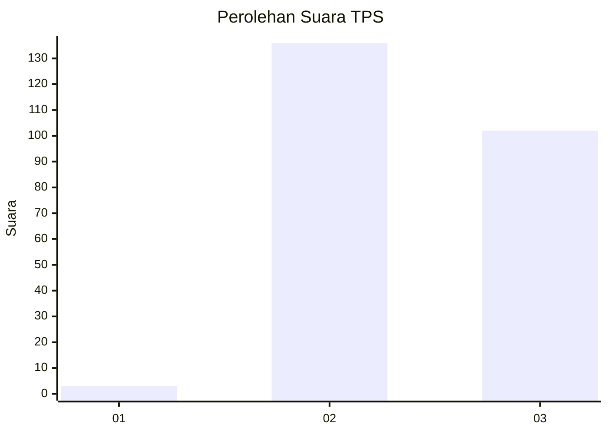
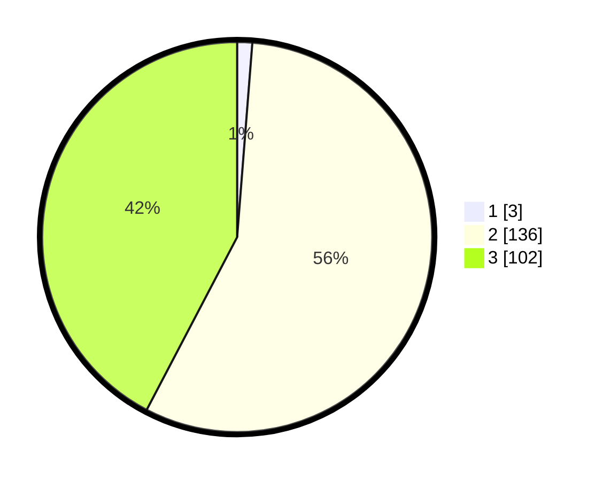

# Hasil

## Grafik

## Tabel

| No. | Nama Paslon    | Suara | Suara (raw) | Persentase |
|:--- |:-------------- | -----:| -----------:| ----------:|
| 1   | ANIES MUHAIMIN | 3     | [3][p-1]    | 1,24       |
| 2   | PRABOWO GIBRAN | 136   | [136][p-2]  | 56,43      |
| 3   | GANJAR MAHFUD  | 102   | [102][p-3]  | 42,32      |

[p-1]: https://github.com/gigit-pemilu/pemilu-2024-51-bali/blob/main/pilpres/hitung-suara/sub/51-bali/sub/02-tabanan/sub/03-selemadeg-barat/sub/2004-antosari/sub/005-tps/sub/paslon-1.txt
[p-2]: https://github.com/gigit-pemilu/pemilu-2024-51-bali/blob/main/pilpres/hitung-suara/sub/51-bali/sub/02-tabanan/sub/03-selemadeg-barat/sub/2004-antosari/sub/005-tps/sub/paslon-2.txt
[p-3]: https://github.com/gigit-pemilu/pemilu-2024-51-bali/blob/main/pilpres/hitung-suara/sub/51-bali/sub/02-tabanan/sub/03-selemadeg-barat/sub/2004-antosari/sub/005-tps/sub/paslon-3.txt

## Foto C Plano

https://sirekap-obj-formc.kpu.go.id/2be6/pemilu/ppwp/51/02/03/20/04/5102032004005-20240216-022652--072fd9c2-c008-4812-af77-d290cd60d93e.jpg

https://sirekap-obj-formc.kpu.go.id/2be6/pemilu/ppwp/51/02/03/20/04/5102032004005-20240216-022653--36fffddd-822f-4241-9df9-23ff3b1b551d.jpg

https://sirekap-obj-formc.kpu.go.id/2be6/pemilu/ppwp/51/02/03/20/04/5102032004005-20240216-022652--c3b35628-48b3-4059-82de-676435680845.jpg

## Metadata

| Key        | Value               |
| ---------- | ------------------- |
| Time Stamp | 2024-02-16 10:00:28 |

## DATA PEMILIH TETAP

Jumlah pemilih dalam DPT: **287**.
 * L: **140**.
 * P: **147**.

## DATA PENGGUNA HAK PILIH

Jumlah pengguna hak pilih dalam DPT: **238**.
 * L: **120**.
 * P: **118**.

Jumlah pengguna hak pilih dalam DPTb: **3**.
 * L: **1**.
 * P: **2**.

Jumlah pengguna hak pilih dalam DPK: **1**.
 * L: **1**.
 * P: **0**.

Jumlah pengguna hak pilih: **242**.
 * L: **122**.
 * P: **120**.

## JUMLAH SUARA SAH DAN TIDAK SAH

JUMLAH SELURUH SUARA SAH: **241**.

JUMLAH SUARA TIDAK SAH: **1**.

JUMLAH SELURUH SUARA SAH DAN SUARA TIDAK SAH: **242**.

