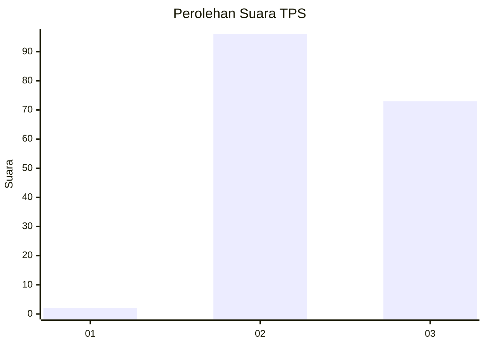
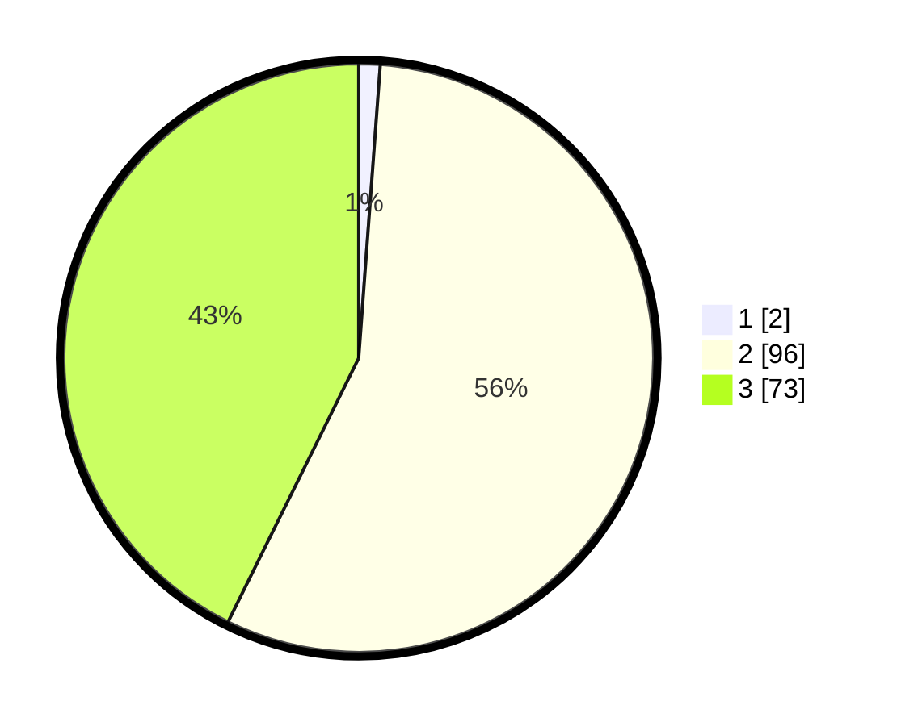

# Hasil

## Grafik

## Tabel

| No. | Nama Paslon    | Suara | Suara (raw) | Persentase |
|:--- |:-------------- | -----:| -----------:| ----------:|
| 1   | ANIES MUHAIMIN | 2     | [2][p-1]    | 1,17       |
| 2   | PRABOWO GIBRAN | 96    | [96][p-2]   | 56,14      |
| 3   | GANJAR MAHFUD  | 73    | [73][p-3]   | 42,69      |

[p-1]: https://github.com/gigit-pemilu/pemilu-2024-51-bali/blob/main/pilpres/hitung-suara/sub/51-bali/sub/02-tabanan/sub/03-selemadeg-barat/sub/2004-antosari/sub/006-tps/sub/paslon-1.txt
[p-2]: https://github.com/gigit-pemilu/pemilu-2024-51-bali/blob/main/pilpres/hitung-suara/sub/51-bali/sub/02-tabanan/sub/03-selemadeg-barat/sub/2004-antosari/sub/006-tps/sub/paslon-2.txt
[p-3]: https://github.com/gigit-pemilu/pemilu-2024-51-bali/blob/main/pilpres/hitung-suara/sub/51-bali/sub/02-tabanan/sub/03-selemadeg-barat/sub/2004-antosari/sub/006-tps/sub/paslon-3.txt

## Foto C Plano

https://sirekap-obj-formc.kpu.go.id/e37f/pemilu/ppwp/51/02/03/20/04/5102032004006-20240216-001720--8b34318f-fd3d-4fda-953a-a9ea5cb57e61.jpg

https://sirekap-obj-formc.kpu.go.id/e37f/pemilu/ppwp/51/02/03/20/04/5102032004006-20240216-001723--4c4294e1-efd3-42c8-9f53-f794056ca8be.jpg

https://sirekap-obj-formc.kpu.go.id/e37f/pemilu/ppwp/51/02/03/20/04/5102032004006-20240216-001722--1d318fcc-a84d-43d3-801d-ef01f618e990.jpg

## Metadata

| Key        | Value               |
| ---------- | ------------------- |
| Time Stamp | 2024-02-16 10:00:28 |

## DATA PEMILIH TETAP

Jumlah pemilih dalam DPT: **198**.
 * L: **92**.
 * P: **106**.

## DATA PENGGUNA HAK PILIH

Jumlah pengguna hak pilih dalam DPT: **170**.
 * L: **78**.
 * P: **92**.

Jumlah pengguna hak pilih dalam DPTb: **1**.
 * L: **0**.
 * P: **1**.

Jumlah pengguna hak pilih dalam DPK: **1**.
 * L: **1**.
 * P: **0**.

Jumlah pengguna hak pilih: **172**.
 * L: **79**.
 * P: **93**.

## JUMLAH SUARA SAH DAN TIDAK SAH

JUMLAH SELURUH SUARA SAH: **171**.

JUMLAH SUARA TIDAK SAH: **1**.

JUMLAH SELURUH SUARA SAH DAN SUARA TIDAK SAH: **172**.

