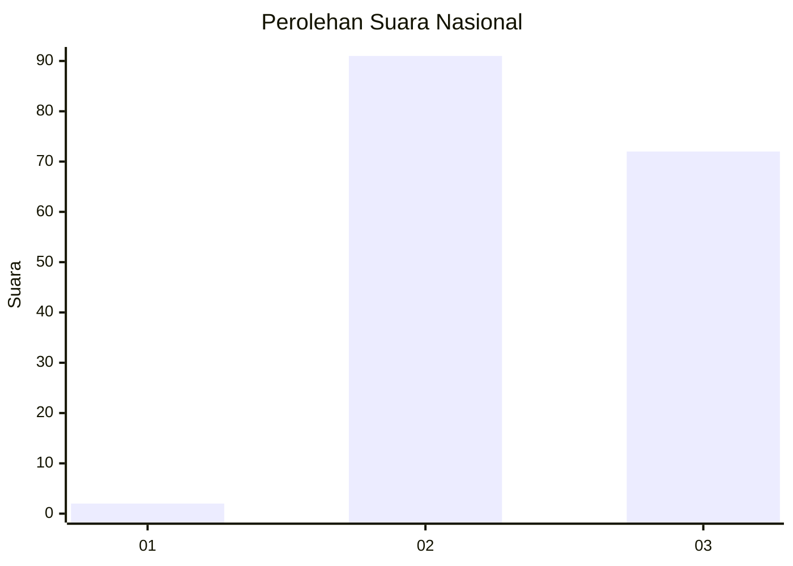
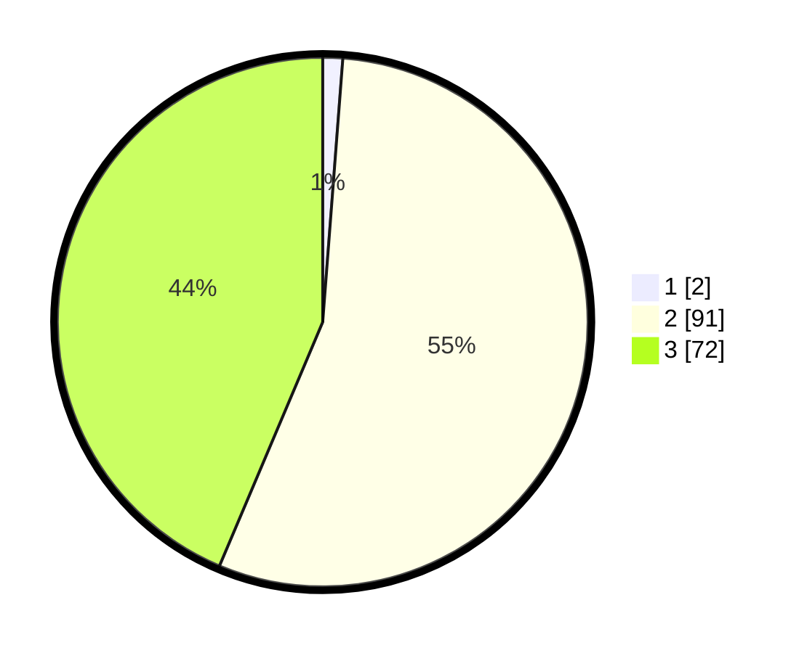

# Hasil

## Grafik

## Tabel

| No. | Nama Paslon    | Suara | Suara (raw) | Persentase |
|:--- |:-------------- | -----:| -----------:| ----------:|
| 1   | ANIES MUHAIMIN | 2     | [2][p-1]    | 1,21       |
| 2   | PRABOWO GIBRAN | 91    | [91][p-2]   | 55,15      |
| 3   | GANJAR MAHFUD  | 72    | [72][p-3]   | 43,64      |

[p-1]: https://github.com/gigit-pemilu/pemilu-2024/blob/main/pilpres/hitung-suara/sub/51-bali/sub/02-tabanan/sub/03-selemadeg-barat/sub/2004-antosari/sub/007-tps/sub/paslon-1.txt
[p-2]: https://github.com/gigit-pemilu/pemilu-2024/blob/main/pilpres/hitung-suara/sub/51-bali/sub/02-tabanan/sub/03-selemadeg-barat/sub/2004-antosari/sub/007-tps/sub/paslon-2.txt
[p-3]: https://github.com/gigit-pemilu/pemilu-2024/blob/main/pilpres/hitung-suara/sub/51-bali/sub/02-tabanan/sub/03-selemadeg-barat/sub/2004-antosari/sub/007-tps/sub/paslon-3.txt

## Foto C Plano

https://sirekap-obj-formc.kpu.go.id/3a3c/pemilu/ppwp/51/02/03/20/04/5102032004007-20240216-131546--ec79e458-be72-4d06-8683-c98cf7950da6.jpg

https://sirekap-obj-formc.kpu.go.id/3a3c/pemilu/ppwp/51/02/03/20/04/5102032004007-20240216-131548--0ef4dc17-0a13-4734-8a08-a9ad0da78205.jpg

https://sirekap-obj-formc.kpu.go.id/3a3c/pemilu/ppwp/51/02/03/20/04/5102032004007-20240216-131547--9de5990a-4f5a-49a5-9e7c-32c3ffb0d3a0.jpg

## Metadata

| Key        | Value               |
| ---------- | ------------------- |
| Time Stamp | 2024-02-16 14:00:34 |

## DATA PEMILIH TETAP

Jumlah pemilih dalam DPT: **204**.
 * L: **100**.
 * P: **104**.

## DATA PENGGUNA HAK PILIH

Jumlah pengguna hak pilih dalam DPT: **166**.
 * L: **80**.
 * P: **86**.

Jumlah pengguna hak pilih dalam DPTb: **2**.
 * L: **0**.
 * P: **2**.

Jumlah pengguna hak pilih dalam DPK: **0**.
 * L: **0**.
 * P: **0**.

Jumlah pengguna hak pilih: **168**.
 * L: **80**.
 * P: **88**.

## JUMLAH SUARA SAH DAN TIDAK SAH

JUMLAH SELURUH SUARA SAH: **165**.

JUMLAH SUARA TIDAK SAH: **3**.

JUMLAH SELURUH SUARA SAH DAN SUARA TIDAK SAH: **168**.

