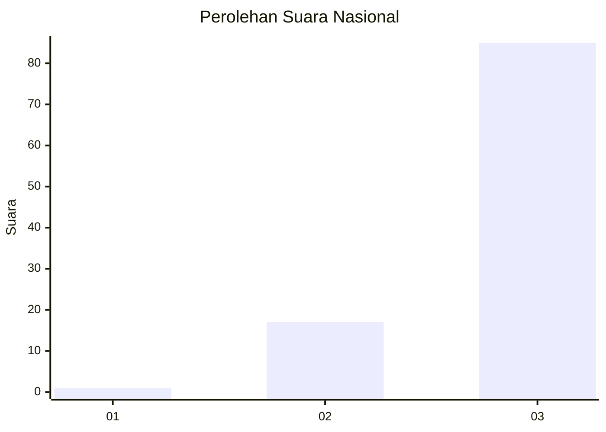
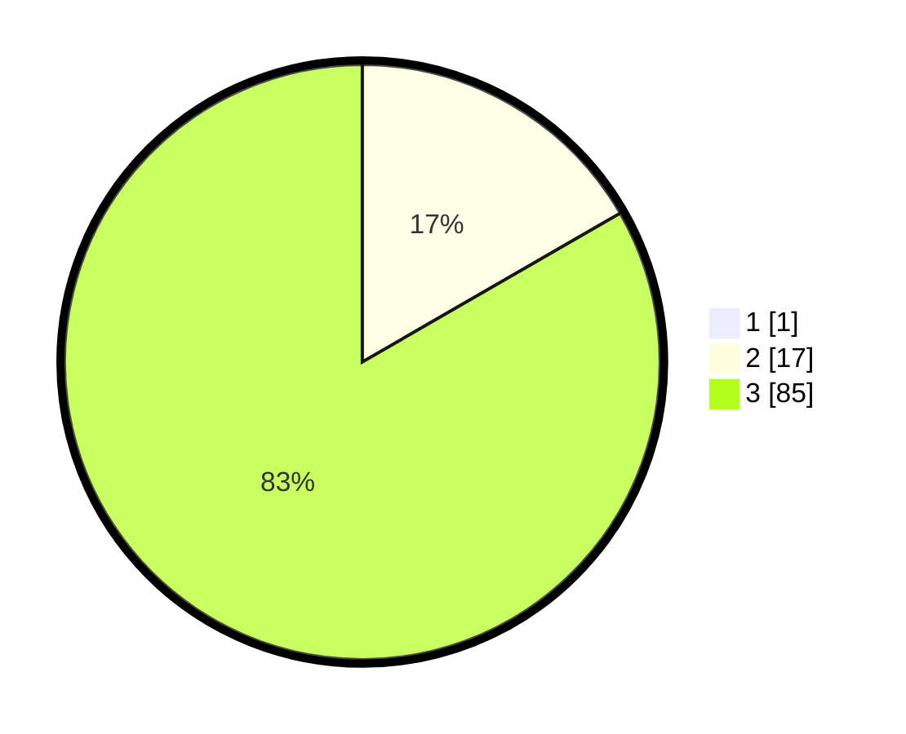

# Hasil

## Grafik

## Tabel

| No. | Nama Paslon    | Suara | Suara (raw) | Persentase |
|:--- |:-------------- | -----:| -----------:| ----------:|
| 1   | ANIES MUHAIMIN | 1     | [1][p-1]    | 0,97       |
| 2   | PRABOWO GIBRAN | 17    | [17][p-2]   | 16,50      |
| 3   | GANJAR MAHFUD  | 85    | [85][p-3]   | 82,52      |

[p-1]: https://github.com/gigit-pemilu/pemilu-2024/blob/main/pilpres/hitung-suara/sub/51-bali/sub/02-tabanan/sub/03-selemadeg-barat/sub/2004-antosari/sub/008-tps/sub/paslon-1.txt
[p-2]: https://github.com/gigit-pemilu/pemilu-2024/blob/main/pilpres/hitung-suara/sub/51-bali/sub/02-tabanan/sub/03-selemadeg-barat/sub/2004-antosari/sub/008-tps/sub/paslon-2.txt
[p-3]: https://github.com/gigit-pemilu/pemilu-2024/blob/main/pilpres/hitung-suara/sub/51-bali/sub/02-tabanan/sub/03-selemadeg-barat/sub/2004-antosari/sub/008-tps/sub/paslon-3.txt

## Foto C Plano

https://sirekap-obj-formc.kpu.go.id/43f1/pemilu/ppwp/51/02/03/20/04/5102032004008-20240214-131855--ed8f88f1-dc68-4850-b6d0-1dace236af06.jpg

https://sirekap-obj-formc.kpu.go.id/43f1/pemilu/ppwp/51/02/03/20/04/5102032004008-20240214-132115--c5813b4d-6a8b-4d65-8840-e3dce1e7f143.jpg

https://sirekap-obj-formc.kpu.go.id/43f1/pemilu/ppwp/51/02/03/20/04/5102032004008-20240214-132420--f913e2e4-3d9f-40f2-914b-7a9ac380ae7d.jpg

## Metadata

| Key        | Value               |
| ---------- | ------------------- |
| Time Stamp | 2024-02-14 21:46:01 |

## DATA PEMILIH TETAP

Jumlah pemilih dalam DPT: **102**.
 * L: **47**.
 * P: **55**.

## DATA PENGGUNA HAK PILIH

Jumlah pengguna hak pilih dalam DPT: **98**.
 * L: **46**.
 * P: **52**.

Jumlah pengguna hak pilih dalam DPTb: **6**.
 * L: **2**.
 * P: **4**.

Jumlah pengguna hak pilih dalam DPK: **0**.
 * L: **0**.
 * P: **0**.

Jumlah pengguna hak pilih: **104**.
 * L: **48**.
 * P: **56**.

## JUMLAH SUARA SAH DAN TIDAK SAH

JUMLAH SELURUH SUARA SAH: **103**.

JUMLAH SUARA TIDAK SAH: **1**.

JUMLAH SELURUH SUARA SAH DAN SUARA TIDAK SAH: **104**.

