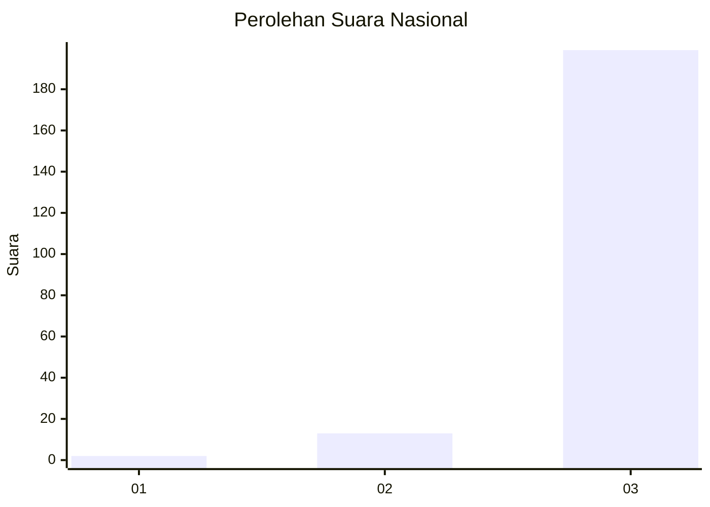
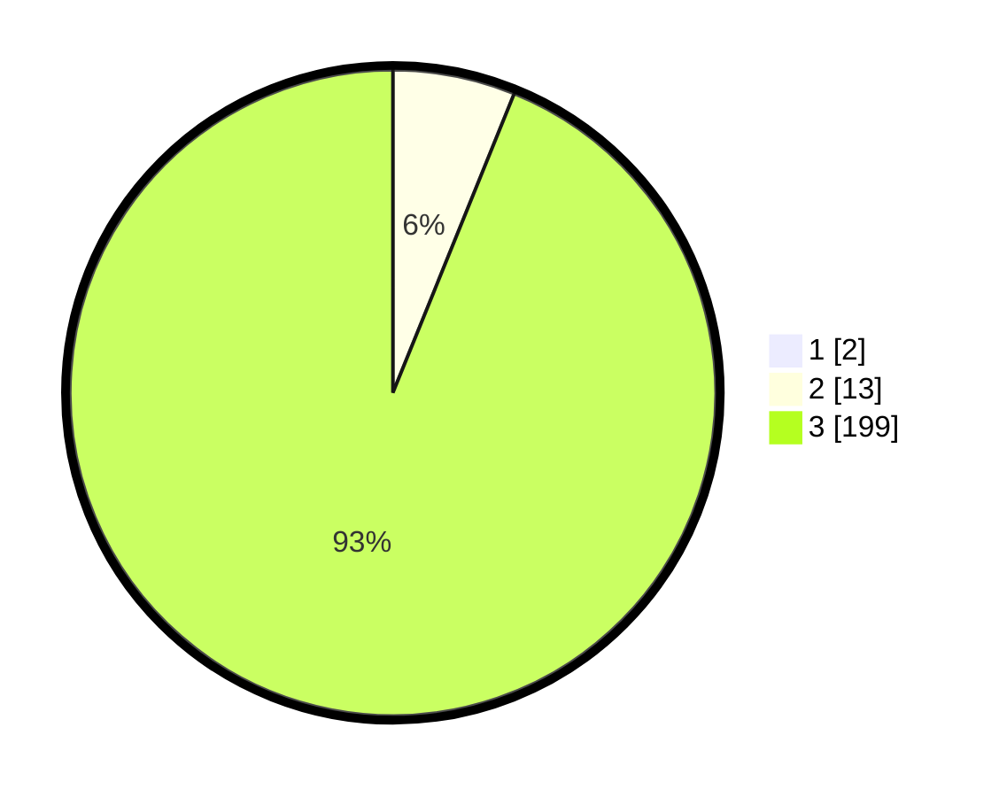

# Hasil

## Grafik

## Tabel

| No. | Nama Paslon    | Suara | Suara (raw) | Persentase |
|:--- |:-------------- | -----:| -----------:| ----------:|
| 1   | ANIES MUHAIMIN | 2     | [2][p-1]    | 0,93       |
| 2   | PRABOWO GIBRAN | 13    | [13][p-2]   | 6,07       |
| 3   | GANJAR MAHFUD  | 199   | [199][p-3]  | 92,99      |

[p-1]: https://github.com/gigit-pemilu/pemilu-2024/blob/main/pilpres/hitung-suara/sub/51-bali/sub/02-tabanan/sub/03-selemadeg-barat/sub/2005-lumbung/sub/001-tps/sub/paslon-1.txt
[p-2]: https://github.com/gigit-pemilu/pemilu-2024/blob/main/pilpres/hitung-suara/sub/51-bali/sub/02-tabanan/sub/03-selemadeg-barat/sub/2005-lumbung/sub/001-tps/sub/paslon-2.txt
[p-3]: https://github.com/gigit-pemilu/pemilu-2024/blob/main/pilpres/hitung-suara/sub/51-bali/sub/02-tabanan/sub/03-selemadeg-barat/sub/2005-lumbung/sub/001-tps/sub/paslon-3.txt

## Foto C Plano

https://sirekap-obj-formc.kpu.go.id/c6a8/pemilu/ppwp/51/02/03/20/05/5102032005001-20240215-042757--31b305ff-33b2-4e7a-b847-2eb63b43e696.jpg

https://sirekap-obj-formc.kpu.go.id/c6a8/pemilu/ppwp/51/02/03/20/05/5102032005001-20240215-042819--2e5be0e8-d354-48ed-8f3b-55241fbcfcd5.jpg

https://sirekap-obj-formc.kpu.go.id/c6a8/pemilu/ppwp/51/02/03/20/05/5102032005001-20240215-042808--2400b569-624e-4fa2-8904-75f24c9b13a3.jpg

## Metadata

| Key        | Value               |
| ---------- | ------------------- |
| Time Stamp | 2024-02-15 22:00:27 |

## DATA PEMILIH TETAP

Jumlah pemilih dalam DPT: **231**.
 * L: **119**.
 * P: **112**.

## DATA PENGGUNA HAK PILIH

Jumlah pengguna hak pilih dalam DPT: **216**.
 * L: **109**.
 * P: **107**.

Jumlah pengguna hak pilih dalam DPTb: **0**.
 * L: **0**.
 * P: **0**.

Jumlah pengguna hak pilih dalam DPK: **1**.
 * L: **1**.
 * P: **0**.

Jumlah pengguna hak pilih: **217**.
 * L: **110**.
 * P: **107**.

## JUMLAH SUARA SAH DAN TIDAK SAH

JUMLAH SELURUH SUARA SAH: **214**.

JUMLAH SUARA TIDAK SAH: **3**.

JUMLAH SELURUH SUARA SAH DAN SUARA TIDAK SAH: **217**.

