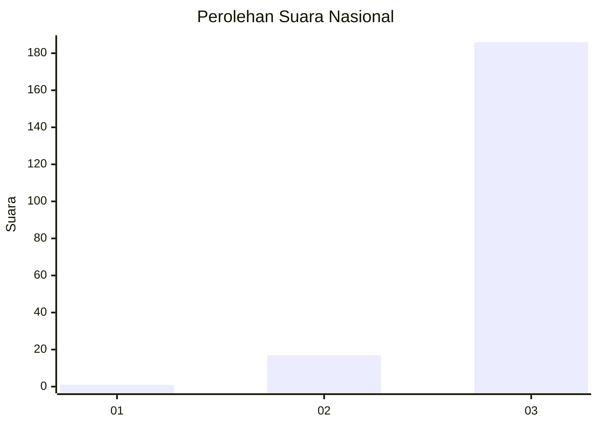
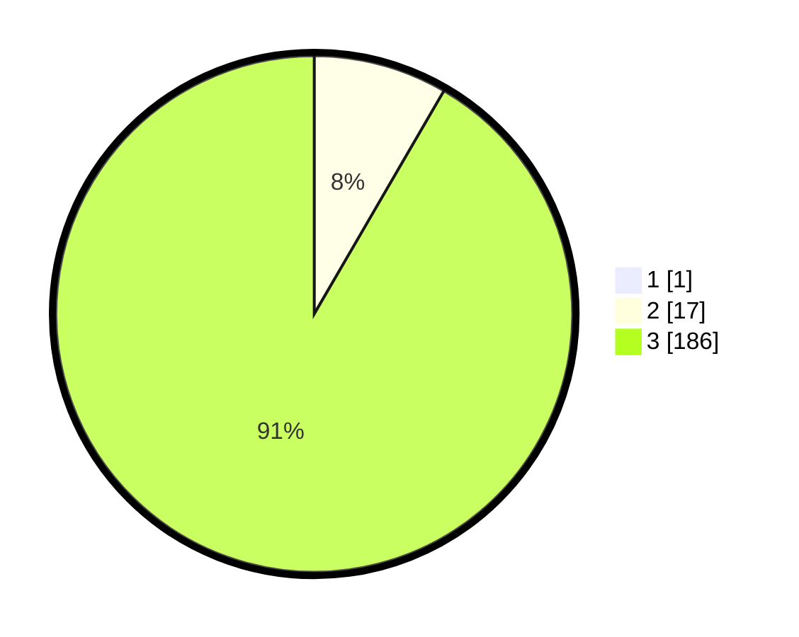

# Hasil

## Grafik

## Tabel

| No. | Nama Paslon    | Suara | Suara (raw) | Persentase |
|:--- |:-------------- | -----:| -----------:| ----------:|
| 1   | ANIES MUHAIMIN | 1     | [1][p-1]    | 0,49       |
| 2   | PRABOWO GIBRAN | 17    | [17][p-2]   | 8,33       |
| 3   | GANJAR MAHFUD  | 186   | [186][p-3]  | 91,18      |

[p-1]: https://github.com/gigit-pemilu/pemilu-2024/blob/main/pilpres/hitung-suara/sub/51-bali/sub/02-tabanan/sub/03-selemadeg-barat/sub/2005-lumbung/sub/003-tps/sub/paslon-1.txt
[p-2]: https://github.com/gigit-pemilu/pemilu-2024/blob/main/pilpres/hitung-suara/sub/51-bali/sub/02-tabanan/sub/03-selemadeg-barat/sub/2005-lumbung/sub/003-tps/sub/paslon-2.txt
[p-3]: https://github.com/gigit-pemilu/pemilu-2024/blob/main/pilpres/hitung-suara/sub/51-bali/sub/02-tabanan/sub/03-selemadeg-barat/sub/2005-lumbung/sub/003-tps/sub/paslon-3.txt

## Foto C Plano

https://sirekap-obj-formc.kpu.go.id/8af2/pemilu/ppwp/51/02/03/20/05/5102032005003-20240216-004614--53d400fa-ef7b-4fe2-bf60-5e82763b0705.jpg

https://sirekap-obj-formc.kpu.go.id/8af2/pemilu/ppwp/51/02/03/20/05/5102032005003-20240216-004618--f24e8fe5-05f4-4e85-bdae-2469a8a1ea3d.jpg

https://sirekap-obj-formc.kpu.go.id/8af2/pemilu/ppwp/51/02/03/20/05/5102032005003-20240216-004617--d412b3e7-e6e1-4199-b79a-0920db139ae1.jpg

## Metadata

| Key        | Value               |
| ---------- | ------------------- |
| Time Stamp | 2024-02-16 10:00:28 |

## DATA PEMILIH TETAP

Jumlah pemilih dalam DPT: **247**.
 * L: **115**.
 * P: **132**.

## DATA PENGGUNA HAK PILIH

Jumlah pengguna hak pilih dalam DPT: **206**.
 * L: **98**.
 * P: **108**.

Jumlah pengguna hak pilih dalam DPTb: **0**.
 * L: **0**.
 * P: **0**.

Jumlah pengguna hak pilih dalam DPK: **0**.
 * L: **0**.
 * P: **0**.

Jumlah pengguna hak pilih: **206**.
 * L: **98**.
 * P: **108**.

## JUMLAH SUARA SAH DAN TIDAK SAH

JUMLAH SELURUH SUARA SAH: **204**.

JUMLAH SUARA TIDAK SAH: **2**.

JUMLAH SELURUH SUARA SAH DAN SUARA TIDAK SAH: **206**.

