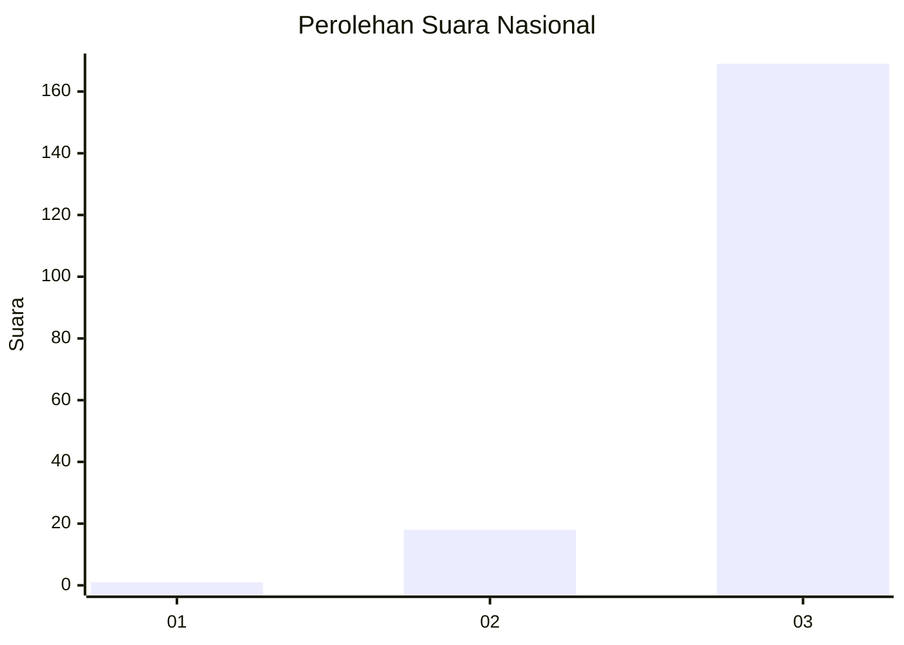
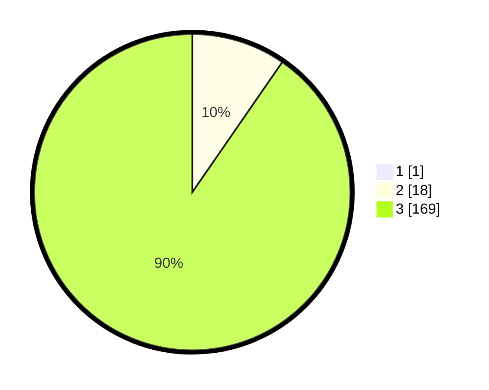

# Hasil

## Grafik

## Tabel

| No. | Nama Paslon    | Suara | Suara (raw) | Persentase |
|:--- |:-------------- | -----:| -----------:| ----------:|
| 1   | ANIES MUHAIMIN | 1     | [1][p-1]    | 0,53       |
| 2   | PRABOWO GIBRAN | 18    | [18][p-2]   | 9,57       |
| 3   | GANJAR MAHFUD  | 169   | [169][p-3]  | 89,89      |

[p-1]: https://github.com/gigit-pemilu/pemilu-2024/blob/main/pilpres/hitung-suara/sub/51-bali/sub/02-tabanan/sub/03-selemadeg-barat/sub/2005-lumbung/sub/004-tps/sub/paslon-1.txt
[p-2]: https://github.com/gigit-pemilu/pemilu-2024/blob/main/pilpres/hitung-suara/sub/51-bali/sub/02-tabanan/sub/03-selemadeg-barat/sub/2005-lumbung/sub/004-tps/sub/paslon-2.txt
[p-3]: https://github.com/gigit-pemilu/pemilu-2024/blob/main/pilpres/hitung-suara/sub/51-bali/sub/02-tabanan/sub/03-selemadeg-barat/sub/2005-lumbung/sub/004-tps/sub/paslon-3.txt

## Foto C Plano

https://sirekap-obj-formc.kpu.go.id/6069/pemilu/ppwp/51/02/03/20/05/5102032005004-20240216-001555--784f5299-61da-4c47-9e39-27ee7779ca70.jpg

https://sirekap-obj-formc.kpu.go.id/6069/pemilu/ppwp/51/02/03/20/05/5102032005004-20240216-001556--42106744-5a03-4664-8cc9-2766291c57d0.jpg

https://sirekap-obj-formc.kpu.go.id/6069/pemilu/ppwp/51/02/03/20/05/5102032005004-20240216-001555--90ae8159-e183-4de2-8977-6ed103641ab2.jpg

## Metadata

| Key        | Value               |
| ---------- | ------------------- |
| Time Stamp | 2024-02-16 10:00:28 |

## DATA PEMILIH TETAP

Jumlah pemilih dalam DPT: **229**.
 * L: **104**.
 * P: **125**.

## DATA PENGGUNA HAK PILIH

Jumlah pengguna hak pilih dalam DPT: **190**.
 * L: **85**.
 * P: **105**.

Jumlah pengguna hak pilih dalam DPTb: **0**.
 * L: **0**.
 * P: **0**.

Jumlah pengguna hak pilih dalam DPK: **1**.
 * L: **0**.
 * P: **1**.

Jumlah pengguna hak pilih: **191**.
 * L: **85**.
 * P: **106**.

## JUMLAH SUARA SAH DAN TIDAK SAH

JUMLAH SELURUH SUARA SAH: **188**.

JUMLAH SUARA TIDAK SAH: **3**.

JUMLAH SELURUH SUARA SAH DAN SUARA TIDAK SAH: **191**.

