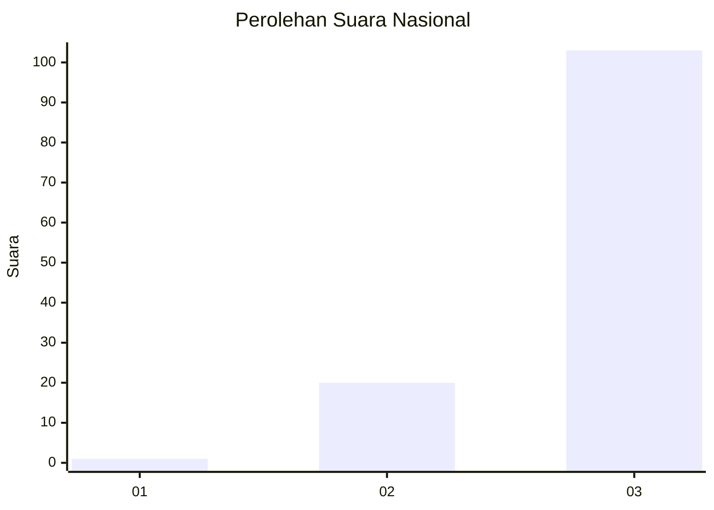
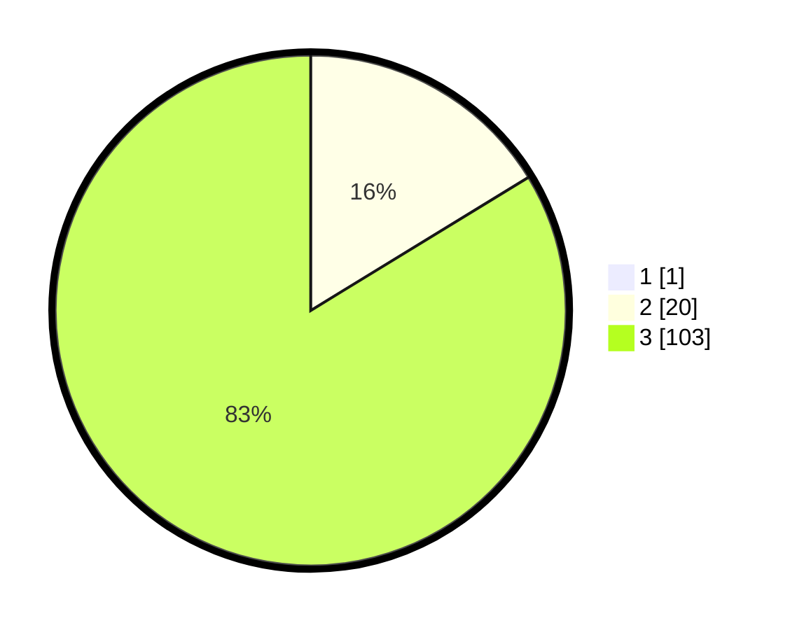

# Hasil

## Grafik

## Tabel

| No. | Nama Paslon    | Suara | Suara (raw) | Persentase |
|:--- |:-------------- | -----:| -----------:| ----------:|
| 1   | ANIES MUHAIMIN | 1     | [1][p-1]    | 0,81       |
| 2   | PRABOWO GIBRAN | 20    | [20][p-2]   | 16,13      |
| 3   | GANJAR MAHFUD  | 103   | [103][p-3]  | 83,06      |

[p-1]: https://github.com/gigit-pemilu/pemilu-2024/blob/main/pilpres/hitung-suara/sub/51-bali/sub/02-tabanan/sub/03-selemadeg-barat/sub/2005-lumbung/sub/005-tps/sub/paslon-1.txt
[p-2]: https://github.com/gigit-pemilu/pemilu-2024/blob/main/pilpres/hitung-suara/sub/51-bali/sub/02-tabanan/sub/03-selemadeg-barat/sub/2005-lumbung/sub/005-tps/sub/paslon-2.txt
[p-3]: https://github.com/gigit-pemilu/pemilu-2024/blob/main/pilpres/hitung-suara/sub/51-bali/sub/02-tabanan/sub/03-selemadeg-barat/sub/2005-lumbung/sub/005-tps/sub/paslon-3.txt

## Foto C Plano

https://sirekap-obj-formc.kpu.go.id/2c3a/pemilu/ppwp/51/02/03/20/05/5102032005005-20240216-133903--74196c31-20ad-4f97-a3b0-5fdf0429297f.jpg

https://sirekap-obj-formc.kpu.go.id/2c3a/pemilu/ppwp/51/02/03/20/05/5102032005005-20240216-133904--575143cb-3e92-49b6-884f-ccccd7bff43d.jpg

https://sirekap-obj-formc.kpu.go.id/2c3a/pemilu/ppwp/51/02/03/20/05/5102032005005-20240216-133904--3b470007-fb3a-4f17-8277-0d85bc8640fe.jpg

## Metadata

| Key        | Value               |
| ---------- | ------------------- |
| Time Stamp | 2024-02-16 14:00:34 |

## DATA PEMILIH TETAP

Jumlah pemilih dalam DPT: **139**.
 * L: **66**.
 * P: **73**.

## DATA PENGGUNA HAK PILIH

Jumlah pengguna hak pilih dalam DPT: **124**.
 * L: **56**.
 * P: **68**.

Jumlah pengguna hak pilih dalam DPTb: **0**.
 * L: **0**.
 * P: **0**.

Jumlah pengguna hak pilih dalam DPK: **0**.
 * L: **0**.
 * P: **0**.

Jumlah pengguna hak pilih: **124**.
 * L: **56**.
 * P: **68**.

## JUMLAH SUARA SAH DAN TIDAK SAH

JUMLAH SELURUH SUARA SAH: **124**.

JUMLAH SUARA TIDAK SAH: **0**.

JUMLAH SELURUH SUARA SAH DAN SUARA TIDAK SAH: **124**.

