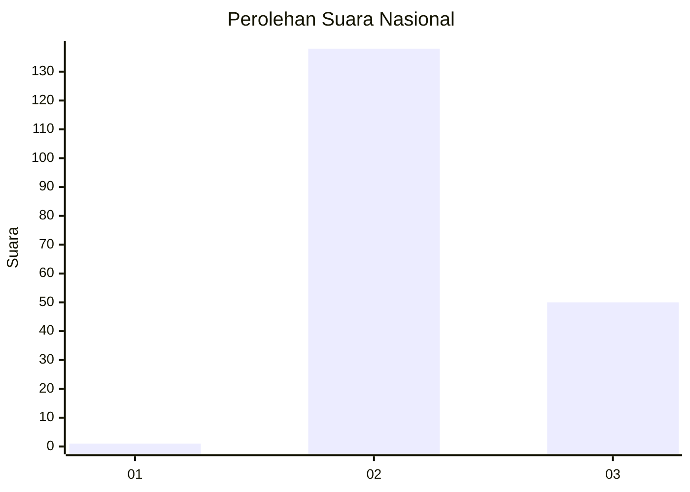
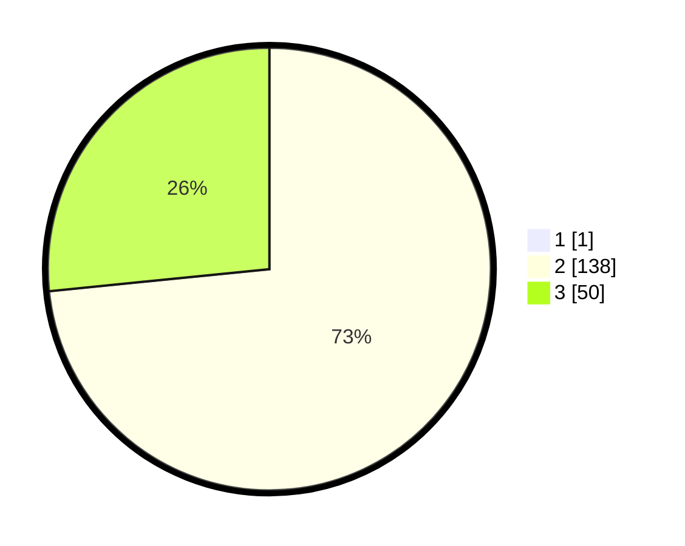

# Hasil

## Grafik

## Tabel

| No. | Nama Paslon    | Suara | Suara (raw) | Persentase |
|:--- |:-------------- | -----:| -----------:| ----------:|
| 1   | ANIES MUHAIMIN | 1     | [1][p-1]    | 0,53       |
| 2   | PRABOWO GIBRAN | 138   | [138][p-2]  | 73,02      |
| 3   | GANJAR MAHFUD  | 50    | [50][p-3]   | 26,46      |

[p-1]: https://github.com/gigit-pemilu/pemilu-2024/blob/main/pilpres/hitung-suara/sub/51-bali/sub/02-tabanan/sub/03-selemadeg-barat/sub/2005-lumbung/sub/006-tps/sub/paslon-1.txt
[p-2]: https://github.com/gigit-pemilu/pemilu-2024/blob/main/pilpres/hitung-suara/sub/51-bali/sub/02-tabanan/sub/03-selemadeg-barat/sub/2005-lumbung/sub/006-tps/sub/paslon-2.txt
[p-3]: https://github.com/gigit-pemilu/pemilu-2024/blob/main/pilpres/hitung-suara/sub/51-bali/sub/02-tabanan/sub/03-selemadeg-barat/sub/2005-lumbung/sub/006-tps/sub/paslon-3.txt

## Foto C Plano

https://sirekap-obj-formc.kpu.go.id/3bd3/pemilu/ppwp/51/02/03/20/05/5102032005006-20240216-140538--dcdaaba2-c1bd-4528-9dc6-f11d1ce92a86.jpg

https://sirekap-obj-formc.kpu.go.id/3bd3/pemilu/ppwp/51/02/03/20/05/5102032005006-20240216-140540--13561562-d040-4d20-ad7d-00b81f456e76.jpg

https://sirekap-obj-formc.kpu.go.id/3bd3/pemilu/ppwp/51/02/03/20/05/5102032005006-20240216-140539--26cfd30f-8cc4-4e90-af34-31280138b661.jpg

## Metadata

| Key        | Value               |
| ---------- | ------------------- |
| Time Stamp | 2024-02-16 14:30:33 |

## DATA PEMILIH TETAP

Jumlah pemilih dalam DPT: **205**.
 * L: **106**.
 * P: **99**.

## DATA PENGGUNA HAK PILIH

Jumlah pengguna hak pilih dalam DPT: **190**.
 * L: **98**.
 * P: **92**.

Jumlah pengguna hak pilih dalam DPTb: **0**.
 * L: **0**.
 * P: **0**.

Jumlah pengguna hak pilih dalam DPK: **0**.
 * L: **0**.
 * P: **0**.

Jumlah pengguna hak pilih: **190**.
 * L: **98**.
 * P: **92**.

## JUMLAH SUARA SAH DAN TIDAK SAH

JUMLAH SELURUH SUARA SAH: **189**.

JUMLAH SUARA TIDAK SAH: **1**.

JUMLAH SELURUH SUARA SAH DAN SUARA TIDAK SAH: **190**.

