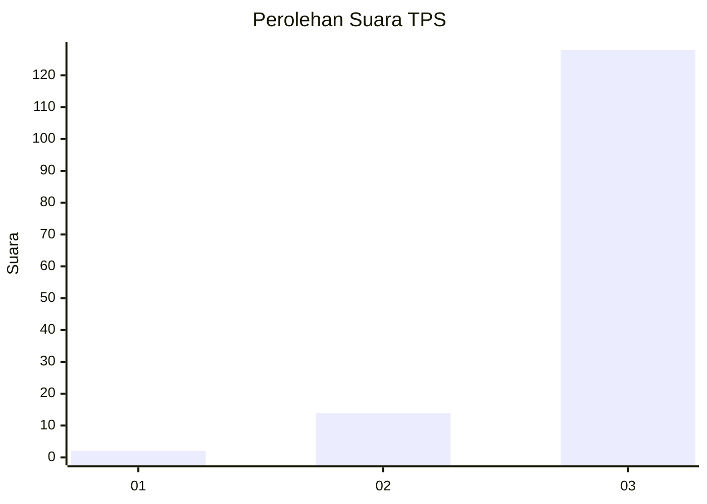
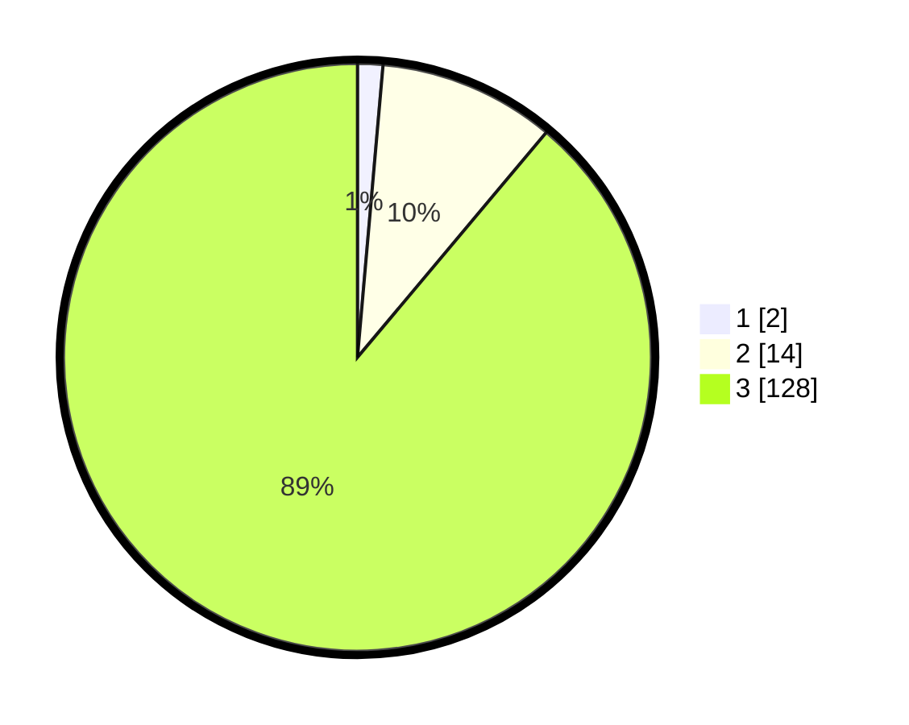

# Hasil

## Grafik

## Tabel

| No. | Nama Paslon    | Suara | Suara (raw) | Persentase |
|:--- |:-------------- | -----:| -----------:| ----------:|
| 1   | ANIES MUHAIMIN | 2     | [2][p-1]    | 1,39       |
| 2   | PRABOWO GIBRAN | 14    | [14][p-2]   | 9,72       |
| 3   | GANJAR MAHFUD  | 128   | [128][p-3]  | 88,89      |

[p-1]: https://github.com/gigit-pemilu/pemilu-2024-51-bali/blob/main/pilpres/hitung-suara/sub/51-bali/sub/02-tabanan/sub/03-selemadeg-barat/sub/2005-lumbung/sub/007-tps/sub/paslon-1.txt
[p-2]: https://github.com/gigit-pemilu/pemilu-2024-51-bali/blob/main/pilpres/hitung-suara/sub/51-bali/sub/02-tabanan/sub/03-selemadeg-barat/sub/2005-lumbung/sub/007-tps/sub/paslon-2.txt
[p-3]: https://github.com/gigit-pemilu/pemilu-2024-51-bali/blob/main/pilpres/hitung-suara/sub/51-bali/sub/02-tabanan/sub/03-selemadeg-barat/sub/2005-lumbung/sub/007-tps/sub/paslon-3.txt

## Foto C Plano

https://sirekap-obj-formc.kpu.go.id/184c/pemilu/ppwp/51/02/03/20/05/5102032005007-20240214-133058--8a3abd0f-f1b2-4a6a-9d8e-31e6b2224e5f.jpg

https://sirekap-obj-formc.kpu.go.id/184c/pemilu/ppwp/51/02/03/20/05/5102032005007-20240214-185443--cc57b19f-ecb1-4fd2-8b4b-0339221ed769.jpg

https://sirekap-obj-formc.kpu.go.id/184c/pemilu/ppwp/51/02/03/20/05/5102032005007-20240214-203617--8e7fa09e-b5b7-4f1f-9960-ea38ed57d6ba.jpg

## Metadata

| Key        | Value               |
| ---------- | ------------------- |
| Time Stamp | 2024-02-15 22:00:27 |

## DATA PEMILIH TETAP

Jumlah pemilih dalam DPT: **159**.
 * L: **85**.
 * P: **74**.

## DATA PENGGUNA HAK PILIH

Jumlah pengguna hak pilih dalam DPT: **144**.
 * L: **77**.
 * P: **67**.

Jumlah pengguna hak pilih dalam DPTb: **0**.
 * L: **0**.
 * P: **0**.

Jumlah pengguna hak pilih dalam DPK: **0**.
 * L: **0**.
 * P: **0**.

Jumlah pengguna hak pilih: **144**.
 * L: **77**.
 * P: **67**.

## JUMLAH SUARA SAH DAN TIDAK SAH

JUMLAH SELURUH SUARA SAH: **144**.

JUMLAH SUARA TIDAK SAH: **0**.

JUMLAH SELURUH SUARA SAH DAN SUARA TIDAK SAH: **144**.

