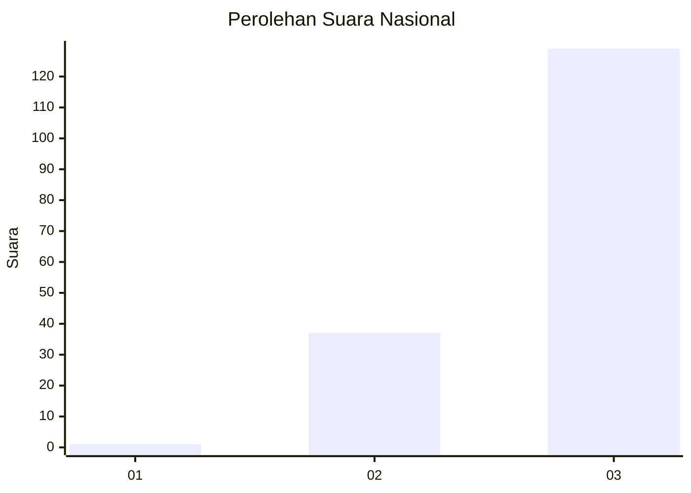
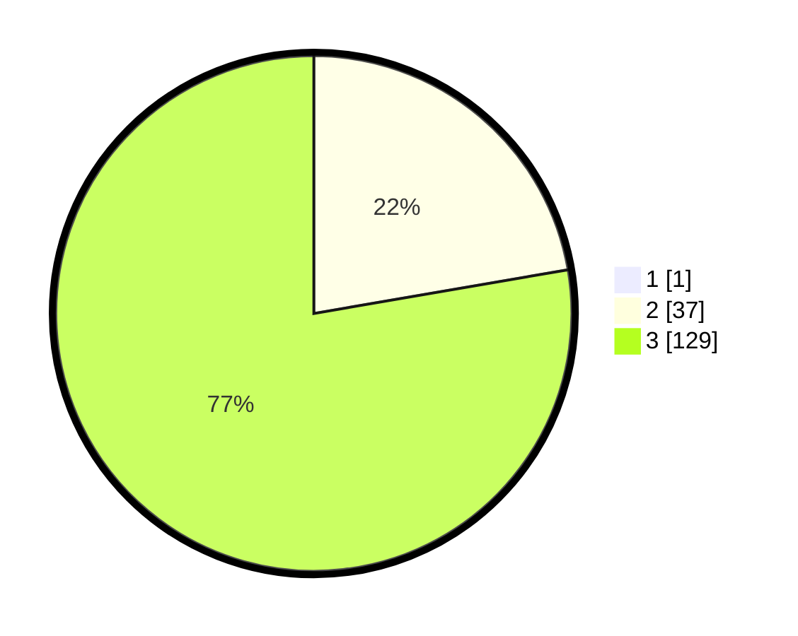

# Hasil

## Grafik

## Tabel

| No. | Nama Paslon    | Suara | Suara (raw) | Persentase |
|:--- |:-------------- | -----:| -----------:| ----------:|
| 1   | ANIES MUHAIMIN | 1     | [1][p-1]    | 0,60       |
| 2   | PRABOWO GIBRAN | 37    | [37][p-2]   | 22,16      |
| 3   | GANJAR MAHFUD  | 129   | [129][p-3]  | 77,25      |

[p-1]: https://github.com/gigit-pemilu/pemilu-2024/blob/main/pilpres/hitung-suara/sub/51-bali/sub/02-tabanan/sub/03-selemadeg-barat/sub/2006-lumbung-kauh/sub/002-tps/sub/paslon-1.txt
[p-2]: https://github.com/gigit-pemilu/pemilu-2024/blob/main/pilpres/hitung-suara/sub/51-bali/sub/02-tabanan/sub/03-selemadeg-barat/sub/2006-lumbung-kauh/sub/002-tps/sub/paslon-2.txt
[p-3]: https://github.com/gigit-pemilu/pemilu-2024/blob/main/pilpres/hitung-suara/sub/51-bali/sub/02-tabanan/sub/03-selemadeg-barat/sub/2006-lumbung-kauh/sub/002-tps/sub/paslon-3.txt

## Foto C Plano

https://sirekap-obj-formc.kpu.go.id/5d9a/pemilu/ppwp/51/02/03/20/06/5102032006002-20240214-141517--81e914e2-9831-4a1d-b351-59ace994c73f.jpg

https://sirekap-obj-formc.kpu.go.id/5d9a/pemilu/ppwp/51/02/03/20/06/5102032006002-20240214-141206--0d6e67af-3d38-4451-b9a7-a402e6a8a4ff.jpg

https://sirekap-obj-formc.kpu.go.id/5d9a/pemilu/ppwp/51/02/03/20/06/5102032006002-20240214-201519--66cfe772-0f52-491a-bff9-c7d42b36e2b6.jpg

## Metadata

| Key        | Value               |
| ---------- | ------------------- |
| Time Stamp | 2024-02-15 23:29:50 |

