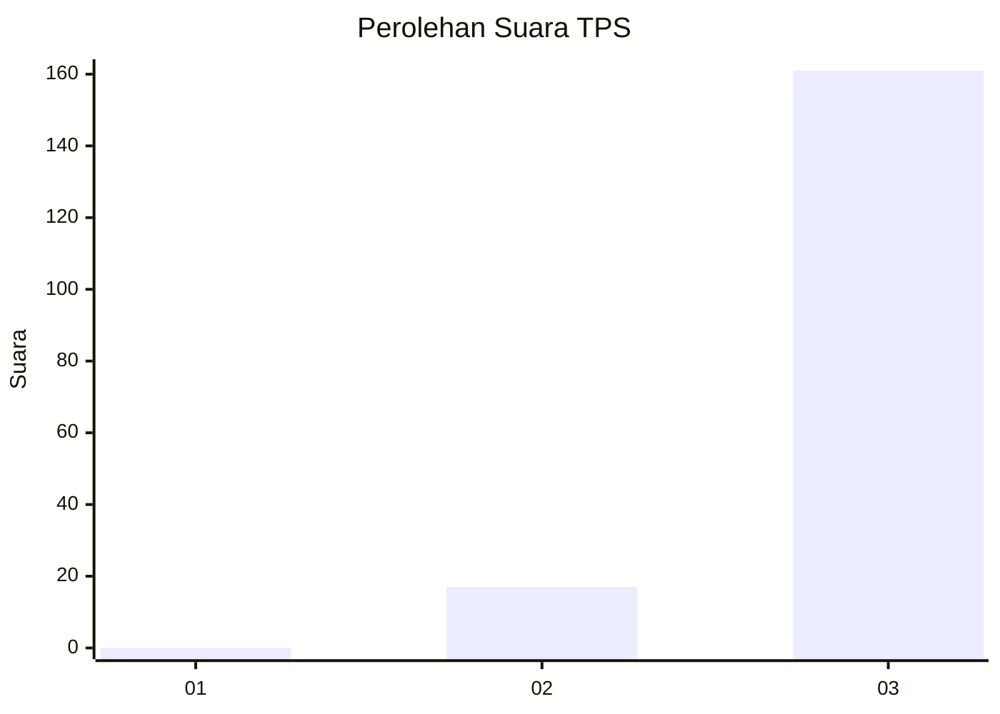
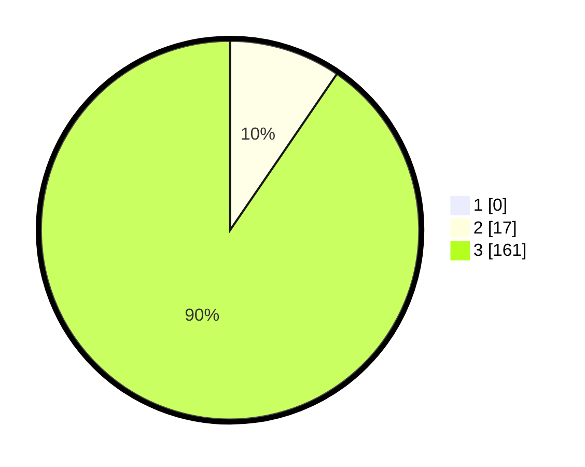

# Hasil

## Grafik

## Tabel

| No. | Nama Paslon    | Suara | Suara (raw) | Persentase |
|:--- |:-------------- | -----:| -----------:| ----------:|
| 1   | ANIES MUHAIMIN | 0     | [0][p-1]    | 0,00       |
| 2   | PRABOWO GIBRAN | 17    | [17][p-2]   | 9,55       |
| 3   | GANJAR MAHFUD  | 161   | [161][p-3]  | 90,45      |

[p-1]: https://github.com/gigit-pemilu/pemilu-2024-51-bali/blob/main/pilpres/hitung-suara/sub/51-bali/sub/02-tabanan/sub/03-selemadeg-barat/sub/2006-lumbung-kauh/sub/003-tps/sub/paslon-1.txt
[p-2]: https://github.com/gigit-pemilu/pemilu-2024-51-bali/blob/main/pilpres/hitung-suara/sub/51-bali/sub/02-tabanan/sub/03-selemadeg-barat/sub/2006-lumbung-kauh/sub/003-tps/sub/paslon-2.txt
[p-3]: https://github.com/gigit-pemilu/pemilu-2024-51-bali/blob/main/pilpres/hitung-suara/sub/51-bali/sub/02-tabanan/sub/03-selemadeg-barat/sub/2006-lumbung-kauh/sub/003-tps/sub/paslon-3.txt

## Foto C Plano

https://sirekap-obj-formc.kpu.go.id/8288/pemilu/ppwp/51/02/03/20/06/5102032006003-20240215-214823--14ee8d1e-b976-4825-8fd3-4e8994826521.jpg

https://sirekap-obj-formc.kpu.go.id/8288/pemilu/ppwp/51/02/03/20/06/5102032006003-20240215-214825--3983a0c0-bba1-4c09-bcda-99cb6b2831c2.jpg

https://sirekap-obj-formc.kpu.go.id/8288/pemilu/ppwp/51/02/03/20/06/5102032006003-20240215-214824--b0c32de5-b05d-4a2f-983f-5767cb5c92b5.jpg

## Metadata

| Key        | Value               |
| ---------- | ------------------- |
| Time Stamp | 2024-02-15 22:30:27 |

## DATA PEMILIH TETAP

Jumlah pemilih dalam DPT: **189**.
 * L: **96**.
 * P: **93**.

## DATA PENGGUNA HAK PILIH

Jumlah pengguna hak pilih dalam DPT: **179**.
 * L: **90**.
 * P: **89**.

Jumlah pengguna hak pilih dalam DPTb: **0**.
 * L: **0**.
 * P: **0**.

Jumlah pengguna hak pilih dalam DPK: **0**.
 * L: **0**.
 * P: **0**.

Jumlah pengguna hak pilih: **179**.
 * L: **90**.
 * P: **89**.

## JUMLAH SUARA SAH DAN TIDAK SAH

JUMLAH SELURUH SUARA SAH: **178**.

JUMLAH SUARA TIDAK SAH: **1**.

JUMLAH SELURUH SUARA SAH DAN SUARA TIDAK SAH: **179**.

