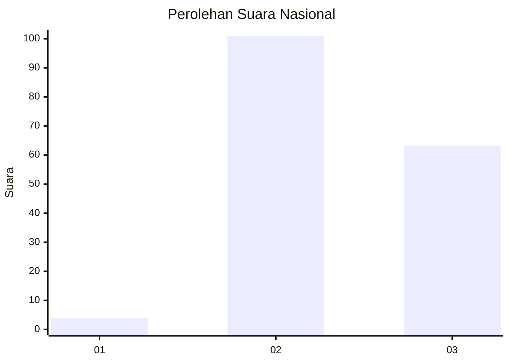
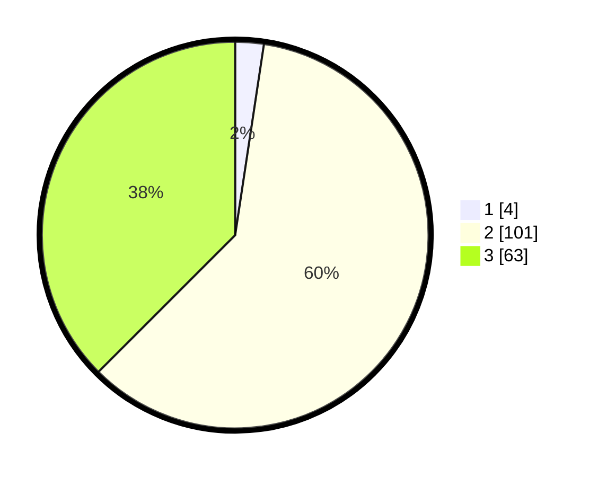

# Hasil

## Grafik

## Tabel

| No. | Nama Paslon    | Suara | Suara (raw) | Persentase |
|:--- |:-------------- | -----:| -----------:| ----------:|
| 1   | ANIES MUHAIMIN | 4     | [4][p-1]    | 2,38       |
| 2   | PRABOWO GIBRAN | 101   | [101][p-2]  | 60,12      |
| 3   | GANJAR MAHFUD  | 63    | [63][p-3]   | 37,50      |

[p-1]: https://github.com/gigit-pemilu/pemilu-2024/blob/main/pilpres/hitung-suara/sub/51-bali/sub/02-tabanan/sub/03-selemadeg-barat/sub/2006-lumbung-kauh/sub/004-tps/sub/paslon-1.txt
[p-2]: https://github.com/gigit-pemilu/pemilu-2024/blob/main/pilpres/hitung-suara/sub/51-bali/sub/02-tabanan/sub/03-selemadeg-barat/sub/2006-lumbung-kauh/sub/004-tps/sub/paslon-2.txt
[p-3]: https://github.com/gigit-pemilu/pemilu-2024/blob/main/pilpres/hitung-suara/sub/51-bali/sub/02-tabanan/sub/03-selemadeg-barat/sub/2006-lumbung-kauh/sub/004-tps/sub/paslon-3.txt

## Foto C Plano

https://sirekap-obj-formc.kpu.go.id/7b0f/pemilu/ppwp/51/02/03/20/06/5102032006004-20240216-022449--7925b425-f874-4180-bac9-2d0d363dc293.jpg

https://sirekap-obj-formc.kpu.go.id/7b0f/pemilu/ppwp/51/02/03/20/06/5102032006004-20240216-022451--d7f62df6-4fa9-477e-ba89-af3470c65282.jpg

https://sirekap-obj-formc.kpu.go.id/7b0f/pemilu/ppwp/51/02/03/20/06/5102032006004-20240216-022450--46ff0149-3bc5-4787-9c5a-a42f0755d69c.jpg

## Metadata

| Key        | Value               |
| ---------- | ------------------- |
| Time Stamp | 2024-02-16 10:00:28 |

## DATA PEMILIH TETAP

Jumlah pemilih dalam DPT: **168**.
 * L: **81**.
 * P: **87**.

## DATA PENGGUNA HAK PILIH

Jumlah pengguna hak pilih dalam DPT: **168**.
 * L: **81**.
 * P: **87**.

Jumlah pengguna hak pilih dalam DPTb: **0**.
 * L: **0**.
 * P: **0**.

Jumlah pengguna hak pilih dalam DPK: **0**.
 * L: **0**.
 * P: **0**.

Jumlah pengguna hak pilih: **168**.
 * L: **81**.
 * P: **87**.

## JUMLAH SUARA SAH DAN TIDAK SAH

JUMLAH SELURUH SUARA SAH: **168**.

JUMLAH SUARA TIDAK SAH: **0**.

JUMLAH SELURUH SUARA SAH DAN SUARA TIDAK SAH: **168**.

