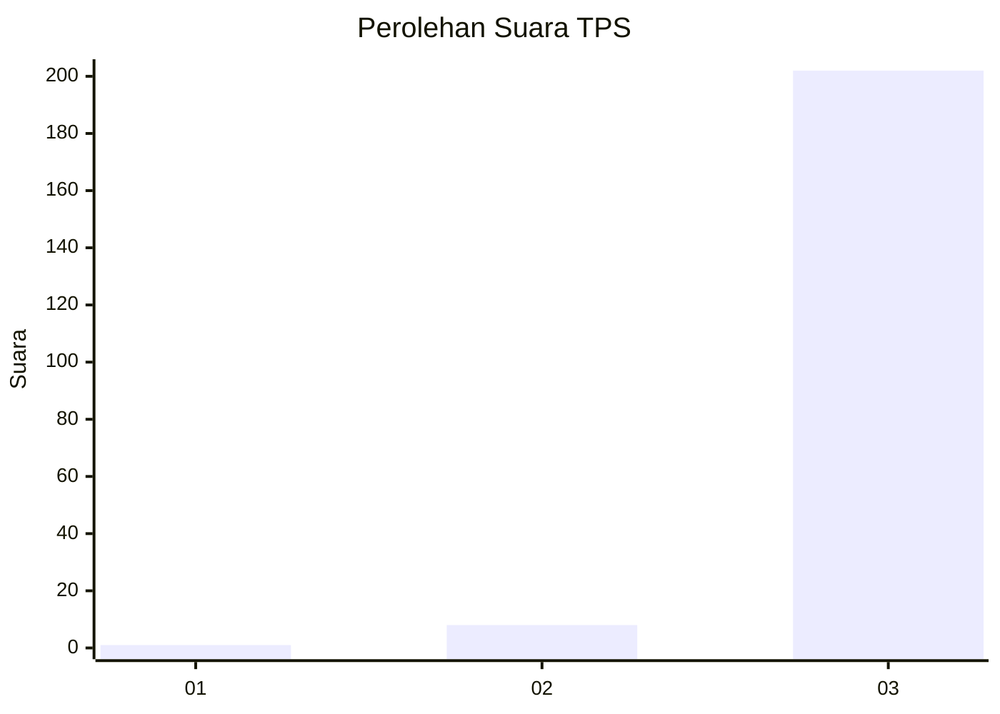
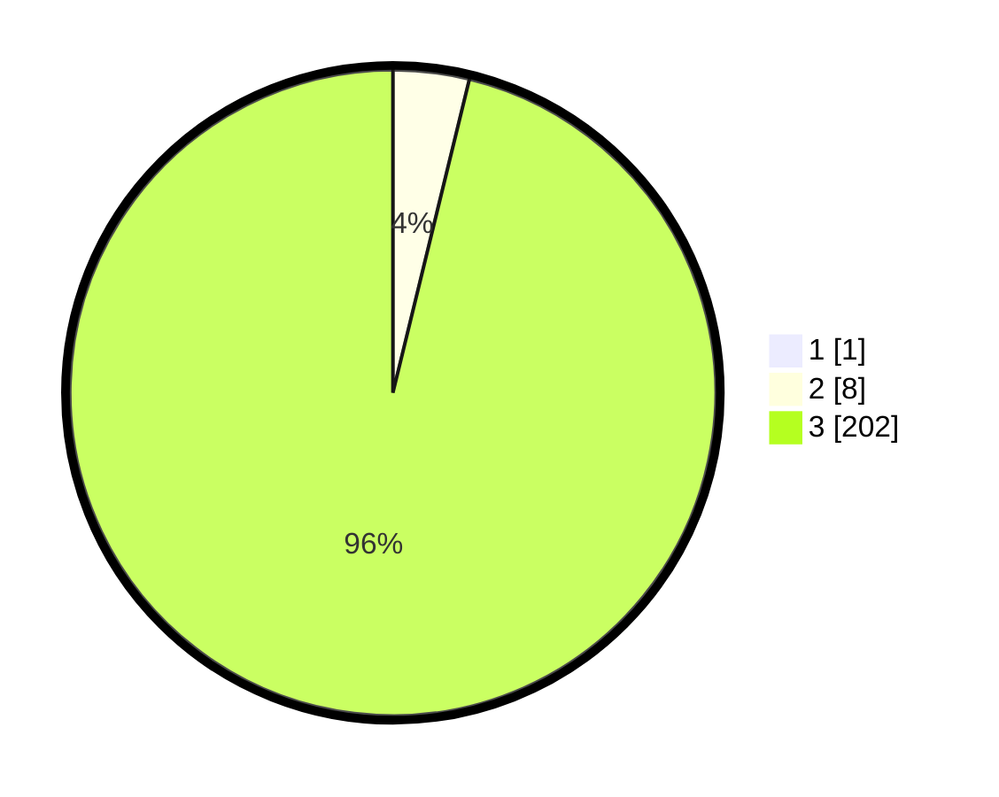

# Hasil

## Grafik

## Tabel

| No. | Nama Paslon    | Suara | Suara (raw) | Persentase |
|:--- |:-------------- | -----:| -----------:| ----------:|
| 1   | ANIES MUHAIMIN | 1     | [1][p-1]    | 0,47       |
| 2   | PRABOWO GIBRAN | 8     | [8][p-2]    | 3,79       |
| 3   | GANJAR MAHFUD  | 202   | [202][p-3]  | 95,73      |

[p-1]: https://github.com/gigit-pemilu/pemilu-2024-51-bali/blob/main/pilpres/hitung-suara/sub/51-bali/sub/02-tabanan/sub/03-selemadeg-barat/sub/2007-tiying-gading/sub/001-tps/sub/paslon-1.txt
[p-2]: https://github.com/gigit-pemilu/pemilu-2024-51-bali/blob/main/pilpres/hitung-suara/sub/51-bali/sub/02-tabanan/sub/03-selemadeg-barat/sub/2007-tiying-gading/sub/001-tps/sub/paslon-2.txt
[p-3]: https://github.com/gigit-pemilu/pemilu-2024-51-bali/blob/main/pilpres/hitung-suara/sub/51-bali/sub/02-tabanan/sub/03-selemadeg-barat/sub/2007-tiying-gading/sub/001-tps/sub/paslon-3.txt

## Foto C Plano

https://sirekap-obj-formc.kpu.go.id/f961/pemilu/ppwp/51/02/03/20/07/5102032007001-20240216-143222--a54063de-7c80-4408-a78a-a8f2998a0678.jpg

https://sirekap-obj-formc.kpu.go.id/f961/pemilu/ppwp/51/02/03/20/07/5102032007001-20240216-143223--54f1cdc6-769c-4bfa-8be4-23c50b17095c.jpg

https://sirekap-obj-formc.kpu.go.id/f961/pemilu/ppwp/51/02/03/20/07/5102032007001-20240216-143223--02cb762f-6fca-4a10-9615-f7875ab34dec.jpg

## Metadata

| Key        | Value               |
| ---------- | ------------------- |
| Time Stamp | 2024-02-16 16:25:10 |

## DATA PEMILIH TETAP

Jumlah pemilih dalam DPT: **211**.
 * L: **106**.
 * P: **105**.

## DATA PENGGUNA HAK PILIH

Jumlah pengguna hak pilih dalam DPT: **210**.
 * L: **107**.
 * P: **103**.

Jumlah pengguna hak pilih dalam DPTb: **1**.
 * L: **0**.
 * P: **1**.

Jumlah pengguna hak pilih dalam DPK: **0**.
 * L: **0**.
 * P: **0**.

Jumlah pengguna hak pilih: **211**.
 * L: **106**.
 * P: **105**.

## JUMLAH SUARA SAH DAN TIDAK SAH

JUMLAH SELURUH SUARA SAH: **211**.

JUMLAH SUARA TIDAK SAH: **0**.

JUMLAH SELURUH SUARA SAH DAN SUARA TIDAK SAH: **211**.

