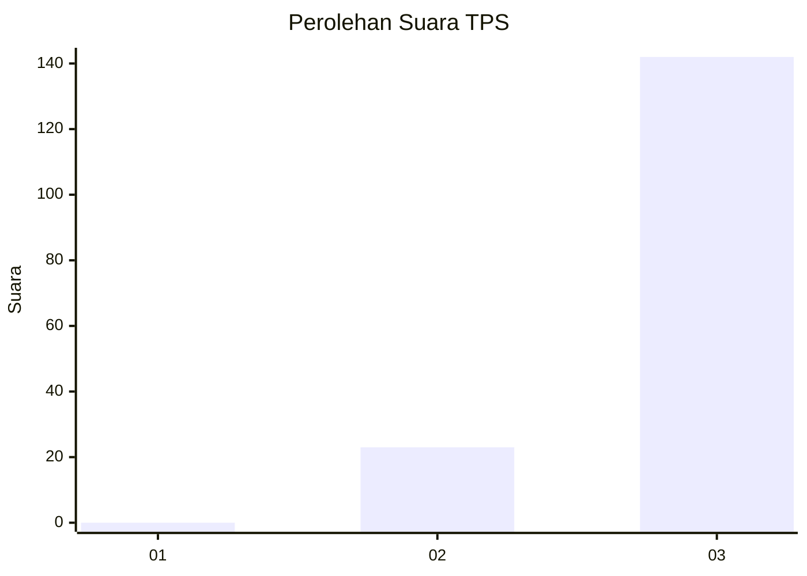
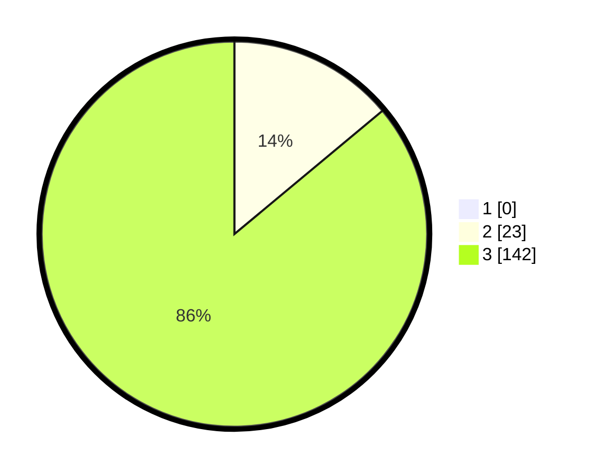

# Hasil

## Grafik

## Tabel

| No. | Nama Paslon    | Suara | Suara (raw) | Persentase |
|:--- |:-------------- | -----:| -----------:| ----------:|
| 1   | ANIES MUHAIMIN | 0     | [0][p-1]    | 0,00       |
| 2   | PRABOWO GIBRAN | 23    | [23][p-2]   | 13,94      |
| 3   | GANJAR MAHFUD  | 142   | [142][p-3]  | 86,06      |

[p-1]: https://github.com/gigit-pemilu/pemilu-2024-51-bali/blob/main/pilpres/hitung-suara/sub/51-bali/sub/02-tabanan/sub/03-selemadeg-barat/sub/2007-tiying-gading/sub/002-tps/sub/paslon-1.txt
[p-2]: https://github.com/gigit-pemilu/pemilu-2024-51-bali/blob/main/pilpres/hitung-suara/sub/51-bali/sub/02-tabanan/sub/03-selemadeg-barat/sub/2007-tiying-gading/sub/002-tps/sub/paslon-2.txt
[p-3]: https://github.com/gigit-pemilu/pemilu-2024-51-bali/blob/main/pilpres/hitung-suara/sub/51-bali/sub/02-tabanan/sub/03-selemadeg-barat/sub/2007-tiying-gading/sub/002-tps/sub/paslon-3.txt

## Foto C Plano

https://sirekap-obj-formc.kpu.go.id/cfe0/pemilu/ppwp/51/02/03/20/07/5102032007002-20240215-214603--057475ba-0728-462a-8380-e5a19f11d9d5.jpg

https://sirekap-obj-formc.kpu.go.id/cfe0/pemilu/ppwp/51/02/03/20/07/5102032007002-20240215-214604--742d1d62-afd5-4868-8e7d-21ae18022ab9.jpg

https://sirekap-obj-formc.kpu.go.id/cfe0/pemilu/ppwp/51/02/03/20/07/5102032007002-20240215-214604--e0e6bb40-21fe-4499-a57f-186d1e1bfd3c.jpg

## Metadata

| Key        | Value               |
| ---------- | ------------------- |
| Time Stamp | 2024-02-15 22:00:27 |

## DATA PEMILIH TETAP

Jumlah pemilih dalam DPT: **173**.
 * L: **89**.
 * P: **84**.

## DATA PENGGUNA HAK PILIH

Jumlah pengguna hak pilih dalam DPT: **165**.
 * L: **84**.
 * P: **81**.

Jumlah pengguna hak pilih dalam DPTb: **0**.
 * L: **0**.
 * P: **0**.

Jumlah pengguna hak pilih dalam DPK: **0**.
 * L: **0**.
 * P: **0**.

Jumlah pengguna hak pilih: **165**.
 * L: **84**.
 * P: **81**.

## JUMLAH SUARA SAH DAN TIDAK SAH

JUMLAH SELURUH SUARA SAH: **165**.

JUMLAH SUARA TIDAK SAH: **0**.

JUMLAH SELURUH SUARA SAH DAN SUARA TIDAK SAH: **165**.

