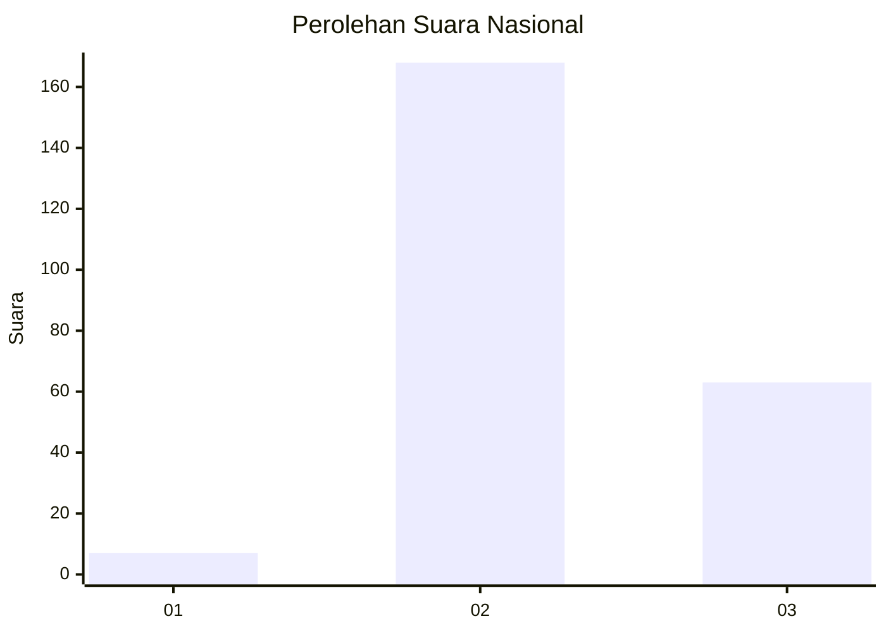
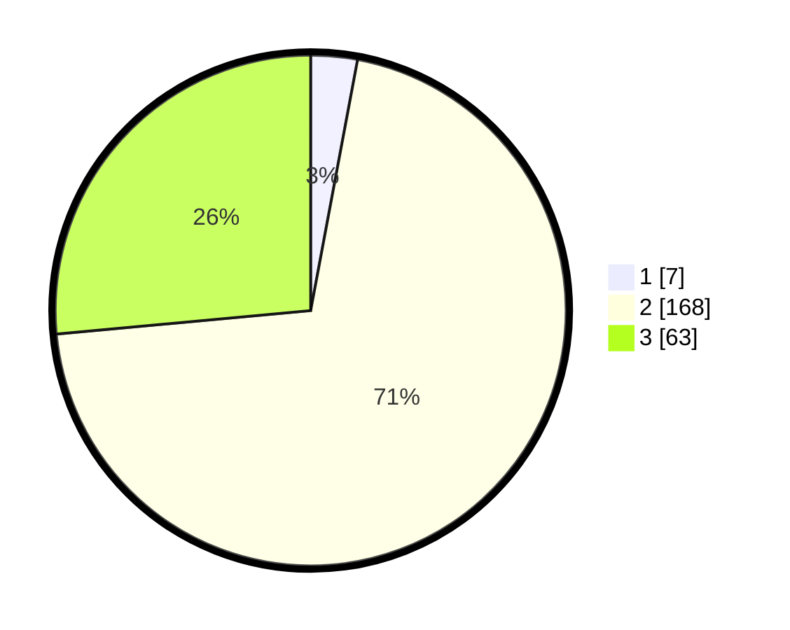

# Hasil

## Grafik

## Tabel

| No. | Nama Paslon    | Suara | Suara (raw) | Persentase |
|:--- |:-------------- | -----:| -----------:| ----------:|
| 1   | ANIES MUHAIMIN | 7     | [7][p-1]    | 2,94       |
| 2   | PRABOWO GIBRAN | 168   | [168][p-2]  | 70,59      |
| 3   | GANJAR MAHFUD  | 63    | [63][p-3]   | 26,47      |

[p-1]: https://github.com/gigit-pemilu/pemilu-2024/blob/main/pilpres/hitung-suara/sub/51-bali/sub/02-tabanan/sub/03-selemadeg-barat/sub/2007-tiying-gading/sub/003-tps/sub/paslon-1.txt
[p-2]: https://github.com/gigit-pemilu/pemilu-2024/blob/main/pilpres/hitung-suara/sub/51-bali/sub/02-tabanan/sub/03-selemadeg-barat/sub/2007-tiying-gading/sub/003-tps/sub/paslon-2.txt
[p-3]: https://github.com/gigit-pemilu/pemilu-2024/blob/main/pilpres/hitung-suara/sub/51-bali/sub/02-tabanan/sub/03-selemadeg-barat/sub/2007-tiying-gading/sub/003-tps/sub/paslon-3.txt

## Foto C Plano

https://sirekap-obj-formc.kpu.go.id/00f8/pemilu/ppwp/51/02/03/20/07/5102032007003-20240216-032837--0500a978-6f1f-47a0-acc0-7acc8440dbde.jpg

https://sirekap-obj-formc.kpu.go.id/00f8/pemilu/ppwp/51/02/03/20/07/5102032007003-20240216-032838--bcc99436-1baa-477c-ace5-8398d702f0a2.jpg

https://sirekap-obj-formc.kpu.go.id/00f8/pemilu/ppwp/51/02/03/20/07/5102032007003-20240216-032838--cd4c0962-9f28-4067-ba4f-9b6098cf1a53.jpg

## Metadata

| Key        | Value               |
| ---------- | ------------------- |
| Time Stamp | 2024-02-16 10:00:28 |

## DATA PEMILIH TETAP

Jumlah pemilih dalam DPT: **238**.
 * L: **127**.
 * P: **111**.

## DATA PENGGUNA HAK PILIH

Jumlah pengguna hak pilih dalam DPT: **238**.
 * L: **127**.
 * P: **111**.

Jumlah pengguna hak pilih dalam DPTb: **1**.
 * L: **0**.
 * P: **1**.

Jumlah pengguna hak pilih dalam DPK: **0**.
 * L: **0**.
 * P: **0**.

Jumlah pengguna hak pilih: **239**.
 * L: **127**.
 * P: **112**.

## JUMLAH SUARA SAH DAN TIDAK SAH

JUMLAH SELURUH SUARA SAH: **238**.

JUMLAH SUARA TIDAK SAH: **1**.

JUMLAH SELURUH SUARA SAH DAN SUARA TIDAK SAH: **239**.

