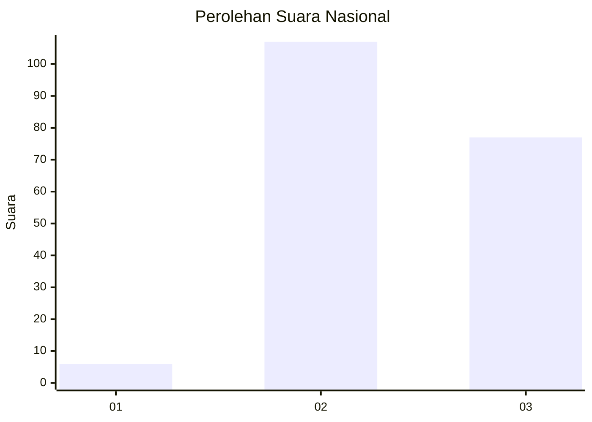
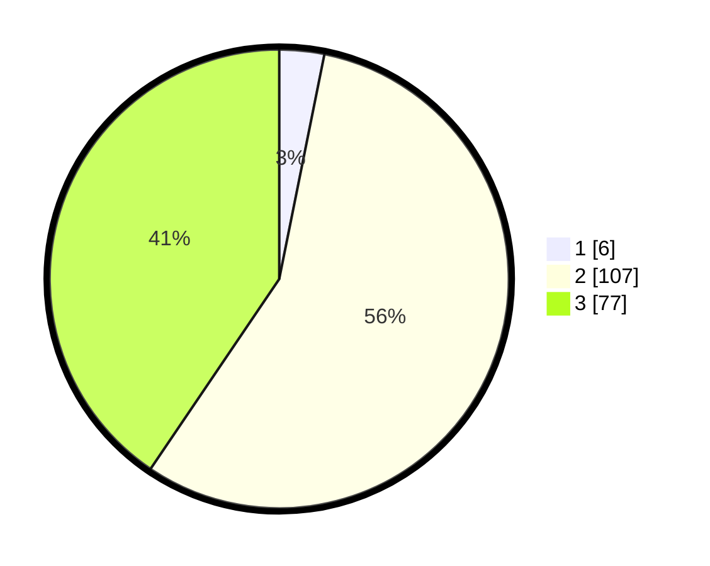

# Hasil

## Grafik

## Tabel

| No. | Nama Paslon    | Suara | Suara (raw) | Persentase |
|:--- |:-------------- | -----:| -----------:| ----------:|
| 1   | ANIES MUHAIMIN | 6     | [6][p-1]    | 3,16       |
| 2   | PRABOWO GIBRAN | 107   | [107][p-2]  | 56,32      |
| 3   | GANJAR MAHFUD  | 77    | [77][p-3]   | 40,53      |

[p-1]: https://github.com/gigit-pemilu/pemilu-2024/blob/main/pilpres/hitung-suara/sub/51-bali/sub/02-tabanan/sub/03-selemadeg-barat/sub/2007-tiying-gading/sub/004-tps/sub/paslon-1.txt
[p-2]: https://github.com/gigit-pemilu/pemilu-2024/blob/main/pilpres/hitung-suara/sub/51-bali/sub/02-tabanan/sub/03-selemadeg-barat/sub/2007-tiying-gading/sub/004-tps/sub/paslon-2.txt
[p-3]: https://github.com/gigit-pemilu/pemilu-2024/blob/main/pilpres/hitung-suara/sub/51-bali/sub/02-tabanan/sub/03-selemadeg-barat/sub/2007-tiying-gading/sub/004-tps/sub/paslon-3.txt

## Foto C Plano

https://sirekap-obj-formc.kpu.go.id/7051/pemilu/ppwp/51/02/03/20/07/5102032007004-20240216-151750--668a5b87-9994-447c-838b-12c215685d23.jpg

https://sirekap-obj-formc.kpu.go.id/7051/pemilu/ppwp/51/02/03/20/07/5102032007004-20240216-151752--08ec9a12-a483-404c-846b-db970509c29c.jpg

https://sirekap-obj-formc.kpu.go.id/7051/pemilu/ppwp/51/02/03/20/07/5102032007004-20240216-151751--eac6a4cf-ad9f-4a28-b88c-5d5fadc5f2c8.jpg

## Metadata

| Key        | Value               |
| ---------- | ------------------- |
| Time Stamp | 2024-02-21 12:00:00 |

## DATA PEMILIH TETAP

Jumlah pemilih dalam DPT: **218**.
 * L: **101**.
 * P: **117**.

## DATA PENGGUNA HAK PILIH

Jumlah pengguna hak pilih dalam DPT: **191**.
 * L: **91**.
 * P: **100**.

Jumlah pengguna hak pilih dalam DPTb: **1**.
 * L: **0**.
 * P: **1**.

Jumlah pengguna hak pilih dalam DPK: **2**.
 * L: **2**.
 * P: **0**.

Jumlah pengguna hak pilih: **194**.
 * L: **93**.
 * P: **101**.

## JUMLAH SUARA SAH DAN TIDAK SAH

JUMLAH SELURUH SUARA SAH: **190**.

JUMLAH SUARA TIDAK SAH: **4**.

JUMLAH SELURUH SUARA SAH DAN SUARA TIDAK SAH: **194**.

