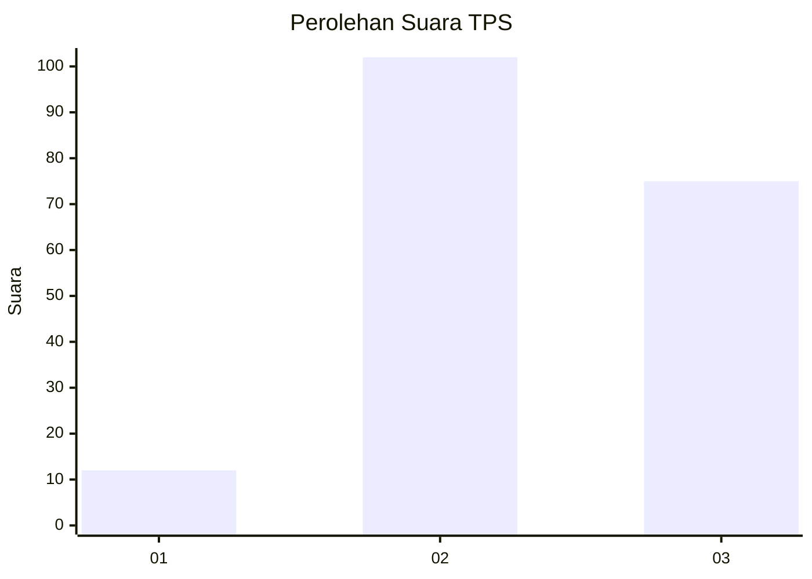
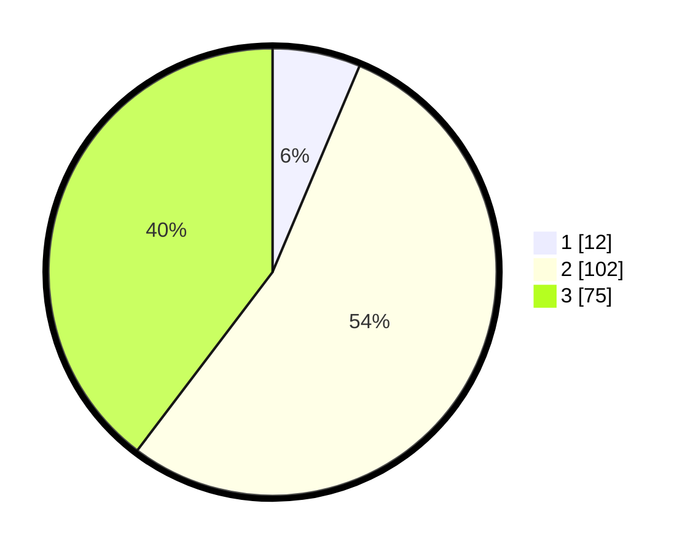

# Hasil

## Grafik

## Tabel

| No. | Nama Paslon    | Suara | Suara (raw) | Persentase |
|:--- |:-------------- | -----:| -----------:| ----------:|
| 1   | ANIES MUHAIMIN | 12    | [12][p-1]   | 6,35       |
| 2   | PRABOWO GIBRAN | 102   | [102][p-2]  | 53,97      |
| 3   | GANJAR MAHFUD  | 75    | [75][p-3]   | 39,68      |

[p-1]: https://github.com/gigit-pemilu/pemilu-2024-51-bali/blob/main/pilpres/hitung-suara/sub/51-bali/sub/02-tabanan/sub/03-selemadeg-barat/sub/2007-tiying-gading/sub/005-tps/sub/paslon-1.txt
[p-2]: https://github.com/gigit-pemilu/pemilu-2024-51-bali/blob/main/pilpres/hitung-suara/sub/51-bali/sub/02-tabanan/sub/03-selemadeg-barat/sub/2007-tiying-gading/sub/005-tps/sub/paslon-2.txt
[p-3]: https://github.com/gigit-pemilu/pemilu-2024-51-bali/blob/main/pilpres/hitung-suara/sub/51-bali/sub/02-tabanan/sub/03-selemadeg-barat/sub/2007-tiying-gading/sub/005-tps/sub/paslon-3.txt

## Foto C Plano

https://sirekap-obj-formc.kpu.go.id/3230/pemilu/ppwp/51/02/03/20/07/5102032007005-20240216-043152--c4407277-fdd9-41e8-acf2-dbb2be90a35d.jpg

https://sirekap-obj-formc.kpu.go.id/3230/pemilu/ppwp/51/02/03/20/07/5102032007005-20240216-043157--1197f097-a144-44e4-b8ce-14ebbe883e7b.jpg

https://sirekap-obj-formc.kpu.go.id/3230/pemilu/ppwp/51/02/03/20/07/5102032007005-20240216-043154--6457b38a-5abf-4207-a0b4-630b227943c8.jpg

## Metadata

| Key        | Value               |
| ---------- | ------------------- |
| Time Stamp | 2024-02-16 10:00:28 |

## DATA PEMILIH TETAP

Jumlah pemilih dalam DPT: **222**.
 * L: **112**.
 * P: **110**.

## DATA PENGGUNA HAK PILIH

Jumlah pengguna hak pilih dalam DPT: **0**.
 * L: **0**.
 * P: **0**.

Jumlah pengguna hak pilih dalam DPTb: **194**.
 * L: **96**.
 * P: **98**.

Jumlah pengguna hak pilih dalam DPK: **1**.
 * L: **0**.
 * P: **1**.

Jumlah pengguna hak pilih: **195**.
 * L: **96**.
 * P: **99**.

## JUMLAH SUARA SAH DAN TIDAK SAH

JUMLAH SELURUH SUARA SAH: **189**.

JUMLAH SUARA TIDAK SAH: **6**.

JUMLAH SELURUH SUARA SAH DAN SUARA TIDAK SAH: **195**.

