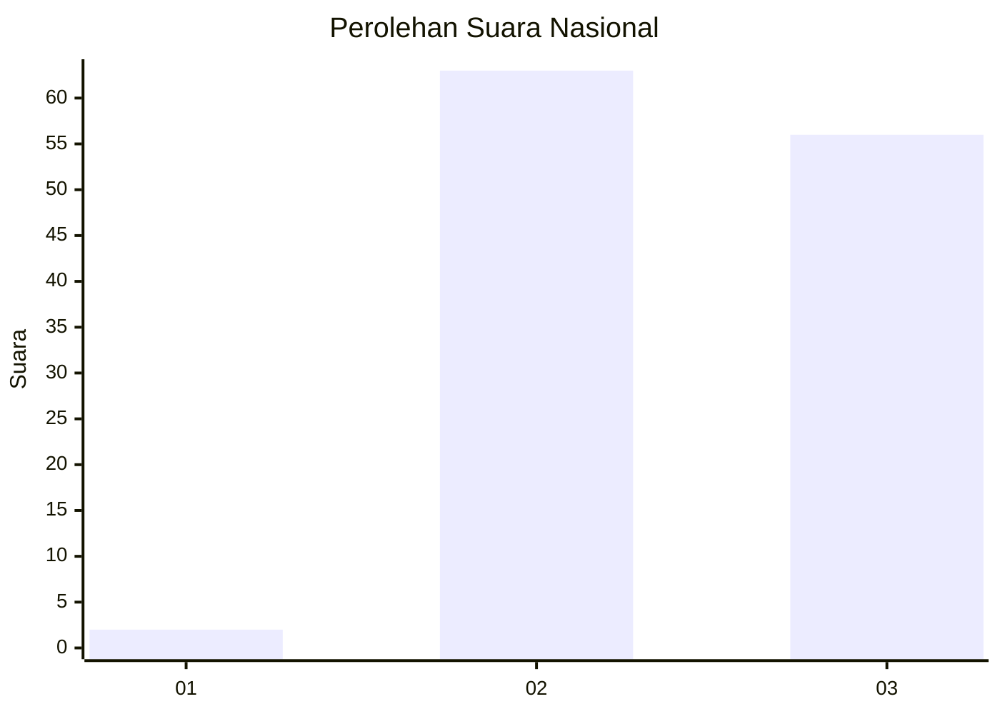
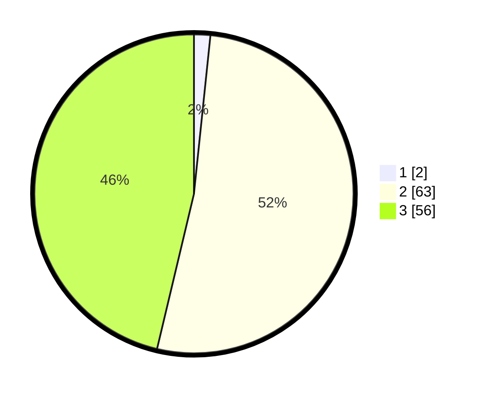

# Hasil

## Grafik

## Tabel

| No. | Nama Paslon    | Suara | Suara (raw) | Persentase |
|:--- |:-------------- | -----:| -----------:| ----------:|
| 1   | ANIES MUHAIMIN | 2     | [2][p-1]    | 1,65       |
| 2   | PRABOWO GIBRAN | 63    | [63][p-2]   | 52,07      |
| 3   | GANJAR MAHFUD  | 56    | [56][p-3]   | 46,28      |

[p-1]: https://github.com/gigit-pemilu/pemilu-2024/blob/main/pilpres/hitung-suara/sub/51-bali/sub/02-tabanan/sub/03-selemadeg-barat/sub/2007-tiying-gading/sub/006-tps/sub/paslon-1.txt
[p-2]: https://github.com/gigit-pemilu/pemilu-2024/blob/main/pilpres/hitung-suara/sub/51-bali/sub/02-tabanan/sub/03-selemadeg-barat/sub/2007-tiying-gading/sub/006-tps/sub/paslon-2.txt
[p-3]: https://github.com/gigit-pemilu/pemilu-2024/blob/main/pilpres/hitung-suara/sub/51-bali/sub/02-tabanan/sub/03-selemadeg-barat/sub/2007-tiying-gading/sub/006-tps/sub/paslon-3.txt

## Foto C Plano

https://sirekap-obj-formc.kpu.go.id/6f6f/pemilu/ppwp/51/02/03/20/07/5102032007006-20240216-002731--15228120-1f23-4549-956c-0ba645232f68.jpg

https://sirekap-obj-formc.kpu.go.id/6f6f/pemilu/ppwp/51/02/03/20/07/5102032007006-20240216-002732--9f77bf37-e93a-4218-ae67-265710de1bf4.jpg

https://sirekap-obj-formc.kpu.go.id/6f6f/pemilu/ppwp/51/02/03/20/07/5102032007006-20240216-002731--c5b19ecc-1903-4798-9cd9-3fa584d484a8.jpg

## Metadata

| Key        | Value               |
| ---------- | ------------------- |
| Time Stamp | 2024-02-16 10:00:28 |

## DATA PEMILIH TETAP

Jumlah pemilih dalam DPT: **127**.
 * L: **63**.
 * P: **64**.

## DATA PENGGUNA HAK PILIH

Jumlah pengguna hak pilih dalam DPT: **127**.
 * L: **63**.
 * P: **64**.

Jumlah pengguna hak pilih dalam DPTb: **1**.
 * L: **0**.
 * P: **1**.

Jumlah pengguna hak pilih dalam DPK: **0**.
 * L: **0**.
 * P: **0**.

Jumlah pengguna hak pilih: **128**.
 * L: **63**.
 * P: **65**.

## JUMLAH SUARA SAH DAN TIDAK SAH

JUMLAH SELURUH SUARA SAH: **121**.

JUMLAH SUARA TIDAK SAH: **1**.

JUMLAH SELURUH SUARA SAH DAN SUARA TIDAK SAH: **122**.

