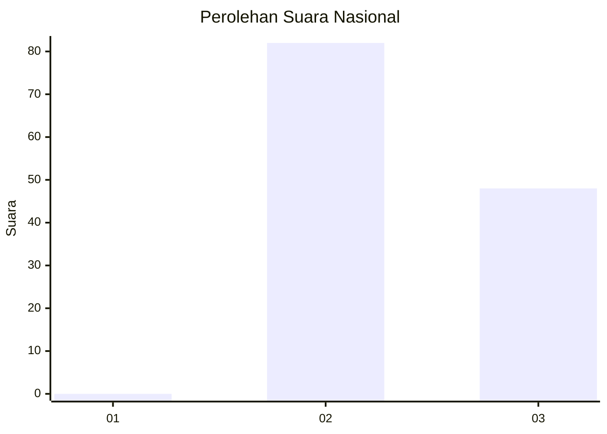
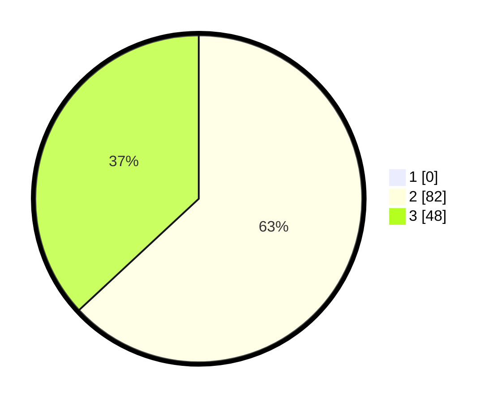

# Hasil

## Grafik

## Tabel

| No. | Nama Paslon    | Suara | Suara (raw) | Persentase |
|:--- |:-------------- | -----:| -----------:| ----------:|
| 1   | ANIES MUHAIMIN | 0     | [0][p-1]    | 0,00       |
| 2   | PRABOWO GIBRAN | 82    | [82][p-2]   | 63,08      |
| 3   | GANJAR MAHFUD  | 48    | [48][p-3]   | 36,92      |

[p-1]: https://github.com/gigit-pemilu/pemilu-2024/blob/main/pilpres/hitung-suara/sub/51-bali/sub/02-tabanan/sub/03-selemadeg-barat/sub/2007-tiying-gading/sub/008-tps/sub/paslon-1.txt
[p-2]: https://github.com/gigit-pemilu/pemilu-2024/blob/main/pilpres/hitung-suara/sub/51-bali/sub/02-tabanan/sub/03-selemadeg-barat/sub/2007-tiying-gading/sub/008-tps/sub/paslon-2.txt
[p-3]: https://github.com/gigit-pemilu/pemilu-2024/blob/main/pilpres/hitung-suara/sub/51-bali/sub/02-tabanan/sub/03-selemadeg-barat/sub/2007-tiying-gading/sub/008-tps/sub/paslon-3.txt

## Foto C Plano

https://sirekap-obj-formc.kpu.go.id/1d58/pemilu/ppwp/51/02/03/20/07/5102032007008-20240216-152210--0cc6e490-97f0-43e9-886b-1bcad2fd688a.jpg

https://sirekap-obj-formc.kpu.go.id/1d58/pemilu/ppwp/51/02/03/20/07/5102032007008-20240216-152211--a2f03648-9dc5-44fb-8317-bccc81b9eb66.jpg

https://sirekap-obj-formc.kpu.go.id/1d58/pemilu/ppwp/51/02/03/20/07/5102032007008-20240216-152210--b1c0fff5-67e5-4bd8-821e-7661a96825c1.jpg

## Metadata

| Key        | Value               |
| ---------- | ------------------- |
| Time Stamp | 2024-02-21 12:00:00 |

## DATA PEMILIH TETAP

Jumlah pemilih dalam DPT: **150**.
 * L: **74**.
 * P: **76**.

## DATA PENGGUNA HAK PILIH

Jumlah pengguna hak pilih dalam DPT: **133**.
 * L: **66**.
 * P: **67**.

Jumlah pengguna hak pilih dalam DPTb: **0**.
 * L: **0**.
 * P: **0**.

Jumlah pengguna hak pilih dalam DPK: **0**.
 * L: **0**.
 * P: **0**.

Jumlah pengguna hak pilih: **133**.
 * L: **66**.
 * P: **67**.

## JUMLAH SUARA SAH DAN TIDAK SAH

JUMLAH SELURUH SUARA SAH: **130**.

JUMLAH SUARA TIDAK SAH: **3**.

JUMLAH SELURUH SUARA SAH DAN SUARA TIDAK SAH: **133**.

