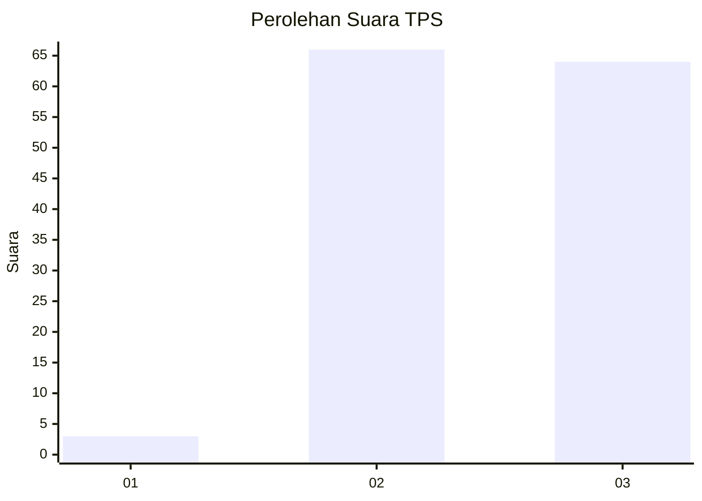
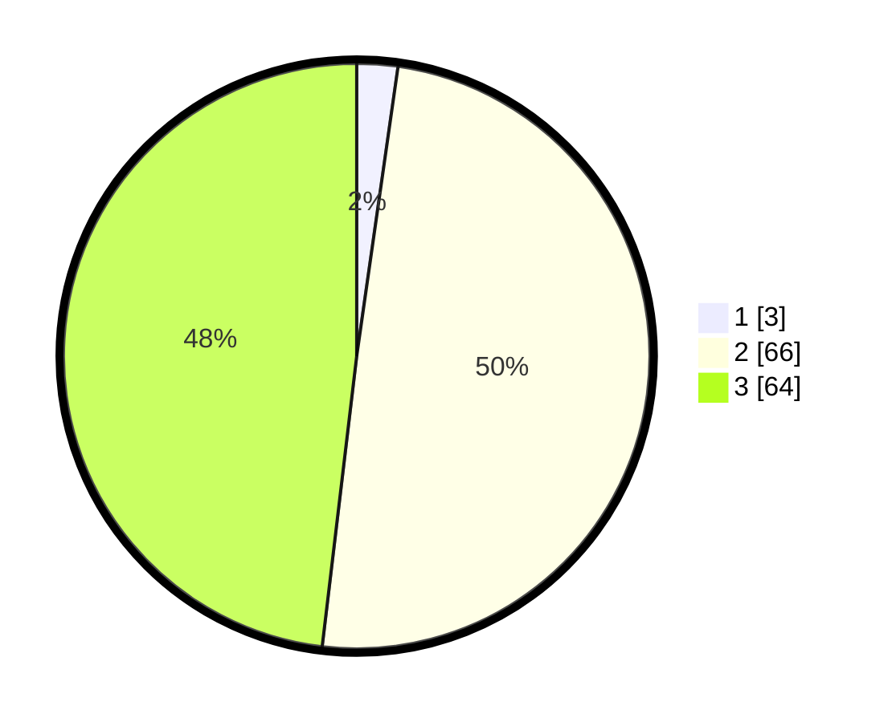

# Hasil

## Grafik

## Tabel

| No. | Nama Paslon    | Suara | Suara (raw) | Persentase |
|:--- |:-------------- | -----:| -----------:| ----------:|
| 1   | ANIES MUHAIMIN | 3     | [3][p-1]    | 2,26       |
| 2   | PRABOWO GIBRAN | 66    | [66][p-2]   | 49,62      |
| 3   | GANJAR MAHFUD  | 64    | [64][p-3]   | 48,12      |

[p-1]: https://github.com/gigit-pemilu/pemilu-2024-51-bali/blob/main/pilpres/hitung-suara/sub/51-bali/sub/02-tabanan/sub/03-selemadeg-barat/sub/2007-tiying-gading/sub/009-tps/sub/paslon-1.txt
[p-2]: https://github.com/gigit-pemilu/pemilu-2024-51-bali/blob/main/pilpres/hitung-suara/sub/51-bali/sub/02-tabanan/sub/03-selemadeg-barat/sub/2007-tiying-gading/sub/009-tps/sub/paslon-2.txt
[p-3]: https://github.com/gigit-pemilu/pemilu-2024-51-bali/blob/main/pilpres/hitung-suara/sub/51-bali/sub/02-tabanan/sub/03-selemadeg-barat/sub/2007-tiying-gading/sub/009-tps/sub/paslon-3.txt

## Foto C Plano

https://sirekap-obj-formc.kpu.go.id/ebfd/pemilu/ppwp/51/02/03/20/07/5102032007009-20240216-140016--1dd0b2ca-d89a-481d-a71b-da0f31a5cd50.jpg

https://sirekap-obj-formc.kpu.go.id/ebfd/pemilu/ppwp/51/02/03/20/07/5102032007009-20240216-140017--3a9112c1-2b61-454f-b208-6c1f4342a4ca.jpg

https://sirekap-obj-formc.kpu.go.id/ebfd/pemilu/ppwp/51/02/03/20/07/5102032007009-20240216-140016--12aa4a2f-a4da-4e54-b8ed-b8578bbfa0c9.jpg

## Metadata

| Key        | Value               |
| ---------- | ------------------- |
| Time Stamp | 2024-02-16 14:30:33 |

## DATA PEMILIH TETAP

Jumlah pemilih dalam DPT: **143**.
 * L: **70**.
 * P: **73**.

## DATA PENGGUNA HAK PILIH

Jumlah pengguna hak pilih dalam DPT: **135**.
 * L: **65**.
 * P: **70**.

Jumlah pengguna hak pilih dalam DPTb: **0**.
 * L: **0**.
 * P: **0**.

Jumlah pengguna hak pilih dalam DPK: **1**.
 * L: **1**.
 * P: **0**.

Jumlah pengguna hak pilih: **136**.
 * L: **66**.
 * P: **70**.

## JUMLAH SUARA SAH DAN TIDAK SAH

JUMLAH SELURUH SUARA SAH: **133**.

JUMLAH SUARA TIDAK SAH: **3**.

JUMLAH SELURUH SUARA SAH DAN SUARA TIDAK SAH: **136**.

