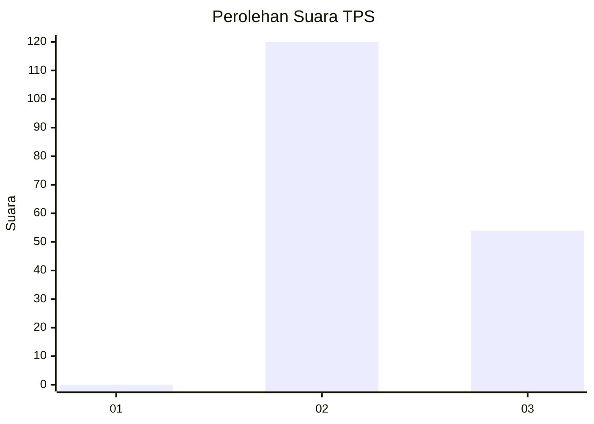
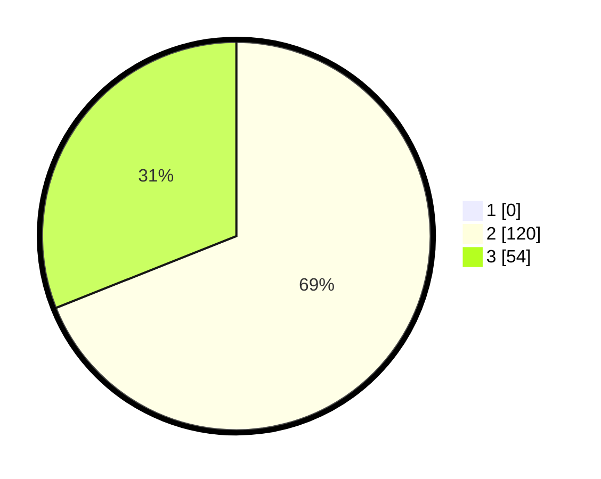

# Hasil

## Grafik

## Tabel

| No. | Nama Paslon    | Suara | Suara (raw) | Persentase |
|:--- |:-------------- | -----:| -----------:| ----------:|
| 1   | ANIES MUHAIMIN | 0     | [0][p-1]    | 0,00       |
| 2   | PRABOWO GIBRAN | 120   | [120][p-2]  | 68,97      |
| 3   | GANJAR MAHFUD  | 54    | [54][p-3]   | 31,03      |

[p-1]: https://github.com/gigit-pemilu/pemilu-2024-51-bali/blob/main/pilpres/hitung-suara/sub/51-bali/sub/02-tabanan/sub/03-selemadeg-barat/sub/2008-mundeh-kauh/sub/001-tps/sub/paslon-1.txt
[p-2]: https://github.com/gigit-pemilu/pemilu-2024-51-bali/blob/main/pilpres/hitung-suara/sub/51-bali/sub/02-tabanan/sub/03-selemadeg-barat/sub/2008-mundeh-kauh/sub/001-tps/sub/paslon-2.txt
[p-3]: https://github.com/gigit-pemilu/pemilu-2024-51-bali/blob/main/pilpres/hitung-suara/sub/51-bali/sub/02-tabanan/sub/03-selemadeg-barat/sub/2008-mundeh-kauh/sub/001-tps/sub/paslon-3.txt

## Foto C Plano

https://sirekap-obj-formc.kpu.go.id/ea47/pemilu/ppwp/51/02/03/20/08/5102032008001-20240216-034816--bdcf32bc-4789-4f8a-b228-97cfdae6c042.jpg

https://sirekap-obj-formc.kpu.go.id/ea47/pemilu/ppwp/51/02/03/20/08/5102032008001-20240216-034817--fd490c5d-eecf-4983-850f-07c82bcbbc19.jpg

https://sirekap-obj-formc.kpu.go.id/ea47/pemilu/ppwp/51/02/03/20/08/5102032008001-20240216-034816--6e16e989-4692-4902-a253-6e5196907d94.jpg

## Metadata

| Key        | Value               |
| ---------- | ------------------- |
| Time Stamp | 2024-02-16 10:00:28 |

## DATA PEMILIH TETAP

Jumlah pemilih dalam DPT: **184**.
 * L: **88**.
 * P: **96**.

## DATA PENGGUNA HAK PILIH

Jumlah pengguna hak pilih dalam DPT: **174**.
 * L: **83**.
 * P: **91**.

Jumlah pengguna hak pilih dalam DPTb: **0**.
 * L: **0**.
 * P: **0**.

Jumlah pengguna hak pilih dalam DPK: **0**.
 * L: **0**.
 * P: **0**.

Jumlah pengguna hak pilih: **174**.
 * L: **83**.
 * P: **91**.

## JUMLAH SUARA SAH DAN TIDAK SAH

JUMLAH SELURUH SUARA SAH: **174**.

JUMLAH SUARA TIDAK SAH: **0**.

JUMLAH SELURUH SUARA SAH DAN SUARA TIDAK SAH: **174**.

